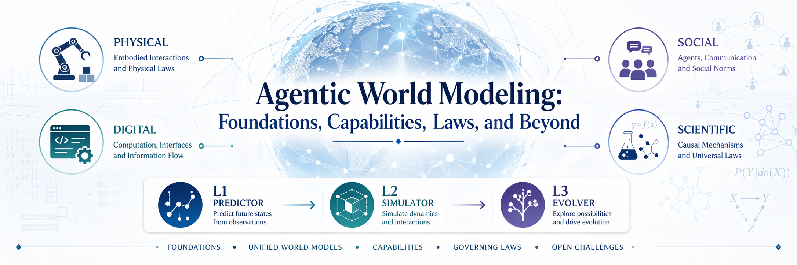

<p align="center">
  
</p>

# Awesome Agentic World Modeling

[](https://awesome.re) [](https://arxiv.org/abs/2604.22748) [](https://agentic-world-modeling.xyz/) [](https://huggingface.co/papers/2604.22748) [](https://x.com/_akhaliq/status/2048805921485148284) [](https://x.com/dotey/status/2049187740084731991) [](https://agentic-world-modeling.notion.site) <!-- omit in toc -->

This repository is a collection of world modeling progress based on [**Agentic World Modeling: Foundations, Capabilities, Laws, and Beyond**](https://arxiv.org/abs/2604.22748), covering **1,000+** papers and benchmarks grouped by section in reverse chronological order and available in a public [Notion database](https://agentic-world-modeling.notion.site). Released under the [MIT License](LICENSE). Check out our [poster](public/poster.png).

> [!NOTE]
> 📚 If you find this resource useful, please cite and [](https://github.com/matrix-agent/awesome-agentic-world-modeling) the repo:
>
> ```bibtex
> @article{chu2026agenticworldmodelingfoundations,
>   title         = {Agentic World Modeling: Foundations, Capabilities, Laws, and Beyond},
>   author        = {Meng Chu and Xuan Billy Zhang and Kevin Qinghong Lin and Lingdong Kong and Jize Zhang and Teng Tu and Weijian Ma and Ziqi Huang and Senqiao Yang and Wei Huang and Yeying Jin and Zhefan Rao and Jinhui Ye and Xinyu Lin and Xichen Zhang and Qisheng Hu and Shuai Yang and Leyang Shen and Wei Chow and Yifei Dong and Fengyi Wu and Quanyu Long and Bin Xia and Shaozuo Yu and Mingkang Zhu and Wenhu Zhang and Jiehui Huang and Haokun Gui and Runyi Li and Chenyu Tang and Dong Huang and Xuhang Chen and Rui Liu and Chengzu Li and Shiyi Du and Xu Huang and Haoxuan Che and Long Chen and Qifeng Chen and Wenya Wang and Wenxuan Zhang and Xiaojuan Qi and Yang Deng and Yanwei Li and Mike Zheng Shou and Zhi-Qi Cheng and See-Kiong Ng and Ziwei Liu and Philip Torr and Jiaya Jia},
>   year          = {2026},
>   eprint        = {2604.22748},
>   archivePrefix = {arXiv},
>   primaryClass  = {cs.AI},
>   url           = {https://arxiv.org/abs/2604.22748}
> }
> ```

> [!TIP]
> 👋 Welcome to join the discussion on [](https://discord.gg/NEAkmhPxqm) or [](https://docs.qq.com/form/page/DY2RFbmN3bmNDWHFx), share your work, collaborate on distillation, and help us grow the agentic world modeling community together.

## News

<!-- Add news items here, newest first. e.g.  - **[2026-06]** Short update here. -->

- 🚧 _More updates coming soon, stay tuned!_

## Table of Contents <!-- omit in toc -->

- [Taxonomy Overview](#taxonomy-overview)
- [L1: Predictor](#l1-predictor)
- [L2: Simulator](#l2-simulator)
- [L3: Evolver](#l3-evolver)
- [Benchmarks & Evaluation](#benchmarks--evaluation)
- [Related Surveys](#related-surveys)
- [Welcome to Contribute](#welcome-to-contribute)

## Overview

| Level | Definition | Key Capability | Physical | Digital | Social | Scientific |
|:------|:-----------|:---------------|:---------|:--------|:-------|:-----------|
| **L1 Predictor** | One-step local transition | Prediction accuracy, robustness, identifiability | RSSM, V-JEPA, TD-MPC2 | LLM pred., Othello-WM | ToMnet, BToM | GNN, FNO |
| **L2 Simulator** | Multi-step rollout respecting governing laws | Long-horizon coherence, intervention sensitivity, constraint consistency | DreamerV3, Sora, Cosmos | WebDreamer, Code2World | Generative Agents, CICERO | GraphCast, NeuralGCM |
| **L3 Evolver** | Design → Execute → Observe → Reflect with model revision | Active information expansion, autonomous execution, belief revision | AdaptSim, Self-Modeling | AlphaEvolve, FunSearch | Evolving Constitutions, AgentSociety | A-Lab, AI Scientist |

## L1: Predictor

Methods learning local one-step operators: state inference, forward dynamics, observation decoding, and inverse dynamics.

### Physical World

+ [**A Compositional Object-Based Approach to Learning Physical Dynamics**](https://arxiv.org/abs/1612.00341) (ICLR, 2016)
+ [**A Game Theoretic Framework for Model Based Reinforcement Learning**](https://arxiv.org/abs/2004.07804) (ICML, 2020)
+ [**A Generalist Agent**](https://arxiv.org/abs/2205.06175) (Trans. Mach. Learn. Res., 2022)
+ [**A Generalist Dynamics Model for Control**](https://arxiv.org/abs/2305.10912) (arXiv, 2023)
+ [**A Lightweight Library for Energy-Based Joint-Embedding Predictive Architectures**](https://arxiv.org/abs/2602.03604) (arXiv, 2026)
+ [**A Path Towards Autonomous Machine Intelligence**](https://openreview.net/pdf?id=BZ5a1r-kVsf) (OpenReview preprint, 2022)
+ [**A-JEPA: Joint-Embedding Predictive Architecture Can Listen**](https://arxiv.org/abs/2311.15830) (arXiv, 2023)
+ [**Accelerating Model-Based Reinforcement Learning with State-Space World Models**](https://arxiv.org/abs/2502.20168) (arXiv, 2025)
+ [**ACT-JEPA: Novel Joint-Embedding Predictive Architecture for Efficient Policy Representation Learning**](https://arxiv.org/abs/2501.14622) (arXiv, 2025)
+ [**Action Shapley: A Training Data Selection Metric for World Model in Reinforcement Learning**](https://arxiv.org/abs/2601.10905) (arXiv, 2026)
+ [**AD3: Implicit Action is the Key for World Models to Distinguish the Diverse Visual Distractors**](https://arxiv.org/abs/2403.09976) (ICML, 2024)
+ [**Adaptive World Models: Learning Behaviors by Latent Imagination Under Non-Stationarity**](https://arxiv.org/abs/2411.01342) (arXiv, 2024)
+ [**Advancing Humanoid Locomotion: Mastering Challenging Terrains with Denoising World Model Learning**](https://arxiv.org/abs/2408.14472) (RSS, 2024)
+ [**Advancing Semantic Future Prediction through Multimodal Visual Sequence Transformers**](https://arxiv.org/abs/2501.08303) (CVPR, 2025) [](https://github.com/Sta8is/FUTURIST)
+ [**Affordances Enable Partial World Modeling with LLMs**](https://arxiv.org/abs/2602.10390) (arXiv, 2026)
+ [**AnyPos: Automated Task-Agnostic Actions for Bimanual Manipulation**](https://arxiv.org/abs/2507.12768) (arXiv, 2025)
+ [**AtomVLA: Scalable Post-Training for Robotic Manipulation via Predictive Latent World Models**](https://arxiv.org/abs/2603.08519) (arXiv, 2026)
+ [**Back to Parsimonious Latents: Learning Task-Centric World Models from Visual Foundations**](https://arxiv.org/abs/2605.25620) (arXiv, 2026)
+ [**Beyond Euclidean Proximity: Repairing Latent World Models with Horizon-Matched Trajectory Reachability Metrics**](https://arxiv.org/abs/2605.22164) (arXiv, 2026)
+ [**BiTAgent: A Task-Aware Modular Framework for Bidirectional Coupling between Multimodal Large Language Models and World Models**](https://arxiv.org/abs/2512.04513) (arXiv, 2025)
+ [**Bootstrap Off-policy with World Model**](https://arxiv.org/abs/2511.00423) (arXiv, 2025)
+ [**Bootstrapping Action-Grounded Visual Dynamics in Unified Vision-Language Models**](https://arxiv.org/abs/2506.06006) (arXiv, 2025)
+ [**Bounded Exploration with World Model Uncertainty in Soft Actor-Critic Reinforcement Learning Algorithm**](https://arxiv.org/abs/2412.06139) (arXiv, 2024)
+ [**Bounding Distributional Shifts in World Modeling through Novelty Detection**](https://arxiv.org/abs/2508.06096) (IEEE/RJS International Conference on Intelligent RObots and Systems, 2025)
+ [**BRICKS-WM: Building Reusability via Interface Composition Kinetics for Structured World Models**](https://arxiv.org/abs/2606.16489) (arXiv, 2026)
+ [**Building spatial world models from sparse transitional episodic memories**](https://arxiv.org/abs/2505.13696) (arXiv, 2025)
+ [**Can World Models Benefit VLMs for World Dynamics?**](https://arxiv.org/abs/2510.00855) (arXiv, 2025)
+ [**Cardiac Copilot: Automatic Probe Guidance for Echocardiography with World Model**](https://arxiv.org/abs/2406.13165) (arXiv, 2024)
+ [**CarFormer: Self-Driving with Learned Object-Centric Representations**](https://arxiv.org/abs/2407.15843) (ECCV, 2024)
+ [**Causal-JEPA: Learning World Models through Object-Level Latent Interventions**](https://arxiv.org/abs/2602.11389) (arXiv, 2026) [](https://github.com/galilai-group/cjepa)
+ [**CausalVAE as a Plug-in for World Models: Towards Reliable Counterfactual Dynamics**](https://arxiv.org/abs/2604.07712) (arXiv, 2026)
+ [**Chain of World: World Model Thinking in Latent Motion**](https://arxiv.org/abs/2603.03195) (arXiv, 2026) [](https://github.com/fx-hit/CoWVLA)
+ [**CLAW: Learning Continuous Latent Action World Models via Adversarial Latent Regularization**](https://arxiv.org/abs/2606.04130) (arXiv, 2026)
+ [**Cloning Deterministic Worlds: The Critical Role of Latent Geometry in Long-Horizon World Models**](https://arxiv.org/abs/2510.26782) (arXiv, 2025)
+ [**Closing the Train-Test Gap in World Models for Gradient-Based Planning**](https://arxiv.org/abs/2512.09929) (arXiv, 2025) [](https://github.com/qw3rtman/robust-world-model-planning)
+ [**Cognitively Inspired Energy-Based World Models**](https://arxiv.org/abs/2406.08862) (arXiv, 2024)
+ [**CoIRL-AD: Collaborative-Competitive Imitation-Reinforcement Learning in Latent World Models for Autonomous Driving**](https://arxiv.org/abs/2510.12560) (arXiv, 2025)
+ [**Context and Diversity Matter: The Emergence of In-Context Learning in World Models**](https://arxiv.org/abs/2509.22353) (arXiv, 2025)
+ [**Contextual Latent World Models for Offline Meta Reinforcement Learning**](https://arxiv.org/abs/2603.02935) (arXiv, 2026)
+ [**CoT-VLA: Visual Chain-of-Thought Reasoning for Vision-Language-Action Models**](https://arxiv.org/abs/2503.22020) (CVPR, 2025)
+ [**CWM: Contrastive World Models for Action Feasibility Learning in Embodied Agent Pipelines**](https://arxiv.org/abs/2602.22452) (arXiv, 2026)
+ [**DAWM: Diffusion Action World Models for Offline Reinforcement Learning via Action-Inferred Transitions**](https://arxiv.org/abs/2509.19538) (arXiv, 2025)
+ [**DayDreamer: World Models for Physical Robot Learning**](https://arxiv.org/abs/2206.14176) (CoRL, 2022) [](https://github.com/danijar/daydreamer)
+ [**Deep Reinforcement Learning in a Handful of Trials using Probabilistic Dynamics Models**](https://arxiv.org/abs/1805.12114) (NeurIPS, 2018) [](https://github.com/kchua/handful-of-trials)
+ [**Demo-JEPA: Joint-Embedding Predictive Architecture for One-shot Cross-Embodiment Imitation**](https://arxiv.org/abs/2605.20811) (arXiv, 2026)
+ [**Describe-Then-Act: Proactive Agent Steering via Distilled Language-Action World Models**](https://arxiv.org/abs/2603.23149) (arXiv, 2026)
+ [**Deterministic World Models for Verification of Closed-loop Vision-based Systems**](https://arxiv.org/abs/2512.08991) (arXiv, 2025)
+ [**DIAL: Decoupling Intent and Action via Latent World Modeling for End-to-End VLA**](https://arxiv.org/abs/2603.29844) (arXiv, 2026) [](https://github.com/xpeng-robotics/DIAL)
+ [**Differentiable Raycasting for Self-supervised Occupancy Forecasting**](https://arxiv.org/abs/2210.01917) (ECCV, 2022) [](https://github.com/tarashakhurana/emergent-occ-forecasting)
+ [**Diffusion Transformer World-Action Model for AV Scene Prediction**](https://arxiv.org/abs/2606.12987) (arXiv, 2026)
+ [**DiLA: Disentangled Latent Action World Models**](https://arxiv.org/abs/2605.15725) (arXiv, 2026)
+ [**DINO-Foresight: Looking into the Future with DINO**](https://arxiv.org/abs/2412.11673) (arXiv, 2024) [](https://github.com/Sta8is/DINO-Foresight)
+ [**DINO-WM: World Models on Pre-trained Visual Features enable Zero-shot Planning**](https://arxiv.org/abs/2411.04983) (ICML, 2024) [](https://github.com/gaoyuezhou/dino_wm)
+ [**Discrete Codebook World Models for Continuous Control**](https://arxiv.org/abs/2503.00653) (ICLR, 2025)
+ [**Disentangled World Models: Learning to Transfer Semantic Knowledge from Distracting Videos for Reinforcement Learning**](https://arxiv.org/abs/2503.08751) (ICCV, 2025)
+ [**DiT4DiT: Jointly Modeling Video Dynamics and Actions for Generalizable Robot Control**](https://arxiv.org/abs/2603.10448) (arXiv, 2026) [](https://github.com/Mondo-Robotics/DiT4DiT)
+ [**DiWA: Diffusion Policy Adaptation with World Models**](https://arxiv.org/abs/2508.03645) (arXiv, 2025) [](https://github.com/acl21/diwa)
+ [**DLWM: Dual Latent World Models enable Holistic Gaussian-centric Pre-training in Autonomous Driving**](https://arxiv.org/abs/2604.00969) (arXiv, 2026)
+ [**Do Transformer World Models Give Better Policy Gradients?**](https://arxiv.org/abs/2402.05290) (ICML, 2024)
+ [**Dream to Control: Learning Behaviors by Latent Imagination**](https://arxiv.org/abs/1912.01603) (ICLR, 2019) [](https://github.com/danijar/dreamer)
+ [**Dream to Drive With Predictive Individual World Model**](https://arxiv.org/abs/2501.16733) (IEEE Transactions on Intelligent Vehicles, 2024) [](https://github.com/gaoyinfeng/PIWM)
+ [**DREAM-Chunk: Reactive Action Chunking with Latent World Model**](https://arxiv.org/abs/2606.18589) (arXiv, 2026) [](https://github.com/wenxichen2746/DREAM-Chunk-Kinetix)
+ [**DREAMer-VXS: A Latent World Model for Sample-Efficient AGV Exploration in Stochastic, Unobserved Environments**](https://arxiv.org/abs/2512.00005) (arXiv, 2025)
+ [**DreamerV3-XP: Optimizing exploration through uncertainty estimation**](https://arxiv.org/abs/2510.21418) (arXiv, 2025)
+ [**Dreaming of Many Worlds: Learning Contextual World Models Aids Zero-Shot Generalization**](https://arxiv.org/abs/2403.10967) (RLJ, 2024) [](https://github.com/sai-prasanna/dreaming_of_many_worlds)
+ [**Dreaming the Unseen: World Model-regularized Diffusion Policy for Out-of-Distribution Robustness**](https://arxiv.org/abs/2603.21017) (arXiv, 2026)
+ [**Dreaming when Necessary: Advancing World Action Models with Adaptive Multi-Modal Reasoning**](https://arxiv.org/abs/2606.07089) (arXiv, 2026)
+ [**Dreaming: Model-based Reinforcement Learning by Latent Imagination without Reconstruction**](https://arxiv.org/abs/2007.14535) (ICRA, 2020)
+ [**DreamSAC: Learning Hamiltonian World Models via Symmetry Exploration**](https://arxiv.org/abs/2603.07545) (arXiv, 2026)
+ [**DreamVLA: A Vision-Language-Action Model Dreamed with Comprehensive World Knowledge**](https://arxiv.org/abs/2507.04447) (arXiv, 2025) [](https://github.com/Zhangwenyao1/DreamVLA)
+ [**Drive-JEPA: Video JEPA Meets Multimodal Trajectory Distillation for End-to-End Driving**](https://arxiv.org/abs/2601.22032) (arXiv, 2026)
+ [**Driving Beyond Privilege: Distilling Dense-Reward Knowledge into Sparse-Reward Policies**](https://arxiv.org/abs/2512.04279) (arXiv, 2025)
+ [**Dynamic Sparsity: Challenging Common Sparsity Assumptions for Learning World Models in Robotic Reinforcement Learning Benchmarks**](https://arxiv.org/abs/2511.08086) (AAAI, 2025)
+ [**Dynamics-Aligned Latent Imagination in Contextual World Models for Zero-Shot Generalization**](https://arxiv.org/abs/2508.20294) (arXiv, 2025)
+ [**DynaMo: In-Domain Dynamics Pretraining for Visuo-Motor Control**](https://arxiv.org/abs/2409.12192) (NeurIPS, 2024)
+ [**DynaWM: Dynamics-Aware Distillation with World Model and Momentum Targets for Smooth Locomotion over Continuous Stairs**](https://arxiv.org/abs/2606.24089) (arXiv, 2026)
+ [**DynFlowDrive: Flow-Based Dynamic World Modeling for Autonomous Driving**](https://arxiv.org/abs/2603.19675) (arXiv, 2026) [](https://github.com/xiaolul2/DynFlowDrive)
+ [**DynVLA: Learning World Dynamics for Action Reasoning in Autonomous Driving**](https://arxiv.org/abs/2603.11041) (arXiv, 2026)
+ [**Efficient Image-Goal Navigation with Representative Latent World Model**](https://arxiv.org/abs/2511.11011) (arXiv, 2025)
+ [**EgoAgent: A Joint Predictive Agent Model in Egocentric Worlds**](https://arxiv.org/abs/2502.05857) (ICCV, 2025)
+ [**Embed to Control: A Locally Linear Latent Dynamics Model for Control from Raw Images**](https://arxiv.org/abs/1506.07365) (NeurIPS, 2015)
+ [**Embodied World Models Emerge from Navigational Task in Open-Ended Environments**](https://arxiv.org/abs/2504.11419) (arXiv, 2025)
+ [**Enhance Sample Efficiency and Robustness of End-to-End Urban Autonomous Driving via Semantic Masked World Model**](https://arxiv.org/abs/2210.04017) (IEEE transactions on intelligent transportation systems \(Print\), 2022) — End-to-end autonomous driving provides a feasible way to automatically maximize overall driving system performance by directly mapping the raw pixels from a front-facing camera to control signals.
+ [**Enhancing End-to-End Autonomous Driving with Latent World Model**](https://arxiv.org/abs/2406.08481) (ICLR, 2024) [](https://github.com/BraveGroup/LAW)
+ [**Enhancing Policy Learning with World-Action Model**](https://arxiv.org/abs/2603.28955) (arXiv, 2026)
+ [**Entity-Centric World Models: Interaction-Aware Masking for Causal Video Prediction**](https://arxiv.org/abs/2605.15466) (arXiv, 2026)
+ [**EWAM: An Enhanced World Action Model for Closed-Loop Online Adaptation in Embodied Intelligence**](https://arxiv.org/abs/2606.12690) (arXiv, 2026)
+ [**F1: A Vision-Language-Action Model Bridging Understanding and Generation to Actions**](https://arxiv.org/abs/2509.06951) (arXiv, 2025) [](https://github.com/InternRobotics/F1-VLA)
+ [**Factored Latent Action World Models**](https://arxiv.org/abs/2602.16229) (arXiv, 2026)
+ [**Factored World Models for Zero-Shot Generalization in Robotic Manipulation**](https://arxiv.org/abs/2202.05333) (arXiv, 2022)
+ [**Factorized Latent Dynamics for Video JEPA: An Empirical Study of Auxiliary Objectives**](https://arxiv.org/abs/2605.17165) (arXiv, 2026)
+ [**FASTopoWM: Fast-Slow Lane Segment Topology Reasoning with Latent World Models**](https://arxiv.org/abs/2507.23325) (arXiv, 2025) [](https://github.com/YimingYang23/FASTopoWM)
+ [**FAWAM: Force-Aware World Action Models for Closed-Loop Contact-Rich Manipulation**](https://arxiv.org/abs/2606.08555) (arXiv, 2026)
+ [**FF-JEPA: Long-Horizon Planning in World Models with Latent Planners**](https://arxiv.org/abs/2606.09311) (arXiv, 2026)
+ [**Finetuning Offline World Models in the Real World**](https://arxiv.org/abs/2310.16029) (CoRL, 2023)
+ [**FLARE: Learning Future-Aware Latent Representations from Vision-Language Models for Autonomous Driving**](https://arxiv.org/abs/2601.05611) (arXiv, 2026)
+ [**FLARE: Robot Learning with Implicit World Modeling**](https://arxiv.org/abs/2505.15659) (arXiv, 2025)
+ [**Flash-WAM: Modality-Aware Distillation for World Action Models**](https://arxiv.org/abs/2606.05254) (arXiv, 2026)
+ [**Flow Equivariant World Models: Memory for Partially Observed Dynamic Environments**](https://arxiv.org/abs/2601.01075) (arXiv, 2026)
+ [**FlowVLA: Visual Chain of Thought-based Motion Reasoning for Vision-Language-Action Models**](https://arxiv.org/abs/2508.18269) (arXiv, 2025)
+ [**FOCUS: Object-Centric World Models for Robotics Manipulation**](https://arxiv.org/abs/2307.02427) (arXiv, 2023) [](https://github.com/StefanoFerraro/FOCUS)
+ [**Foresight Diffusion: Improving Sampling Consistency in Predictive Diffusion Models**](https://arxiv.org/abs/2505.16474) (arXiv, 2025)
+ [**Foundational World Models Accurately Detect Bimanual Manipulator Failures**](https://arxiv.org/abs/2603.06987) (arXiv, 2026)
+ [**FRAPPE: Infusing World Modeling into Generalist Policies via Multiple Future Representation Alignment**](https://arxiv.org/abs/2602.17259) (arXiv, 2026) [](https://github.com/OpenHelix-Team/frappe)
+ [**FSF-Net: Enhance 4D Occupancy Forecasting with Coarse BEV Scene Flow for Autonomous Driving**](https://arxiv.org/abs/2409.15841) (arXiv, 2024)
+ [**GaussianWorld: Gaussian World Model for Streaming 3D Occupancy Prediction**](https://arxiv.org/abs/2412.10373) (CVPR, 2024) [](https://github.com/zuosc19/GaussianWorld)
+ [**GenAD: Generative End-to-End Autonomous Driving**](https://arxiv.org/abs/2402.11502) (ECCV, 2024) [](https://github.com/wzzheng/GenAD)
+ [**General agents contain world models**](https://arxiv.org/abs/2506.01622) (arXiv, 2025)
+ [**GeoSem-WAM: Geometry- and Semantic-Aware World Action Models**](https://arxiv.org/abs/2606.03188) (arXiv, 2026)
+ [**GeoWorld-VLM: Geometry from World Models for Vision-Language Models**](https://arxiv.org/abs/2605.16713) (arXiv, 2026)
+ [**Goal-VLA: Image-Generative VLMs as Object-Centric World Models Empowering Zero-shot Robot Manipulation**](https://arxiv.org/abs/2506.23919) (arXiv, 2025)
+ [**Gradient-based Planning with World Models**](https://arxiv.org/abs/2312.17227) (arXiv, 2023)
+ [**GraphWorld: Long-Horizon Planning with World Models for End-to-End Autonomous Driving**](https://arxiv.org/abs/2606.16274) (arXiv, 2026)
+ [**Grounding Large Language Models In Embodied Environment With Imperfect World Models**](https://arxiv.org/abs/2410.02742) (arXiv, 2024)
+ [**Grounding Video Models to Actions through Goal Conditioned Exploration**](https://arxiv.org/abs/2411.07223) (ICLR, 2024) [](https://github.com/video-to-action/video-to-action-release)
+ [**HarmonyDream: Task Harmonization Inside World Models**](https://arxiv.org/abs/2310.00344) (ICML, 2023) [](https://github.com/thuml/HarmonyDream)
+ [**HEAT: Heterogeneous End-to-End Autonomous Driving via Trajectory-Guided World Models**](https://arxiv.org/abs/2605.19631) (arXiv, 2026)
+ [**Hierarchical JEPA Meets Predictive Remote Control in Beyond 5G Networks**](https://arxiv.org/abs/2602.07000) (arXiv, 2026)
+ [**Hindsight for Foresight: Unsupervised Structured Dynamics Models from Physical Interaction**](https://arxiv.org/abs/2008.00456) (IEEE/RJS International Conference on Intelligent RObots and Systems, 2020) [](https://github.com/nematoli/hind4sight)
+ [**How Hard is it to Confuse a World Model?**](https://arxiv.org/abs/2510.21232) (arXiv, 2025)
+ [**IGOR: Image-GOal Representations are the Atomic Control Units for Foundation Models in Embodied AI**](https://arxiv.org/abs/2411.00785) (arXiv, 2024)
+ [**In-Context Reinforcement Learning via Communicative World Models**](https://arxiv.org/abs/2508.06659) (arXiv, 2025) [](https://github.com/fernando-ml/CORAL)
+ [**InDRiVE: Intrinsic Disagreement based Reinforcement for Vehicle Exploration through Curiosity Driven Generalized World Model**](https://arxiv.org/abs/2503.05573) (arXiv, 2025)
+ [**InDRiVE: Reward-Free World-Model Pretraining for Autonomous Driving via Latent Disagreement**](https://arxiv.org/abs/2512.18850) (arXiv, 2025)
+ [**Inference-time Physics Alignment of Video Generative Models with Latent World Models**](https://arxiv.org/abs/2601.10553) (arXiv, 2026) [](https://github.com/facebookresearch/WMReward)
+ [**Inter-environmental world modeling for continuous and compositional dynamics**](https://arxiv.org/abs/2503.09911) (arXiv, 2025)
+ [**Intuitive physics understanding emerges from self-supervised pretraining on natural videos**](https://arxiv.org/abs/2502.11831) (arXiv, 2025) [](https://github.com/facebookresearch/jepa-intuitive-physics)
+ [**IRL-VLA: Training an Vision-Language-Action Policy via Reward World Model**](https://arxiv.org/abs/2508.06571) (arXiv, 2025)
+ [**Is Conditional Generative Modeling all you need for Decision-Making?**](https://arxiv.org/abs/2211.15657) (ICLR, 2022) [](https://github.com/zbzhu99/decision-diffuser-jax)
+ [**Iso-Dream: Isolating and Leveraging Noncontrollable Visual Dynamics in World Models**](https://arxiv.org/abs/2205.13817) (NeurIPS, 2022) [](https://github.com/panmt/Iso-Dream)
+ [**JEDI: Joint Embedding Diffusion World Model for Online Model-Based Reinforcement Learning**](https://arxiv.org/abs/2605.13013) (arXiv, 2026)
+ [**JEPA for RL: Investigating Joint-Embedding Predictive Architectures for Reinforcement Learning**](https://arxiv.org/abs/2504.16591) (arXiv, 2025)
+ [**JEPA-VLA: Video Predictive Embedding is Needed for VLA Models**](https://arxiv.org/abs/2602.11832) (arXiv, 2026)
+ [**KAN-Dreamer: Benchmarking Kolmogorov-Arnold Networks as Function Approximators in World Models**](https://arxiv.org/abs/2512.07437) (arXiv, 2025)
+ [**Kinodynamic Motion Planning for Mobile Robot Navigation across Inconsistent World Models**](https://arxiv.org/abs/2509.26339) (arXiv, 2025)
+ [**Knowledge Graphs as World Models for Semantic Material-Aware Obstacle Handling in Autonomous Vehicles**](https://arxiv.org/abs/2503.21232) (arXiv, 2025)
+ [**Label-Efficient Grasp Joint Prediction with Point-JEPA**](https://arxiv.org/abs/2509.13349) (arXiv, 2025)
+ [**Language-conditioned world model improves policy generalization by reading environmental descriptions**](https://arxiv.org/abs/2511.22904) (arXiv, 2025)
+ [**LaST-VLA: Thinking in Latent Spatio-Temporal Space for Vision-Language-Action in Autonomous Driving**](https://arxiv.org/abs/2603.01928) (arXiv, 2026)
+ [**Latent Action Pretraining from Videos**](https://arxiv.org/abs/2410.11758) (arXiv, 2024)
+ [**Latent Action Pretraining Through World Modeling**](https://arxiv.org/abs/2509.18428) (arXiv, 2025) [](https://github.com/baheytharwat/lawm)
+ [**Latent Action World Models for Control with Unlabeled Trajectories**](https://arxiv.org/abs/2512.10016) (arXiv, 2025)
+ [**Latent Policy Steering with Embodiment-Agnostic Pretrained World Models**](https://arxiv.org/abs/2507.13340) (arXiv, 2025)
+ [**Latent Video Prediction Learns Better World Models**](https://arxiv.org/abs/2605.15618) (arXiv, 2026)
+ [**LaWAM: Latent World Action Models for Efficient Dynamics-Aware Robot Policies**](https://arxiv.org/abs/2606.15768) (arXiv, 2026)
+ [**LDA-1B: Scaling Latent Dynamics Action Model via Universal Embodied Data Ingestion**](https://arxiv.org/abs/2602.12215) (arXiv, 2026) [](https://github.com/jiangranlv/latent-dynamics-action)
+ [**Learned Perceptive Forward Dynamics Model for Safe and Platform-aware Robotic Navigation**](https://arxiv.org/abs/2504.19322) (Robotics, 2025)
+ [**Learning Abstract World Models with a Group-Structured Latent Space**](https://arxiv.org/abs/2506.01529) (arXiv, 2025)
+ [**Learning and Leveraging World Models in Visual Representation Learning**](https://arxiv.org/abs/2403.00504) (arXiv, 2024) [](https://github.com/facebookresearch/jepa)
+ [**Learning Humanoid Locomotion with World Model Reconstruction**](https://arxiv.org/abs/2502.16230) (arXiv, 2025)
+ [**Learning Invariant Visual Representations for Planning with Joint-Embedding Predictive World Models**](https://arxiv.org/abs/2602.18639) (arXiv, 2026)
+ [**Learning Latent Action World Models In The Wild**](https://arxiv.org/abs/2601.05230) (arXiv, 2026)
+ [**Learning Latent Dynamic Robust Representations for World Models**](https://arxiv.org/abs/2405.06263) (ICML, 2024) [](https://github.com/bit1029public/HRSSM)
+ [**Learning Latent Dynamics for Planning from Pixels**](https://arxiv.org/abs/1811.04551) (ICML, 2018) [](https://github.com/google-research/planet)
+ [**Learning Robot Manipulation from Audio World Models**](https://arxiv.org/abs/2512.08405) (arXiv, 2025)
+ [**Learning to Act from Actionless Videos through Dense Correspondences**](https://arxiv.org/abs/2310.08576) (ICLR, 2023) [](https://github.com/flow-diffusion/AVDC)
+ [**Learning to Poke by Poking: Experiential Learning of Intuitive Physics**](https://arxiv.org/abs/1606.07419) (Advances in Neural Information Processing Systems, 2016)
+ [**Learning to Reach Goals via Iterated Supervised Learning**](https://arxiv.org/abs/1912.06088) (ICLR, 2021) [](https://github.com/dibyaghosh/gcsl)
+ [**Learning to Sample: Reinforcement Learning-Guided Sampling for Autonomous Vehicle Motion Planning**](https://arxiv.org/abs/2509.24313) (arXiv, 2025)
+ [**Learning to unfold cloth: Scaling up world models to deformable object manipulation**](https://arxiv.org/abs/2602.16675) (arXiv, 2026)
+ [**Learning World Models for Unconstrained Goal Navigation**](https://arxiv.org/abs/2411.02446) (NeurIPS, 2024) [](https://github.com/RU-Automated-Reasoning-Group/MUN)
+ [**LeWorldModel: Stable End-to-End Joint-Embedding Predictive Architecture from Pixels**](https://arxiv.org/abs/2603.19312) (arXiv, 2026) [](https://github.com/lucas-maes/le-wm)
+ [**Linear Spatial World Models Emerge in Large Language Models**](https://arxiv.org/abs/2506.02996) (arXiv, 2025)
+ [**LSRE: Latent Semantic Rule Encoding for Real-Time Semantic Risk Detection in Autonomous Driving**](https://arxiv.org/abs/2512.24712) (arXiv, 2025)
+ [**LVDrive: Latent Visual Representation Enhanced Vision-Language-Action Autonomous Driving Model**](https://arxiv.org/abs/2605.22089) (arXiv, 2026)
+ [**Making Foresight Actionable: Repurposing Representation Alignment in World Action Models**](https://arxiv.org/abs/2606.12217) (arXiv, 2026)
+ [**MAMBA: an Effective World Model Approach for Meta-Reinforcement Learning**](https://arxiv.org/abs/2403.09859) (ICLR, 2024) [](https://github.com/zoharri/mamba)
+ [**ManiGaussian++: General Robotic Bimanual Manipulation with Hierarchical Gaussian World Model**](https://arxiv.org/abs/2506.19842) (IEEE/RJS International Conference on Intelligent RObots and Systems, 2025) [](https://github.com/April-Yz/ManiGaussian_Bimanual)
+ [**ManiGaussian: Dynamic Gaussian Splatting for Multi-task Robotic Manipulation**](https://arxiv.org/abs/2403.08321) (ECCV, 2024) [](https://github.com/GuanxingLu/ManiGaussian)
+ [**Mask World Model: Predicting What Matters for Robust Robot Policy Learning**](https://arxiv.org/abs/2604.19683) (arXiv, 2026)
+ [**Masked World Models for Visual Control**](https://arxiv.org/abs/2206.14244) (CoRL, 2022) [](https://github.com/younggyoseo/MWM)
+ [**Mastering diverse control tasks through world models**](https://doi.org/10.1038/s41586-025-08744-2) (Nature, 2025)
+ [**Mastering Diverse Domains through World Models**](https://arxiv.org/abs/2301.04104) (arXiv, 2023) [](https://github.com/danijar/dreamerv3)
+ [**Mastering Visual Continuous Control: Improved Data-Augmented Reinforcement Learning**](https://arxiv.org/abs/2107.09645) (ICLR, 2022) [](https://github.com/facebookresearch/drqv2)
+ [**MC-JEPA: A Joint-Embedding Predictive Architecture for Self-Supervised Learning of Motion and Content Features**](https://arxiv.org/abs/2307.12698) (arXiv, 2023) [](https://github.com/facebookresearch/eb_jepa)
+ [**Metis: A Generalizable and Efficient World-Action Model for Autonomous Driving and Urban Navigation**](https://arxiv.org/abs/2606.15869) (arXiv, 2026) [](https://github.com/LogosRoboticsGroup/Metis)
+ [**mimic-video: Video-Action Models for Generalizable Robot Control Beyond VLAs**](https://arxiv.org/abs/2512.15692) (arXiv, 2025)
+ [**MMaDA-VLA: Large Diffusion Vision-Language-Action Model with Unified Multi-Modal Instruction and Generation**](https://arxiv.org/abs/2603.25406) (arXiv, 2026)
+ [**Mobile Manipulation with Active Inference for Long-Horizon Rearrangement Tasks**](https://arxiv.org/abs/2507.17338) (arXiv, 2025)
+ [**MoDem-V2: Visuo-Motor World Models for Real-World Robot Manipulation**](https://arxiv.org/abs/2309.14236) (ICRA, 2023)
+ [**MrCoM: A Meta-Regularized World-Model Generalizing Across Multi-Scenarios**](https://arxiv.org/abs/2511.06252) (AAAI, 2025)
+ [**Multi-Camera Unified Pre-Training via 3D Scene Reconstruction**](https://arxiv.org/abs/2305.18829) (IEEE Robotics and Automation Letters, 2023) [](https://github.com/chaytonmin/UniScene)
+ [**Multi-Stage Manipulation with Demonstration-Augmented Reward, Policy, and World Model Learning**](https://arxiv.org/abs/2503.01837) (ICML, 2025) [](https://github.com/adrialopezescoriza/demo3)
+ [**Multi-View Video Diffusion Policy: A 3D Spatio-Temporal-Aware Video Action Model**](https://arxiv.org/abs/2604.03181) (arXiv, 2026)
+ [**Multimodal Dreaming: A Global Workspace Approach to World Model-Based Reinforcement Learning**](https://arxiv.org/abs/2502.21142) (arXiv, 2025)
+ [**NavCoT: Boosting LLM-Based Vision-and-Language Navigation via Learning Disentangled Reasoning**](https://arxiv.org/abs/2403.07376) (IEEE Transactions on Pattern Analysis and Machine Intelligence, 2024) [](https://github.com/expectorlin/NavCoT)
+ [**NavigateDiff: Visual Predictors are Zero-Shot Navigation Assistants**](https://arxiv.org/abs/2502.13894) (arXiv, 2025)
+ [**Neural Fields as World Models**](https://arxiv.org/abs/2602.18690) (arXiv, 2026)
+ [**Neural Motion Simulator Pushing the Limit of World Models in Reinforcement Learning**](https://arxiv.org/abs/2504.07095) (CVPR, 2025) [](https://github.com/OamIcs/MoSim)
+ [**Neural Network Dynamics for Model-Based Deep Reinforcement Learning with Model-Free Fine-Tuning**](https://arxiv.org/abs/1708.02596) (ICRA, 2017) [](https://github.com/anagabandi/nn_dynamics)
+ [**Next Embedding Prediction Makes World Models Stronger**](https://arxiv.org/abs/2603.02765) (arXiv, 2026)
+ [**Next Forcing: Causal World Modeling with Multi-Chunk Prediction**](https://arxiv.org/abs/2606.11187) (arXiv, 2026)
+ [**NORA-1.5: A Vision-Language-Action Model Trained using World Model- and Action-based Preference Rewards**](https://arxiv.org/abs/2511.14659) (arXiv, 2025) [](https://github.com/declare-lab/nora-1.5)
+ [**NRSeg: Noise-Resilient Learning for BEV Semantic Segmentation via Driving World Models**](https://arxiv.org/abs/2507.04002) (IEEE Transactions on Image Processing, 2025) [](https://github.com/lynn-yu/NRSeg)
+ [**Object-Centric World Model for Language-Guided Manipulation**](https://arxiv.org/abs/2503.06170) (arXiv, 2025)
+ [**Object-Centric World Models for Causality-Aware Reinforcement Learning**](https://arxiv.org/abs/2511.14262) (AAAI, 2025)
+ [**OccVLA: Vision-Language-Action Model with Implicit 3D Occupancy Supervision**](https://arxiv.org/abs/2509.05578) (arXiv, 2025)
+ [**On Memory: A comparison of memory mechanisms in world models**](https://arxiv.org/abs/2512.06983) (arXiv, 2025)
+ [**One Model for All Tasks: Leveraging Efficient World Models in Multi-Task Planning**](https://arxiv.org/abs/2509.07945) (arXiv, 2025) [](https://github.com/opendilab/LightZero)
+ [**One-shot World Models Using a Transformer Trained on a Synthetic Prior**](https://arxiv.org/abs/2409.14084) (arXiv, 2024)
+ [**PACT: Perception-Action Causal Transformer for Autoregressive Robotics Pre-Training**](https://arxiv.org/abs/2209.11133) (IEEE/RJS International Conference on Intelligent RObots and Systems, 2022)
+ [**PH-Dreamer: A Physics-Driven World Model via Port-Hamiltonian Generative Dynamics**](https://arxiv.org/abs/2605.18303) (arXiv, 2026)
+ [**Physical Autoregressive Model for Robotic Manipulation without Action Pretraining**](https://arxiv.org/abs/2508.09822) (arXiv, 2025) [](https://github.com/HCPLab-SYSU/PhysicalAutoregressiveModel)
+ [**Physically Interpretable World Models via Weakly Supervised Representation Learning**](https://arxiv.org/abs/2412.12870) (arXiv, 2024)
+ [**PIGDreamer: Privileged Information Guided World Models for Safe Partially Observable Reinforcement Learning**](https://arxiv.org/abs/2508.02159) (ICML, 2025)
+ [**PILCO: A Model-Based and Data-Efficient Approach to Policy Search**](https://mlg.eng.cam.ac.uk/pub/pdf/DeiRas11.pdf) (ICML, 2011)
+ [**PIVOT-R: Primitive-Driven Waypoint-Aware World Model for Robotic Manipulation**](https://arxiv.org/abs/2410.10394) (NeurIPS, 2024) [](https://github.com/abliao/PIVOT-R)
+ [**PLAN-S: Bridging Planning with Latent Style Dynamics for Autonomous Driving World Models**](https://arxiv.org/abs/2606.06014) (arXiv, 2026)
+ [**Planning from Pixels using Inverse Dynamics Models**](https://arxiv.org/abs/2012.02419) (ICLR, 2020) [](https://github.com/keirp/glamor)
+ [**PLUME: Probabilistic Latent Unified World Modeling and Parameter Estimation for Multi-Finger Manipulation**](https://arxiv.org/abs/2606.11396) (arXiv, 2026)
+ [**Point Cloud Forecasting as a Proxy for 4D Occupancy Forecasting**](https://arxiv.org/abs/2302.13130) (CVPR, 2023) [](https://github.com/tarashakhurana/4d-occ-forecasting)
+ [**Point Tracking Improves World Action Models**](https://arxiv.org/abs/2605.23856) (arXiv, 2026)
+ [**Pre-training Contextualized World Models with In-the-wild Videos for Reinforcement Learning**](https://arxiv.org/abs/2305.18499) (NeurIPS, 2023) [](https://github.com/thuml/ContextWM)
+ [**Pre-VLA: Preemptive Runtime Verification for Reliable Vision-Language-Action and World-Model Rollouts**](https://arxiv.org/abs/2605.22446) (arXiv, 2026)
+ [**Predictive Inverse Dynamics Models are Scalable Learners for Robotic Manipulation**](https://arxiv.org/abs/2412.15109) (arXiv, 2024)
+ [**Prismatic World Model: Learning Compositional Dynamics for Planning in Hybrid Systems**](https://arxiv.org/abs/2512.08411) (arXiv, 2025)
+ [**Privileged Foresight Distillation: Zero-Cost Future Correction for World Action Models**](https://arxiv.org/abs/2604.25859) (arXiv, 2026)
+ [**Probing the effectiveness of World Models for Spatial Reasoning through Test-time Scaling**](https://arxiv.org/abs/2512.05809) (arXiv, 2025) [](https://github.com/chandar-lab/visa-for-mindjourney)
+ [**ProTerrain: Probabilistic Physics-Informed Rough Terrain World Modeling**](https://arxiv.org/abs/2510.19364) (arXiv, 2025)
+ [**R2-Dreamer: Redundancy-Reduced World Models without Decoders or Augmentation**](https://arxiv.org/abs/2603.18202) (arXiv, 2026) [](https://github.com/NM512/r2dreamer)
+ [**Real-World Robot Control by Deep Active Inference With a Temporally Hierarchical World Model**](https://arxiv.org/abs/2512.01924) (IEEE Robotics and Automation Letters, 2025)
+ [**RECON: Rapid Exploration for Open-World Navigation with Latent Goal Models**](https://arxiv.org/abs/2104.05859) (CoRL, 2021)
+ [**Reconstruction or Semantics? What Makes a Latent Space Useful for Robotic World Models**](https://arxiv.org/abs/2605.06388) (arXiv, 2026)
+ [**Reinforcement Learning with Inverse Rewards for World Model Post-training**](https://arxiv.org/abs/2509.23958) (arXiv, 2025)
+ [**Render, Don't Decode: Weight-Space World Models with Latent Structural Disentanglement**](https://arxiv.org/abs/2605.06298) (arXiv, 2026)
+ [**Representing Positional Information in Generative World Models for Object Manipulation**](https://arxiv.org/abs/2409.12005) (European Conference on Artificial Intelligence, 2024)
+ [**RESBev: Making BEV Perception More Robust**](https://arxiv.org/abs/2603.09529) (arXiv, 2026)
+ [**Reset-free Reinforcement Learning with World Models**](https://arxiv.org/abs/2408.09807) (Trans. Mach. Learn. Res., 2024)
+ [**ResWM: Residual-Action World Model for Visual RL**](https://arxiv.org/abs/2603.11110) (arXiv, 2026)
+ [**Revisiting Feature Prediction for Learning Visual Representations from Video**](https://arxiv.org/abs/2404.08471) (Trans. Mach. Learn. Res., 2024)
+ [**Reward-free World Models for Online Imitation Learning**](https://arxiv.org/abs/2410.14081) (ICML, 2024)
+ [**RoboFlow4D: A Lightweight Flow World Model Toward Real-Time Flow-Guided Robotic Manipulation**](https://arxiv.org/abs/2605.17522) (arXiv, 2026)
+ [**Safety Certification in the Latent space using Control Barrier Functions and World Models**](https://arxiv.org/abs/2507.13871) (International Conference on Intelligent Cloud Computing, 2025)
+ [**SANTS: A State-Adaptive Scheduler for World Action Models**](https://arxiv.org/abs/2605.27947) (arXiv, 2026)
+ [**Seeing through Imagination: Learning Scene Geometry via Implicit Spatial World Modeling**](https://arxiv.org/abs/2512.01821) (arXiv, 2025)
+ [**Self-Consistent Model-based Adaptation for Visual Reinforcement Learning**](https://arxiv.org/abs/2502.09923) (IJCAI, 2025)
+ [**Self-Supervised JEPA-based World Models for LiDAR Occupancy Completion and Forecasting**](https://arxiv.org/abs/2602.12540) (arXiv, 2026)
+ [**Self-supervised Multi-future Occupancy Forecasting for Autonomous Driving**](https://arxiv.org/abs/2407.21126) (Robotics, 2024)
+ [**Self-Supervised Representation Learning with Joint Embedding Predictive Architecture for Automotive LiDAR Object Detection**](https://arxiv.org/abs/2501.04969) (AAAI, 2025)
+ [**Semantic Belief-State World Model for 3D Human Motion Prediction**](https://arxiv.org/abs/2601.03517) (arXiv, 2026)
+ [**SENSEI: Semantic Exploration Guided by Foundation Models to Learn Versatile World Models**](https://arxiv.org/abs/2503.01584) (ICML, 2025)
+ [**seq-JEPA: Autoregressive Predictive Learning of Invariant-Equivariant World Models**](https://arxiv.org/abs/2505.03176) (arXiv, 2025)
+ [**SimuDICE: Offline Policy Optimization Through World Model Updates and DICE Estimation**](https://arxiv.org/abs/2412.06486) (arXiv, 2024)
+ [**SkyJEPA: Learning Long-Horizon World Models for Zero-Shot Sim-to-Real Control of Quadrotors**](https://arxiv.org/abs/2606.23444) (arXiv, 2026)
+ [**SPARTAN: A Sparse Transformer World Model Attending to What Matters**](https://arxiv.org/abs/2411.06890) (arXiv, 2024)
+ [**Spatiotemporal Decoupling for Efficient Vision-Based Occupancy Forecasting**](https://arxiv.org/abs/2411.14169) (CVPR, 2024)
+ [**Spiking World Model with Multi-Compartment Neurons for Model-based Reinforcement Learning**](https://arxiv.org/abs/2503.00713) (Proceedings of the National Academy of Sciences of the United States of America, 2025)
+ [**SR-AIF: Solving Sparse-Reward Robotic Tasks From Pixels with Active Inference and World Models**](https://arxiv.org/abs/2409.14216) (ICRA, 2024)
+ [**State Representation Learning for Control: An Overview**](https://arxiv.org/abs/1802.04181) (Neural Networks, 2018)
+ [**Statler: State-Maintaining Language Models for Embodied Reasoning**](https://arxiv.org/abs/2306.17840) (ICRA, 2023)
+ [**Structure Abstraction and Generalization in a Hippocampal-Entorhinal Inspired World Model**](https://arxiv.org/abs/2605.15733) (arXiv, 2026)
+ [**Structure-aware World Model for Probe Guidance via Large-scale Self-supervised Pre-train**](https://arxiv.org/abs/2406.19756) (arXiv, 2024)
+ [**Sub-JEPA: Subspace Gaussian Regularization for Stable End-to-End World Models**](https://arxiv.org/abs/2605.09241) (arXiv, 2026) [](https://github.com/intcomp/Sub-JEPA)
+ [**SWAP: Symmetric Equivariant World-Model for Agile Robot Parkour**](https://arxiv.org/abs/2606.19928) (arXiv, 2026)
+ [**SWEET: Sparse World Modeling with Image Editing for Embodied Task Execution**](https://arxiv.org/abs/2605.19319) (arXiv, 2026)
+ [**TacForeSight: Force-Guided Tactile World Model for Contact-Rich Manipulation**](https://arxiv.org/abs/2606.11184) (arXiv, 2026)
+ [**Taming generative video models for zero-shot optical flow extraction**](https://arxiv.org/abs/2507.09082) (arXiv, 2025)
+ [**TD-JEPA: Latent-predictive Representations for Zero-Shot Reinforcement Learning**](https://arxiv.org/abs/2510.00739) (arXiv, 2025)
+ [**TD-MPC2: Scalable, Robust World Models for Continuous Control**](https://arxiv.org/abs/2310.16828) (ICLR, 2023) [](https://github.com/nicklashansen/tdmpc2)
+ [**Temporal Difference Learning for Model Predictive Control**](https://arxiv.org/abs/2203.04955) (ICML, 2022) [](https://github.com/nicklashansen/tdmpc)
+ [**Temporal Straightening for Latent Planning**](https://arxiv.org/abs/2603.12231) (arXiv, 2026) [](https://github.com/agentic-learning-ai-lab/temporal-straightening)
+ [**Think Before You Drive: World Model-Inspired Multimodal Grounding for Autonomous Vehicles**](https://arxiv.org/abs/2512.03454) (arXiv, 2025)
+ [**ThinkJEPA: Empowering Latent World Models with Large Vision-Language Reasoning Model**](https://arxiv.org/abs/2603.22281) (arXiv, 2026)
+ [**Time-Aware World Model for Adaptive Prediction and Control**](https://arxiv.org/abs/2506.08441) (ICML, 2025) [](https://github.com/anh-nn01/Time-Aware-World-Model)
+ [**Time-Series JEPA for Predictive Remote Control under Capacity-Limited Networks**](https://arxiv.org/abs/2406.04853) (arXiv, 2024)
+ [**Towards Unraveling and Improving Generalization in World Models**](https://arxiv.org/abs/2501.00195) (arXiv, 2024)
+ [**TPS-Drive: Task-Guided Representation Purification for VLM-based Autonomous Driving**](https://arxiv.org/abs/2605.27038) (arXiv, 2026)
+ [**TraceGen: World Modeling in 3D Trace Space Enables Learning from Cross-Embodiment Videos**](https://arxiv.org/abs/2511.21690) (arXiv, 2025)
+ [**TransDreamer: Reinforcement Learning with Transformer World Models**](https://arxiv.org/abs/2202.09481) (arXiv, 2022) [](https://github.com/changchencc/TransDreamer)
+ [**Transformers and Slot Encoding for Sample Efficient Physical World Modelling**](https://arxiv.org/abs/2405.20180) (arXiv, 2024) [](https://github.com/torchipeppo/transformers-and-slot-encoding-for-wm)
+ [**UMAD: Unsupervised Mask-Level Anomaly Detection for Autonomous Driving**](https://arxiv.org/abs/2406.06370) (BMVC Workshops, 2024)
+ [**UNeMo: Collaborative Visual-Language Reasoning and Navigation via a Multimodal World Model**](https://arxiv.org/abs/2511.18845) (AAAI, 2025)
+ [**Unified Vision-Language-Action Model**](https://arxiv.org/abs/2506.19850) (arXiv, 2025) [](https://github.com/baaivision/UniVLA)
+ [**Unifying (Machine) Vision via Counterfactual World Modeling**](https://arxiv.org/abs/2306.01828) (arXiv, 2023)
+ [**Unifying Object-Centric World Models and Diffusion Policy: A Hierarchical Framework for Multi-Stage Robotic Tasks**](https://arxiv.org/abs/2606.08775) (arXiv, 2026)
+ [**UniJEPA: Enhancing Robot Policy via Unified Continuous and Discrete Representation Learning**](https://arxiv.org/abs/2510.10642) (arXiv, 2025)
+ [**UniVLA: Learning to Act Anywhere with Task-centric Latent Actions**](https://arxiv.org/abs/2505.06111) (Robotics, 2025) [](https://github.com/OpenDriveLab/UniVLA)
+ [**Unleashing Large-Scale Video Generative Pre-training for Visual Robot Manipulation**](https://arxiv.org/abs/2312.13139) (ICLR, 2023) [](https://github.com/bytedance/GR-1)
+ [**UP-VLA: A Unified Understanding and Prediction Model for Embodied Agent**](https://arxiv.org/abs/2501.18867) (ICML, 2025) [](https://github.com/CladernyJorn/UP-VLA)
+ [**UWM-JEPA: Predictive World Models That Imagine in Belief Space**](https://arxiv.org/abs/2605.25313) (arXiv, 2026) [](https://github.com/santoshkumarradha/uwm-jepa)
+ [**V-JEPA 2.1: Unlocking Dense Features in Video Self-Supervised Learning**](https://arxiv.org/abs/2603.14482) (arXiv, 2026) [](https://github.com/facebookresearch/vjepa2)
+ [**VAG: Dual-Stream Video-Action Generation for Embodied Data Synthesis**](https://arxiv.org/abs/2604.09330) (arXiv, 2026)
+ [**Value-guided action planning with JEPA world models**](https://arxiv.org/abs/2601.00844) (arXiv, 2025)
+ [**VDRive: Leveraging Reinforced VLA and Diffusion Policy for End-to-end Autonomous Driving**](https://arxiv.org/abs/2510.15446) (arXiv, 2025)
+ [**VEGA-3D: Generation Models Know Space: Unleashing Implicit 3D Priors for Scene Understanding**](https://arxiv.org/abs/2603.19235) (arXiv, 2026) [](https://github.com/H-EmbodVis/VEGA-3D)
+ [**VFMF: World Modeling by Forecasting Vision Foundation Model Features**](https://arxiv.org/abs/2512.11225) (arXiv, 2025) [](https://github.com/gboduljak/vfmf)
+ [**VGGRPO: Towards World-Consistent Video Generation with 4D Latent Reward**](https://arxiv.org/abs/2603.26599) (arXiv, 2026)
+ [**VGGT-World: Transforming VGGT into an Autoregressive Geometry World Model**](https://arxiv.org/abs/2603.12655) (arXiv, 2026)
+ [**Video generation models as world simulators**](https://openai.com/research/video-generation-models-as-world-simulators) (OpenAI, 2024)
+ [**Video Prediction Models as Rewards for Reinforcement Learning**](https://arxiv.org/abs/2305.14343) (NeurIPS, 2023) [](https://github.com/Alescontrela/viper_rl)
+ [**Video Prediction Policy: A Generalist Robot Policy with Predictive Visual Representations**](https://arxiv.org/abs/2412.14803) (ICML, 2024) [](https://github.com/roboterax/video-prediction-policy)
+ [**Video2Act: A Dual-System Video Diffusion Policy with Robotic Spatio-Motional Modeling**](https://arxiv.org/abs/2512.03044) (arXiv, 2025) [](https://github.com/jiayueru/Video2Act)
+ [**VidMan: Exploiting Implicit Dynamics from Video Diffusion Model for Effective Robot Manipulation**](https://arxiv.org/abs/2411.09153) (NeurIPS, 2024) [](https://github.com/jirufengyu/VidMan)
+ [**villa-X: Enhancing Latent Action Modeling in Vision-Language-Action Models**](https://arxiv.org/abs/2507.23682) (arXiv, 2025)
+ [**ViPRA: Video Prediction for Robot Actions**](https://arxiv.org/abs/2511.07732) (arXiv, 2025) [](https://github.com/sroutray/vipra)
+ [**Visual Point Cloud Forecasting Enables Scalable Autonomous Driving**](https://arxiv.org/abs/2312.17655) (CVPR, 2023) [](https://github.com/OpenDriveLab/ViDAR)
+ [**Visuomotor Grasping with World Models for Surgical Robots**](https://arxiv.org/abs/2508.11200) (arXiv, 2025)
+ [**ViVa: A Video-Generative Value Model for Robot Reinforcement Learning**](https://arxiv.org/abs/2604.08168) (arXiv, 2026)
+ [**VLA-JEPA: Enhancing Vision-Language-Action Model with Latent World Model**](https://arxiv.org/abs/2602.10098) (arXiv, 2026) [](https://github.com/ginwind/VLA-JEPA)
+ [**VoxPoser: Composable 3D Value Maps for Robotic Manipulation with Language Models**](https://arxiv.org/abs/2307.05973) (arXiv, 2023)
+ [**WAM-Nav: Asymmetric Latent World-Action Modeling for Unified Visual Navigation**](https://arxiv.org/abs/2606.04907) (arXiv, 2026)
+ [**WestWorld: A Knowledge-Encoded Scalable Trajectory World Model for Diverse Robotic Systems**](https://arxiv.org/abs/2603.14392) (arXiv, 2026) [](https://github.com/511205787/WestWorld)
+ [**What Drives Success in Physical Planning with Joint-Embedding Predictive World Models?**](https://arxiv.org/abs/2512.24497) (arXiv, 2025) [](https://github.com/facebookresearch/jepa-wms)
+ [**What You Don't Know Can Hurt You: How Well do Latent Safety Filters Understand Partially Observable Safety Constraints?**](https://arxiv.org/abs/2510.06492) (arXiv, 2025)
+ [**When Does LeJEPA Learn a World Model?**](https://arxiv.org/abs/2605.26379) (arXiv, 2026)
+ [**When Object-Centric World Models Meet Policy Learning: From Pixels to Policies, and Where It Breaks**](https://arxiv.org/abs/2511.06136) (arXiv, 2025)
+ [**When to Trust Your Model: Model-Based Policy Optimization**](https://arxiv.org/abs/1906.08253) (NeurIPS, 2019) [](https://github.com/jannerm/mbpo)
+ [**Why and How Auxiliary Tasks Improve JEPA Representations**](https://arxiv.org/abs/2509.12249) (arXiv, 2025)
+ [**WIMLE: Uncertainty-Aware World Models with IMLE for Sample-Efficient Continuous Control**](https://arxiv.org/abs/2602.14351) (arXiv, 2026)
+ [**World Model Failure Classification and Anomaly Detection for Autonomous Inspection**](https://arxiv.org/abs/2602.16182) (arXiv, 2026)
+ [**World Model for AI Autonomous Navigation in Mechanical Thrombectomy**](https://arxiv.org/abs/2509.25518) (International Conference on Medical Image Computing and Computer-Assisted Intervention, 2025)
+ [**World Model Implanting for Test-time Adaptation of Embodied Agents**](https://arxiv.org/abs/2509.03956) (ICML, 2025)
+ [**World Model Robustness via Surprise Recognition**](https://arxiv.org/abs/2512.01119) (arXiv, 2025)
+ [**World Model-Based Perception for Visual Legged Locomotion**](https://arxiv.org/abs/2409.16784) (ICRA, 2024) [](https://github.com/thuml/TrajWorld)
+ [**World Modeling Makes a Better Planner: Dual Preference Optimization for Embodied Task Planning**](https://arxiv.org/abs/2503.10480) (ACL, 2025)
+ [**World Models as Group Actions**](https://arxiv.org/abs/2605.24578) (arXiv, 2026)
+ [**World Models as Reference Trajectories for Rapid Motor Adaptation**](https://arxiv.org/abs/2505.15589) (arXiv, 2025)
+ [**World Models for Anomaly Detection during Model-Based Reinforcement Learning Inference**](https://arxiv.org/abs/2503.02552) (IEEE/RJS International Conference on Intelligent RObots and Systems, 2025)
+ [**World Models for Autonomous Navigation of Terrestrial Robots from LIDAR Observations**](https://arxiv.org/abs/2512.03429) (Journal of Intelligent &amp;amp; Fuzzy Systems: Applications in Engineering and Technology, 2025)
+ [**World Models That Know When They Don't Know: Controllable Video Generation with Calibrated Uncertainty**](https://arxiv.org/abs/2512.05927) (arXiv, 2025) [](https://github.com/irom-princeton/c-cubed)
+ [**World Pilot: Steering Vision-Language-Action Models with World-Action Priors**](https://arxiv.org/abs/2606.12403) (arXiv, 2026)
+ [**World Value Models for Robotic Manipulation**](https://arxiv.org/abs/2606.24742) (arXiv, 2026) [](https://github.com/255isWhite/WVM)
+ [**World-Language-Action Model for Unified World Modeling, Language Reasoning, and Action Synthesis**](https://arxiv.org/abs/2606.05979) (arXiv, 2026) [](https://github.com/SJTU-DENG-Lab/WLA)
+ [**World-Task Factorization for Robot Learning**](https://arxiv.org/abs/2606.02027) (arXiv, 2026)
+ [**World2VLM: Distilling World Model Imagination into VLMs for Dynamic Spatial Reasoning**](https://arxiv.org/abs/2604.26934) (arXiv, 2026) [](https://github.com/WanyueZhang-ai/World2VLM)
+ [**WorldVLA: Towards Autoregressive Action World Model**](https://arxiv.org/abs/2506.21539) (arXiv, 2025) [](https://github.com/alibaba-damo-academy/WorldVLA)
+ [**Xiaomi OneVL: One-Step Latent Reasoning and Planning with Vision-Language Explanation**](https://arxiv.org/abs/2604.18486) (arXiv, 2026)
+ [**Zero-Shot Robotic Manipulation with Pretrained Image-Editing Diffusion Models**](https://arxiv.org/abs/2310.10639) (ICLR, 2023) [](https://github.com/kvablack/susie)
+ [**Zero-shot World Models Are Developmentally Efficient Learners**](https://arxiv.org/abs/2604.10333) (arXiv, 2026) [](https://github.com/awwkl/ZWM)

### Digital World

+ [**A Causal World Model Underlying Next Token Prediction: Exploring GPT in a Controlled Environment**](https://arxiv.org/abs/2412.07446) (ICML, 2024)
+ [**A Generalist Agent**](https://arxiv.org/abs/2205.06175) (Trans. Mach. Learn. Res., 2022)
+ [**A Simple Framework for Contrastive Learning of Visual Representations**](https://arxiv.org/abs/2002.05709) (ICML, 2020) [](https://github.com/google-research/simclr)
+ [**A0C: Alpha Zero in Continuous Action Space**](https://arxiv.org/abs/1805.09613) (arXiv, 2018) [](https://github.com/tmoer/a0c)
+ [**Accurate and Efficient World Modeling with Masked Latent Transformers**](https://arxiv.org/abs/2507.04075) (ICML, 2025)
+ [**Adapting a World Model for Trajectory Following in a 3D Game**](https://arxiv.org/abs/2504.12299) (arXiv, 2025)
+ [**ARROW: Augmented Replay for RObust World models**](https://arxiv.org/abs/2603.11395) (arXiv, 2026)
+ [**Auto-Encoding Variational Bayes**](https://arxiv.org/abs/1312.6114) (ICLR, 2013)
+ [**$beta$-VAE: Learning Basic Visual Concepts with a Constrained Variational Framework**](https://openreview.net/forum?id=Sy2fzU9gl) (ICLR, 2017)
+ [**Better World Models Can Lead to Better Post-Training Performance**](https://arxiv.org/abs/2512.03400) (arXiv, 2025)
+ [**BRo-JEPA: Learning Modular Arithmetic in Latent Space**](https://arxiv.org/abs/2606.01372) (arXiv, 2026)
+ [**BWArea Model: Learning World Model, Inverse Dynamics, and Policy for Controllable Language Generation**](https://arxiv.org/abs/2405.17039) (arXiv, 2024)
+ [**Cloning Deterministic Worlds: The Critical Role of Latent Geometry in Long-Horizon World Models**](https://arxiv.org/abs/2510.26782) (arXiv, 2025)
+ [**CoDreamer: Communication-Based Decentralised World Models**](https://arxiv.org/abs/2406.13600) (arXiv, 2024)
+ [**Compete and Compose: Learning Independent Mechanisms for Modular World Models**](https://arxiv.org/abs/2404.15109) (arXiv, 2024)
+ [**Cross-View World Models**](https://arxiv.org/abs/2602.07277) (arXiv, 2026)
+ [**CtrlAttack: A Unified Attack on World-Model Control in Diffusion Models**](https://arxiv.org/abs/2603.13435) (arXiv, 2026)
+ [**Curiosity-Driven Exploration by Self-Supervised Prediction**](https://arxiv.org/abs/1705.05363) (ICML, 2017) [](https://github.com/pathak22/noreward-rl)
+ [**CURL: Contrastive Unsupervised Representations for Reinforcement Learning**](https://arxiv.org/abs/2004.04136) (ICML, 2020) [](https://github.com/MishaLaskin/curl)
+ [**Data-Efficient Reinforcement Learning with Self-Predictive Representations**](https://arxiv.org/abs/2007.05929) (ICLR, 2020) [](https://github.com/mila-iqia/spr)
+ [**Deep SPI: Safe Policy Improvement via World Models**](https://arxiv.org/abs/2510.12312) (arXiv, 2025)
+ [**DeepMDP: Learning Continuous Latent Space Models for Representation Learning**](https://arxiv.org/abs/1906.02736) (ICML, 2019)
+ [**Design and Optimization of Reinforcement Learning-Based Agents in Text-Based Games**](https://arxiv.org/abs/2509.03479) (International Journal of Computer Science &amp; Information Technology \(IJCSIT\), 2025) — As AI technology advances, research in playing text-based games with agents has become progressively popular.
+ [**Diffusion for World Modeling: Visual Details Matter in Atari**](https://arxiv.org/abs/2405.12399) (NeurIPS, 2024) [](https://github.com/eloialonso/diamond)
+ [**DINOv2: Learning Robust Visual Features without Supervision**](https://arxiv.org/abs/2304.07193) (Trans. Mach. Learn. Res., 2023) [](https://github.com/facebookresearch/dinov2)
+ [**Discrete JEPA: Learning Discrete Token Representations without Reconstruction**](https://arxiv.org/abs/2506.14373) (arXiv, 2025)
+ [**DreamerV3-XP: Optimizing exploration through uncertainty estimation**](https://arxiv.org/abs/2510.21418) (arXiv, 2025)
+ [**DreamSmooth: Improving Model-based Reinforcement Learning via Reward Smoothing**](https://arxiv.org/abs/2311.01450) (ICLR, 2023)
+ [**DyMoDreamer: World Modeling with Dynamic Modulation**](https://arxiv.org/abs/2509.24804) (arXiv, 2025) [](https://github.com/Ultraman-Tiga1/DyMoDreamer)
+ [**Dyn-O: Building Structured World Models with Object-Centric Representations**](https://arxiv.org/abs/2507.03298) (arXiv, 2025)
+ [**Dyna, an integrated architecture for learning, planning, and reacting**](https://doi.org/10.1145/122344.122377) (ACM SIGART Bulletin, 1991)
+ [**EDELINE: Enhancing Memory in Diffusion-based World Models via Linear-Time Sequence Modeling**](https://arxiv.org/abs/2502.00466) (arXiv, 2025)
+ [**Efficient Exploration and Discriminative World Model Learning with an Object-Centric Abstraction**](https://arxiv.org/abs/2408.11816) (ICLR, 2024)
+ [**Efficient World Models with Context-Aware Tokenization**](https://arxiv.org/abs/2406.19320) (ICML, 2024) [](https://github.com/vmicheli/delta-iris)
+ [**Finite Automata Extraction: Low-data World Model Learning as Programs from Gameplay Video**](https://arxiv.org/abs/2508.11836) (arXiv, 2025)
+ [**From Curiosity to Competence: How World Models Interact with the Dynamics of Exploration**](https://arxiv.org/abs/2507.08210) (Annual Meeting of the Cognitive Science Society, 2025)
+ [**From Observations to Events: Event-Aware World Model for Reinforcement Learning**](https://arxiv.org/abs/2601.19336) (arXiv, 2026) [](https://github.com/MarquisDarwin/EAWM)
+ [**GLAM: Global-Local Variation Awareness in Mamba-based World Model**](https://arxiv.org/abs/2501.11949) (AAAI, 2025) [](https://github.com/GLAM2025/glam)
+ [**Hieros: Hierarchical Imagination on Structured State Space Sequence World Models**](https://arxiv.org/abs/2310.05167) (ICML, 2023)
+ [**High-Resolution Image Synthesis with Latent Diffusion Models**](https://arxiv.org/abs/2112.10752) (CVPR, 2021) [](https://github.com/CompVis/stable-diffusion)
+ [**Higher Embedding Dimension Creates a Stronger World Model for a Simple Sorting Task**](https://arxiv.org/abs/2510.18315) (arXiv, 2025)
+ [**Identifiable Token Correspondence for World Models**](https://arxiv.org/abs/2605.16457) (arXiv, 2026) [](https://github.com/snu-mllab/Identifiable-Token-Correspondence)
+ [**Improving Token-Based World Models with Parallel Observation Prediction**](https://arxiv.org/abs/2402.05643) (ICML, 2024) [](https://github.com/leor-c/REM)
+ [**Improving Transformer World Models for Data-Efficient RL**](https://arxiv.org/abs/2502.01591) (ICML, 2025)
+ [**Improving World Models using Deep Supervision with Linear Probes**](https://arxiv.org/abs/2504.03861) (arXiv, 2025)
+ [**InCoder-32B-Thinking: Industrial Code World Model for Thinking**](https://arxiv.org/abs/2604.03144) (arXiv, 2026)
+ [**Joint Learning of Hierarchical Neural Options and Abstract World Model**](https://arxiv.org/abs/2602.02799) (arXiv, 2026)
+ [**Large Language Models as Commonsense Knowledge for Large-Scale Task Planning**](https://arxiv.org/abs/2305.14078) (NeurIPS, 2023)
+ [**Learning Local Causal World Models with State Space Models and Attention**](https://arxiv.org/abs/2505.02074) (arXiv, 2025)
+ [**Learning To Explore With Predictive World Model Via Self-Supervised Learning**](https://arxiv.org/abs/2502.13200) (arXiv, 2025)
+ [**Learning Transformer-based World Models with Contrastive Predictive Coding**](https://arxiv.org/abs/2503.04416) (ICLR, 2025) [](https://github.com/burchim/TWISTER)
+ [**LLM-JEPA: Large Language Models Meet Joint Embedding Predictive Architectures**](https://arxiv.org/abs/2509.14252) (arXiv, 2025) [](https://github.com/rbalestr-lab/llm-jepa)
+ [**Making Large Language Models into World Models with Precondition and Effect Knowledge**](https://arxiv.org/abs/2409.12278) (International Conference on Computational Linguistics, 2024)
+ [**Making Offline RL Online: Collaborative World Models for Offline Visual Reinforcement Learning**](https://arxiv.org/abs/2305.15260) (NeurIPS, 2023)
+ [**Markov Decision Processes: Discrete Stochastic Dynamic Programming**](https://doi.org/10.1002/9780470316887) (John Wiley &amp; Sons, 1994)
+ [**Mastering Atari Games with Limited Data**](https://arxiv.org/abs/2111.00210) (NeurIPS, 2021) [](https://github.com/YeWR/EfficientZero)
+ [**Mastering Atari with Discrete World Models**](https://arxiv.org/abs/2010.02193) (ICLR, 2020) [](https://github.com/danijar/dreamerv2)
+ [**Mastering Atari, Go, chess and shogi by planning with a learned model**](https://arxiv.org/abs/1911.08265) (Nature, 2019)
+ [**Mastering Diverse Domains through World Models**](https://arxiv.org/abs/2301.04104) (arXiv, 2023) [](https://github.com/danijar/dreamerv3)
+ [**Mastering Memory Tasks with World Models**](https://arxiv.org/abs/2403.04253) (ICLR, 2024) [](https://github.com/chandar-lab/Recall2Imagine)
+ [**Meta-Reinforcement Learning with Discrete World Models for Adaptive Load Balancing**](https://arxiv.org/abs/2503.08872) (ACM Southeast Regional Conference, 2025)
+ [**MetaOthello: A Controlled Study of Multiple World Models in Transformers**](https://arxiv.org/abs/2602.23164) (arXiv, 2026)
+ [**Model-Based Reinforcement Learning for Atari**](https://arxiv.org/abs/1903.00374) (ICLR, 2019)
+ [**Momentum Contrast for Unsupervised Visual Representation Learning**](https://arxiv.org/abs/1911.05722) (CVPR, 2019)
+ [**Neural Discrete Representation Learning**](https://arxiv.org/abs/1711.00937) (NeurIPS, 2017) [](https://github.com/MishaLaskin/vqvae)
+ [**Next-Latent Prediction Transformers Learn Compact World Models**](https://arxiv.org/abs/2511.05963) (arXiv, 2025)
+ [**Novelty Detection in Reinforcement Learning with World Models**](https://arxiv.org/abs/2310.08731) (ICML, 2023)
+ [**Object-Centric World Models from Few-Shot Annotations for Sample-Efficient Reinforcement Learning**](https://arxiv.org/abs/2501.16443) (arXiv, 2025)
+ [**One Model for All Tasks: Leveraging Efficient World Models in Multi-Task Planning**](https://arxiv.org/abs/2509.07945) (arXiv, 2025) [](https://github.com/opendilab/LightZero)
+ [**Performance Asymmetry in Model-Based Reinforcement Learning**](https://arxiv.org/abs/2505.19698) (arXiv, 2025)
+ [**Planning and Acting in Partially Observable Stochastic Domains**](https://doi.org/10.1016/S0004-3702(98)00023-X) (Artificial Intelligence, 1998) — In this paper, we bring techniques from operations research to bear on the problem of choosing optimal actions in partially observable stochastic domains.
+ [**Policy and World Modeling Co-Training for Language Agents**](https://arxiv.org/abs/2606.02388) (arXiv, 2026)
+ [**Recurrent World Models Facilitate Policy Evolution**](https://arxiv.org/abs/1809.01999) (Advances in Neural Information Processing Systems, 2018)
+ [**Representation Learning with Contrastive Predictive Coding**](https://arxiv.org/abs/1807.03748) (arXiv, 2018)
+ [**Revisiting the Othello World Model Hypothesis**](https://arxiv.org/abs/2503.04421) (arXiv, 2025)
+ [**SafeDream: Safety World Model for Proactive Early Jailbreak Detection**](https://arxiv.org/abs/2604.16824) (arXiv, 2026)
+ [**Scalable Diffusion Models with Transformers**](https://arxiv.org/abs/2212.09748) (IEEE/CVF International Conference on Computer Vision, 2023) [](https://github.com/facebookresearch/DiT)
+ [**Self-supervised Hierarchical Visual Reasoning with World Model**](https://arxiv.org/abs/2605.17537) (arXiv, 2026) [](https://github.com/XuYuanFei01/ResDreamer)
+ [**Self-Supervised Learning from Images with a Joint-Embedding Predictive Architecture**](https://arxiv.org/abs/2301.08243) (CVPR, 2023) [](https://github.com/facebookresearch/ijepa)
+ [**Simple, Good, Fast: Self-Supervised World Models Free of Baggage**](https://arxiv.org/abs/2506.02612) (ICLR, 2025) [](https://github.com/jrobine/sgf)
+ [**Simulus: Combining Improvements in Sample-Efficient World Model Agents**](https://arxiv.org/abs/2502.11537) (arXiv, 2025) [](https://github.com/leor-c/M3)
+ [**Slots, Transitions, Loops: Learning Composable World Models for ARC**](https://arxiv.org/abs/2606.12316) (arXiv, 2026)
+ [**Stochastic Backpropagation and Approximate Inference in Deep Generative Models**](https://arxiv.org/abs/1401.4082) (ICML, 2014)
+ [**STORM: Efficient Stochastic Transformer based World Models for Reinforcement Learning**](https://arxiv.org/abs/2310.09615) (NeurIPS, 2023) [](https://github.com/weipu-zhang/STORM)
+ [**Structured Latent Dynamics in Wireless CSI via Homomorphic World Models**](https://arxiv.org/abs/2603.20048) (arXiv, 2026)
+ [**Task Aware Dreamer for Task Generalization in Reinforcement Learning**](https://arxiv.org/abs/2303.05092) (arXiv, 2023)
+ [**Thinking by Doing: Building Efficient World Model Reasoning in LLMs via Multi-turn Interaction**](https://arxiv.org/abs/2511.23476) (arXiv, 2025)
+ [**Thinking with Blueprints: Assisting Vision-Language Models in Spatial Reasoning via Structured Object Representation**](https://arxiv.org/abs/2601.01984) (arXiv, 2026)
+ [**Thoughts-as-Planning: Latent World Models for Chain-of-Thoughts Optimization via Reinforcement Planning**](https://arxiv.org/abs/2605.28842) (bioRxiv, 2026) [](https://github.com/FastLM/Thoughts-as-Planning)
+ [**Toward Accurate Image Generation via Dynamic Generative Image Transformer**](https://doi.org/10.1109/TPAMI.2026.3653620) (IEEE Transactions on Pattern Analysis and Machine Intelligence, 2026)
+ [**TransDreamerV3: Implanting Transformer In DreamerV3**](https://arxiv.org/abs/2506.17103) (arXiv, 2025)
+ [**Transformer-based World Models Are Happy With 100k Interactions**](https://arxiv.org/abs/2303.07109) (ICLR, 2023) [](https://github.com/jrobine/twm)
+ [**Transformers are Sample Efficient World Models**](https://arxiv.org/abs/2209.00588) (ICLR, 2022) [](https://github.com/eloialonso/iris)
+ [**Transformers Linearly Represent Highly Structured World Models**](https://arxiv.org/abs/2605.18847) (arXiv, 2026)
+ [**Transformers Use Causal World Models in Maze-Solving Tasks**](https://arxiv.org/abs/2412.11867) (arXiv, 2024)
+ [**Unsupervised State Representation Learning in Atari**](https://arxiv.org/abs/1906.08226) (Advances in Neural Information Processing Systems, 2019) [](https://github.com/mila-iqia/atari-representation-learning)
+ [**Video PreTraining \(VPT\): Learning to Act by Watching Unlabeled Online Videos**](https://arxiv.org/abs/2206.11795) (Advances in Neural Information Processing Systems, 2022) [](https://github.com/openai/Video-Pre-Training)
+ [**World Modelling Improves Language Model Agents**](https://arxiv.org/abs/2506.02918) (arXiv, 2025)
+ [**World Models**](https://arxiv.org/abs/1803.10122) (arXiv, 2018) [](https://github.com/hardmaru/WorldModelsExperiments)
+ [**Zero-shot World Models via Search in Memory**](https://arxiv.org/abs/2510.16123) (arXiv, 2025)

### Social World

+ [**Active Confusion Expression in Large Language Models: Leveraging World Models toward Better Social Reasoning**](https://arxiv.org/abs/2510.07974) (arXiv, 2025)
+ [**AffectVerse: Emotional World Models for Multimodal Affective Computing**](https://arxiv.org/abs/2605.19950) (arXiv, 2026)
+ [**GAWM: Global-Aware World Model for Multi-Agent Reinforcement Learning**](https://arxiv.org/abs/2501.10116) (arXiv, 2025)
+ [**Large Emotional World Model**](https://arxiv.org/abs/2512.24149) (arXiv, 2025)
+ [**LSRE: Latent Semantic Rule Encoding for Real-Time Semantic Risk Detection in Autonomous Driving**](https://arxiv.org/abs/2512.24712) (arXiv, 2025)
+ [**Machine theory of mind**](https://arxiv.org/abs/1802.07740) (ICML, 2018)
+ [**Neural Sabermetrics with World Model: Play-by-play Predictive Modeling with Large Language Model**](https://arxiv.org/abs/2602.07030) (arXiv, 2026)
+ [**Puzzle it Out: Local-to-Global World Model for Offline Multi-Agent Reinforcement Learning**](https://arxiv.org/abs/2601.07463) (Proceedings of the 25th International Conference on Autonomous Agents and Multiagent Systems, 2026)
+ [**Social-JEPA: Emergent Geometric Isomorphism**](https://arxiv.org/abs/2603.02263) (arXiv, 2026)
+ [**Speech World Model: Causal State-Action Planning with Explicit Reasoning for Speech**](https://arxiv.org/abs/2512.05933) (arXiv, 2025)
+ [**The Mouth is Not the Brain: Bridging Energy-Based World Models and Language Generation**](https://arxiv.org/abs/2601.17094) (arXiv, 2026)

### Scientific World

+ [**A multimodal and temporal foundation model for virtual patient representations at healthcare system scale**](https://arxiv.org/abs/2604.18570) (arXiv, 2026)
+ [**A World Model of Radiologist Reading for Medical Image Representation Learning**](https://arxiv.org/abs/2605.23992) (arXiv, 2026)
+ [**Accurate Prediction of Protein Structures and Interactions Using a Three-Track Neural Network**](https://www.science.org/doi/10.1126/science.abj8754) (Science, 2021) [](https://github.com/RosettaCommons/RoseTTAFold)
+ [**Accurate Structure Prediction of Biomolecular Interactions with AlphaFold 3**](https://www.nature.com/articles/s41586-024-07487-w) (Nature, 2024) [](https://github.com/google-deepmind/alphafold3)
+ [**Cardiac Copilot: Automatic Probe Guidance for Echocardiography with World Model**](https://arxiv.org/abs/2406.13165) (arXiv, 2024)
+ [**CheXWorld: Exploring Image World Modeling for Radiograph Representation Learning**](https://arxiv.org/abs/2504.13820) (CVPR, 2025) [](https://github.com/LeapLabTHU/CheXWorld)
+ [**Chreode: A Cell World Model for One-Step Temporal Dynamics and Perturbation Prediction**](https://arxiv.org/abs/2605.28111) (arXiv, 2026)
+ [**DyNeMoC: A semi-supervised architecture for classifying time series brain data**](https://openreview.net/forum?id=Tja0YnZv_QD) (International Conference on Learning Representations Workshop, 2023)
+ [**Evolutionary-Scale Prediction of Atomic-Level Protein Structure with a Language Model**](https://www.science.org/doi/10.1126/science.ade2574) (Science, 2023) [](https://github.com/facebookresearch/esm)
+ [**Fast transient networks in spontaneous human brain activity**](https://doi.org/10.7554/eLife.01867) (eLife, 2014)
+ [**From Kepler to Newton: Inductive Biases Guide Learned World Models in Transformers**](https://arxiv.org/abs/2602.06923) (arXiv, 2026)
+ [**Highly Accurate Protein Structure Prediction with AlphaFold**](https://www.nature.com/articles/s41586-021-03819-2) (Nature, 2021) [](https://github.com/google-deepmind/alphafold)
+ [**Improved Protein Structure Prediction Using Potentials from Deep Learning**](https://www.nature.com/articles/s41586-019-1923-7) (Nature, 2020) [](https://github.com/google-deepmind/deepmind-research/tree/master/alphafold_casp13)
+ [**Large-scale cortical functional networks are organized in structured cycles**](https://doi.org/10.1038/s41593-025-02052-8) (Nature Neuroscience, 2025) [](https://github.com/OHBA-analysis/Tinda)
+ [**Mixtures of large-scale dynamic functional brain network modes**](https://doi.org/10.1016/j.neuroimage.2022.119595) (NeuroImage, 2022) [](https://github.com/OHBA-analysis/osl-dynamics)
+ [**Predictive Coding in the Visual Cortex: a Functional Interpretation of Some Extra-Classical Receptive-Field Effects**](https://doi.org/10.1038/4580) (Nature Neuroscience, 1999)
+ [**Sonata: A Hybrid World Model for Inertial Kinematics under Clinical Data Scarcity**](https://arxiv.org/abs/2604.18058) (arXiv, 2026)
+ [**Spontaneous cortical activity transiently organises into frequency specific phase-coupling networks**](https://www.nature.com/articles/s41467-018-05316-z) (Nature Communications, 2018) [](https://github.com/OHBA-analysis/HMM-MAR)
+ [**Structure-aware World Model for Probe Guidance via Large-scale Self-supervised Pre-train**](https://arxiv.org/abs/2406.19756) (arXiv, 2024)
+ [**The Free-Energy Principle: A Unified Brain Theory?**](https://doi.org/10.1038/nrn2787) (Nature Reviews Neuroscience, 2010)
+ [**The Patient is not a Moving Document: A World Model Training Paradigm for Longitudinal EHR**](https://arxiv.org/abs/2601.22128) (arXiv, 2026)
+ [**Vector Quantization in the Brain: Grid-like Codes in World Models**](https://arxiv.org/abs/2510.16039) (arXiv, 2025)
+ [**When do World Models Successfully Learn Dynamical Systems?**](https://arxiv.org/abs/2507.04898) (arXiv, 2025)
+ [**World Model for AI Autonomous Navigation in Mechanical Thrombectomy**](https://arxiv.org/abs/2509.25518) (International Conference on Medical Image Computing and Computer-Assisted Intervention, 2025)
+ [**World Models Unlock Optimal Foraging Strategies in Reinforcement Learning Agents**](https://arxiv.org/abs/2512.12548) (arXiv, 2025)
+ [**X-WIN: Building Chest Radiograph World Model via Predictive Sensing**](https://arxiv.org/abs/2511.14918) (arXiv, 2025)
+ [**Xray2Xray: World Model from Chest X-rays with Volumetric Context**](https://arxiv.org/abs/2506.19055) (arXiv, 2025)

## L2: Simulator

Methods rolling out multi-step futures that respect governing laws: long-horizon coherence, intervention sensitivity, and constraint consistency.

### Physical World

+ [**τ_0-WM: A Unified Video-Action World Model for Robotic Manipulation**](https://arxiv.org/abs/2606.01027) (arXiv, 2026)
+ [**3D-Belief: Embodied Belief Inference via Generative 3D World Modeling**](https://arxiv.org/abs/2605.11367) (arXiv, 2026)
+ [**3D-VLA: A 3D Vision-Language-Action Generative World Model**](https://arxiv.org/abs/2403.09631) (ICML, 2024)
+ [**3D4D: An Interactive, Editable, 4D World Model via 3D Video Generation**](https://arxiv.org/abs/2511.08536) (AAAI, 2025)
+ [**3DFlowAction: Learning Cross-Embodiment Manipulation from 3D Flow World Model**](https://arxiv.org/abs/2506.06199) (arXiv, 2025) [](https://github.com/Hoyyyaard/3DFlowAction)
+ [**4D Driving Scene Generation With Stereo Forcing**](https://arxiv.org/abs/2509.20251) (arXiv, 2025)
+ [**A Frame is Worth One Token: Efficient Generative World Modeling with Delta Tokens**](https://arxiv.org/abs/2604.04913) (arXiv, 2026) [](https://github.com/amazon-far/deltatok)
+ [**A Recipe for Efficient Sim-to-Real Transfer in Manipulation with Online Imitation-Pretrained World Models**](https://arxiv.org/abs/2510.02538) (arXiv, 2025)
+ [**ABot-PhysWorld: Interactive World Foundation Model for Robotic Manipulation with Physics Alignment**](https://arxiv.org/abs/2603.23376) (arXiv, 2026) [](https://github.com/amap-cvlab/ABot-PhysWorld)
+ [**AcceRL: A Distributed Asynchronous Reinforcement Learning and World Model Framework for Vision-Language-Action Models**](https://arxiv.org/abs/2603.18464) (arXiv, 2026)
+ [**Act2Goal: From World Model To General Goal-conditioned Policy**](https://arxiv.org/abs/2512.23541) (arXiv, 2025)
+ [**Action Images: End-to-End Policy Learning via Multiview Video Generation**](https://arxiv.org/abs/2604.06168) (arXiv, 2026) [](https://github.com/UMass-Embodied-AGI/ActionImages)
+ [**Active World-Model with 4D-informed Retrieval for Exploration and Awareness**](https://arxiv.org/abs/2604.16733) (arXiv, 2026)
+ [**ActWorld: From Explorable to Interactive World Model via Action-Aware Memory**](https://arxiv.org/abs/2606.17730) (arXiv, 2026)
+ [**AD-R1: Closed-Loop Reinforcement Learning for End-to-End Autonomous Driving with Impartial World Models**](https://arxiv.org/abs/2511.20325) (arXiv, 2025)
+ [**AdaPower: Specializing World Foundation Models for Predictive Manipulation**](https://arxiv.org/abs/2512.03538) (arXiv, 2025)
+ [**Adapting World Models with Latent-State Dynamics Residuals**](https://arxiv.org/abs/2504.02252) (arXiv, 2025)
+ [**AdaWM: Adaptive World Model based Planning for Autonomous Driving**](https://arxiv.org/abs/2501.13072) (ICLR, 2025)
+ [**AdaWorld: Learning Adaptable World Models with Latent Actions**](https://arxiv.org/abs/2503.18938) (ICML, 2025) [](https://github.com/Little-Podi/AdaWorld)
+ [**AdaWorldPolicy: World-Model-Driven Diffusion Policy with Online Adaptive Learning for Robotic Manipulation**](https://arxiv.org/abs/2602.20057) (arXiv, 2026)
+ [**Addressing Corner Cases in Autonomous Driving: A World Model-based Approach with Mixture of Experts and LLMs**](https://arxiv.org/abs/2510.21867) (arXiv, 2025)
+ [**ADriver-I: A General World Model for Autonomous Driving**](https://arxiv.org/abs/2311.13549) (arXiv, 2023) [](https://github.com/BraveGroup/Drive-WM)
+ [**Advancing Open-source World Models**](https://arxiv.org/abs/2601.20540) (arXiv, 2026) [](https://github.com/Robbyant/lingbot-world)
+ [**Aerial World Model for Long-horizon Visual Generation and Navigation in 3D Space**](https://arxiv.org/abs/2512.21887) (arXiv, 2025)
+ [**AETHER: Geometric-Aware Unified World Modeling**](https://arxiv.org/abs/2503.18945) (ICCV, 2025) [](https://github.com/OpenRobotLab/Aether)
+ [**AHA-WAM: Asynchronous Horizon-Adaptive World-Action Modeling with Observation-Guided Context Routing**](https://arxiv.org/abs/2606.09811) (arXiv, 2026)
+ [**AIM: Intent-Aware Unified world action Modeling with Spatial Value Maps**](https://arxiv.org/abs/2604.11135) (arXiv, 2026) [](https://github.com/Agentic-Intelligence-Lab/AIM)
+ [**AirScape: An Aerial Generative World Model with Motion Controllability**](https://arxiv.org/abs/2507.08885) (ACM Multimedia, 2025)
+ [**ALFWorld: Aligning Text and Embodied Environments for Interactive Learning**](https://arxiv.org/abs/2010.03768) (ICLR, 2020) [](https://github.com/alfworld/alfworld)
+ [**Alpamayo-R1: Bridging Reasoning and Action Prediction for Generalizable Autonomous Driving in the Long Tail**](https://arxiv.org/abs/2511.00088) (arXiv, 2025) [](https://github.com/NVlabs/alpamayo)
+ [**An Efficient and Multi-Modal Navigation System with One-Step World Model**](https://arxiv.org/abs/2601.12277) (arXiv, 2026) [](https://github.com/robotnav-bot/NOW)
+ [**An Efficient Occupancy World Model via Decoupled Dynamic Flow and Image-assisted Training**](https://arxiv.org/abs/2412.13772) (arXiv, 2024)
+ [**AnchorDrive: LLM Scenario Rollout with Anchor-Guided Diffusion Regeneration for Safety-Critical Scenario Generation**](https://arxiv.org/abs/2603.02542) (arXiv, 2026)
+ [**AnchorWeave: World-Consistent Video Generation with Retrieved Local Spatial Memories**](https://arxiv.org/abs/2602.14941) (arXiv, 2026)
+ [**AnchorWorld: Embodied Egocentric World Simulation with View-based Evolution Customization**](https://arxiv.org/abs/2606.07326) (arXiv, 2026)
+ [**Astra: General Interactive World Model with Autoregressive Denoising**](https://arxiv.org/abs/2512.08931) (arXiv, 2025) [](https://github.com/EternalEvan/Astra)
+ [**AstraNav-World: World Model for Foresight Control and Consistency**](https://arxiv.org/abs/2512.21714) (arXiv, 2025)
+ [**Audio-Visual World Models: Towards Multisensory Imagination in Sight and Sound**](https://arxiv.org/abs/2512.00883) (arXiv, 2025)
+ [**Autoregressive Adversarial Post-Training for Real-Time Interactive Video Generation**](https://arxiv.org/abs/2506.09350) (arXiv, 2025)
+ [**AutoWorld: Scaling Multi-Agent Traffic Simulation with Self-Supervised World Models**](https://arxiv.org/abs/2603.28963) (arXiv, 2026)
+ [**AVID: Adapting Video Diffusion Models to World Models**](https://arxiv.org/abs/2410.12822) (arXiv, 2024)
+ [**Back to the Features: DINO as a Foundation for Video World Models**](https://arxiv.org/abs/2507.19468) (arXiv, 2025)
+ [**BagelVLA: Enhancing Long-Horizon Manipulation via Interleaved Vision-Language-Action Generation**](https://arxiv.org/abs/2602.09849) (arXiv, 2026)
+ [**BAgger: Backwards Aggregation for Mitigating Drift in Autoregressive Video Diffusion Models**](https://arxiv.org/abs/2512.12080) (arXiv, 2025)
+ [**Behavior-Invariant Task Representation Learning with Transformer-based World Models for Offline Meta-Reinforcement Learning**](https://arxiv.org/abs/2606.00780) (arXiv, 2026)
+ [**Being-H0.7: A Latent World-Action Model from Egocentric Videos**](https://arxiv.org/abs/2605.00078) (arXiv, 2026)
+ [**BEVWorld: A Multimodal World Simulator for Autonomous Driving via Scene-Level BEV Latents**](https://arxiv.org/abs/2407.05679) (arXiv, 2024) [](https://github.com/zympsyche/BevWorld)
+ [**Beyond Dense Futures: World Models as Structured Planners for Robotic Manipulation**](https://arxiv.org/abs/2603.12553) (arXiv, 2026)
+ [**Beyond Pixel Histories: World Models with Persistent 3D State**](https://arxiv.org/abs/2603.03482) (arXiv, 2026) [](https://github.com/francelico/PERSIST)
+ [**Brax -- A Differentiable Physics Engine for Large Scale Rigid Body Simulation**](https://arxiv.org/abs/2106.13281) (Advances in Neural Information Processing Systems, 2021) [](https://github.com/google/brax)
+ [**BridgeV2W: Bridging Video Generation Models to Embodied World Models via Embodiment Masks**](https://arxiv.org/abs/2602.03793) (arXiv, 2026)
+ [**Bridging Scene Generation and Planning: Driving with World Model via Unifying Vision and Motion Representation**](https://arxiv.org/abs/2603.14948) (arXiv, 2026) [](https://github.com/TabGuigui/WorldDrive)
+ [**Bridging the Gap Between Multimodal Foundation Models and World Models**](https://arxiv.org/abs/2510.03727) (arXiv, 2025)
+ [**BuilderBench: The Building Blocks of Intelligent Agents**](https://arxiv.org/abs/2510.06288) (arXiv, 2025) [](https://github.com/RajGhugare19/builderbench)
+ [**Building Explicit World Model for Zero-Shot Open-World Object Manipulation**](https://arxiv.org/abs/2603.13825) (arXiv, 2026)
+ [**Can Test-Time Scaling Improve World Foundation Model?**](https://arxiv.org/abs/2503.24320) (arXiv, 2025) [](https://github.com/Mia-Cong/SWIFT)
+ [**Captain Safari: A World Engine**](https://arxiv.org/abs/2511.22815) (arXiv, 2025)
+ [**CARLA: An Open Urban Driving Simulator**](https://arxiv.org/abs/1711.03938) (CoRL, 2017)
+ [**Causal Forcing++: Scalable Few-Step Autoregressive Diffusion Distillation for Real-Time Interactive Video Generation**](https://arxiv.org/abs/2605.15141) (arXiv, 2026) [](https://github.com/thu-ml/Causal-Forcing)
+ [**Causal Forcing: Autoregressive Diffusion Distillation Done Right for High-Quality Real-Time Interactive Video Generation**](https://arxiv.org/abs/2602.02214) (arXiv, 2026)
+ [**Causal World Modeling for Robot Control**](https://arxiv.org/abs/2601.21998) (arXiv, 2026) [](https://github.com/Robbyant/lingbot-va)
+ [**Challenger: Affordable Adversarial Driving Video Generation**](https://arxiv.org/abs/2505.15880) (arXiv, 2025) [](https://github.com/Pixtella/Challenger)
+ [**Choreographing a World of Dynamic Objects**](https://arxiv.org/abs/2601.04194) (arXiv, 2026)
+ [**ChronoDreamer: Action-Conditioned World Model as an Online Simulator for Robotic Planning**](https://arxiv.org/abs/2512.18619) (arXiv, 2025)
+ [**ChronoEdit: Towards Temporal Reasoning for Image Editing and World Simulation**](https://arxiv.org/abs/2510.04290) (arXiv, 2025) [](https://github.com/nv-tlabs/ChronoEdit)
+ [**ChronosObserver: Taming 4D World with Hyperspace Diffusion Sampling**](https://arxiv.org/abs/2512.01481) (arXiv, 2025)
+ [**CKT-WAM: Parameter-Efficient Context Knowledge Transfer Between World Action Models**](https://arxiv.org/abs/2605.06247) (arXiv, 2026) [](https://github.com/YuhuaJiang2002/CKT-WAM)
+ [**Co-Evolving Latent Action World Models**](https://arxiv.org/abs/2510.26433) (arXiv, 2025)
+ [**Coding Agent Is Good As World Simulator**](https://arxiv.org/abs/2605.14398) (arXiv, 2026)
+ [**CoGen: 3D Consistent Video Generation via Adaptive Conditioning for Autonomous Driving**](https://arxiv.org/abs/2503.22231) (arXiv, 2025)
+ [**COMBO: Compositional World Models for Embodied Multi-Agent Cooperation**](https://arxiv.org/abs/2404.10775) (ICLR, 2024) [](https://github.com/UMass-Foundation-Model/COMBO)
+ [**COME: Adding Scene-Centric Forecasting Control to Occupancy World Model**](https://arxiv.org/abs/2506.13260) (arXiv, 2025) [](https://github.com/synsin0/COME)
+ [**Composition of Memory Experts for Diffusion World Models**](https://arxiv.org/abs/2605.18813) (arXiv, 2026)
+ [**Compositional Foundation Models for Hierarchical Planning**](https://arxiv.org/abs/2309.08587) (NeurIPS, 2023) [](https://github.com/anuragajay/hip)
+ [**Compression and Retrieval: Implicit Memory Retrieval for Video World Models**](https://arxiv.org/abs/2606.23105) (arXiv, 2026) [](https://github.com/Orange-3DV-Team/CaR)
+ [**ConsisDrive: Identity-Preserving Driving World Models for Video Generation by Instance Mask**](https://arxiv.org/abs/2602.03213) (arXiv, 2026)
+ [**Constructing the Umwelt: Cognitive Planning through Belief-Intent Co-Evolution**](https://arxiv.org/abs/2511.05540) (arXiv, 2025)
+ [**ContactGaussian-WM: Learning Physics-Grounded World Model from Videos**](https://arxiv.org/abs/2602.11021) (arXiv, 2026)
+ [**Context as Memory: Scene-Consistent Interactive Long Video Generation with Memory Retrieval**](https://arxiv.org/abs/2506.03141) (ACM SIGGRAPH Conference and Exhibition on Computer Graphics and Interactive Techniques in Asia, 2025)
+ [**Continual Reinforcement Learning by Planning with Online World Models**](https://arxiv.org/abs/2507.09177) (ICML, 2025)
+ [**Copilot4D: Learning Unsupervised World Models for Autonomous Driving via Discrete Diffusion**](https://arxiv.org/abs/2311.01017) (ICLR, 2023)
+ [**CorrectAD: A Self-Correcting Agentic System to Improve End-to-end Planning in Autonomous Driving**](https://arxiv.org/abs/2511.13297) (Proceedings of the AAAI Conference on Artificial Intelligence, 2025)
+ [**CorrectionPlanner: Self-Correction Planner with Reinforcement Learning in Autonomous Driving**](https://arxiv.org/abs/2603.15771) (arXiv, 2026)
+ [**Cortex 2.0: Grounding World Models in Real-World Industrial Deployment**](https://arxiv.org/abs/2604.20246) (arXiv, 2026)
+ [**Cosmos 3: Omnimodal World Models for Physical AI**](https://arxiv.org/abs/2606.02800) (arXiv, 2026) [](https://github.com/nvidia/cosmos)
+ [**Cosmos Policy: Fine-Tuning Video Models for Visuomotor Control and Planning**](https://arxiv.org/abs/2601.16163) (arXiv, 2026) [](https://github.com/NVlabs/cosmos-policy)
+ [**Cosmos World Foundation Model Platform for Physical AI**](https://arxiv.org/abs/2501.03575) (arXiv, 2025) [](https://github.com/NVIDIA/Cosmos)
+ [**Cosmos-Drive-Dreams: Scalable Synthetic Driving Data Generation with World Foundation Models**](https://arxiv.org/abs/2506.09042) (arXiv, 2025) [](https://github.com/nv-tlabs/Cosmos-Drive-Dreams)
+ [**Cosmos-H-Surgical: Learning Surgical Robot Policies from Videos via World Modeling**](https://arxiv.org/abs/2512.23162) (arXiv, 2025)
+ [**Cosmos-Surg-DVRK: World Foundation Model-Based Automated Online Evaluation of Surgical Robot Policy Learning**](https://arxiv.org/abs/2510.16240) (IEEE Robotics and Automation Letters, 2025)
+ [**Cosmos-Transfer1: Conditional World Generation with Adaptive Multimodal Control**](https://arxiv.org/abs/2503.14492) (arXiv, 2025) [](https://github.com/nvidia-cosmos/cosmos-transfer1)
+ [**Counterfactual World Models via Digital Twin-conditioned Video Diffusion**](https://arxiv.org/abs/2511.17481) (arXiv, 2025)
+ [**CounterScene: Counterfactual Causal Reasoning in Generative World Models for Safety-Critical Closed-Loop Evaluation**](https://arxiv.org/abs/2603.21104) (arXiv, 2026)
+ [**Coupled Distributional Random Expert Distillation for World Model Online Imitation Learning**](https://arxiv.org/abs/2505.02228) (arXiv, 2025)
+ [**Coupled Local and Global World Models for Efficient First Order RL**](https://arxiv.org/abs/2602.06219) (arXiv, 2026)
+ [**CoWorld-VLA: Thinking in a Multi-Expert World Model for Autonomous Driving**](https://arxiv.org/abs/2605.10426) (arXiv, 2026) [](https://github.com/potatochip1211/CoWorld-VLA)
+ [**Ctrl-World: A Controllable Generative World Model for Robot Manipulation**](https://arxiv.org/abs/2510.10125) (arXiv, 2025) [](https://github.com/Robert-gyj/Ctrl-World)
+ [**CVD-STORM: Cross-View Video Diffusion with Spatial-Temporal Reconstruction Model for Autonomous Driving**](https://arxiv.org/abs/2510.07944) (arXiv, 2025)
+ [**DCARL: A Divide-and-Conquer Framework for Autoregressive Long-Trajectory Video Generation**](https://arxiv.org/abs/2603.24835) (arXiv, 2026)
+ [**DDP-WM: Disentangled Dynamics Prediction for Efficient World Models**](https://arxiv.org/abs/2602.01780) (arXiv, 2026)
+ [**DecMem: Towards Minute-Long Consistent World Generation with Decoupled Memory**](https://arxiv.org/abs/2605.31336) (arXiv, 2026)
+ [**Decoupled Diffusion Sparks Adaptive Scene Generation**](https://arxiv.org/abs/2504.10485) (ICCV, 2025) [](https://github.com/OpenDriveLab/Nexus)
+ [**Deep Active Inference with Diffusion Policy and Multiple Timescale World Model for Real-World Exploration and Navigation**](https://arxiv.org/abs/2510.23258) (arXiv, 2025)
+ [**Deep Forcing: Training-Free Long Video Generation with Deep Sink and Participative Compression**](https://arxiv.org/abs/2512.05081) (arXiv, 2025) [](https://github.com/cvlab-kaist/DeepForcing)
+ [**DeepSight: Long-Horizon World Modeling via Latent States Prediction for End-to-End Autonomous Driving**](https://arxiv.org/abs/2605.10564) (arXiv, 2026) [](https://github.com/hotdogcheesewhite/DeepSight)
+ [**DeepVerse: 4D Autoregressive Video Generation as a World Model**](https://arxiv.org/abs/2506.01103) (arXiv, 2025)
+ [**DeformMaster: An Interactive Physics-Neural World Model for Deformable Objects from Videos**](https://arxiv.org/abs/2605.09586) (arXiv, 2026)
+ [**Denoising Hamiltonian Network for Physical Reasoning**](https://arxiv.org/abs/2503.07596) (Trans. Mach. Learn. Res., 2025)
+ [**DeTrack: A Benchmark and Altitude-Aware Dual World Model for Drone-embodied Tracking**](https://arxiv.org/abs/2605.17451) (arXiv, 2026)
+ [**DexSim2Real$^\{\\mathbf\{2\}\}$: Building Explicit World Model for Precise Articulated Object Dexterous Manipulation**](https://arxiv.org/abs/2409.08750) (IEEE Transactions on robotics, 2024) [](https://github.com/jiangtaoran/DexSim2Real2)
+ [**Dexterous World Models**](https://arxiv.org/abs/2512.17907) (arXiv, 2025)
+ [**DexWorldModel: Causal Latent World Modeling towards Automated Learning of Embodied Tasks**](https://arxiv.org/abs/2604.16484) (arXiv, 2026) [](https://github.com/DexForce/EmbodiChain)
+ [**Diff4Splat: Controllable 4D Scene Generation with Latent Dynamic Reconstruction Models**](https://arxiv.org/abs/2511.00503) (arXiv, 2025) [](https://github.com/paulpanwang/Diff4Splat)
+ [**Diffusion Forcing: Next-token Prediction Meets Full-Sequence Diffusion**](https://arxiv.org/abs/2407.01392) (NeurIPS, 2024) [](https://github.com/buoyancy99/diffusion-forcing)
+ [**Diffusion Models for Video Prediction and Infilling**](https://arxiv.org/abs/2206.07696) (arXiv, 2022)
+ [**Diffusion World Model**](https://arxiv.org/abs/2402.03570) (arXiv, 2024)
+ [**Diffusion-Based Imaginative Coordination for Bimanual Manipulation**](https://arxiv.org/abs/2507.11296) (arXiv, 2025)
+ [**Discrete-WAM: Unified Discrete Vision-Action Token Editing for World-Policy Learning**](https://arxiv.org/abs/2606.05645) (arXiv, 2026)
+ [**DiST-4D: Disentangled Spatiotemporal Diffusion with Metric Depth for 4D Driving Scene Generation**](https://arxiv.org/abs/2503.15208) (ICCV, 2025) [](https://github.com/royalmelon0505/dist4d)
+ [**Distill to Think, Foresee to Act: Cognitive-Physical Reinforcement Learning for Autonomous Driving**](https://arxiv.org/abs/2605.21139) (arXiv, 2026)
+ [**DiVE: Efficient Multi-View Driving Scenes Generation Based on Video Diffusion Transformer**](https://arxiv.org/abs/2504.19614) (arXiv, 2025)
+ [**dm\_control: Software and Tasks for Continuous Control**](https://arxiv.org/abs/2006.12983) (Software Impacts, 2020) [](https://github.com/google-deepmind/dm_control)
+ [**DMWM: Dual-Mind World Model with Long-Term Imagination**](https://arxiv.org/abs/2502.07591) (arXiv, 2025)
+ [**Doe-1: Closed-Loop Autonomous Driving with Large World Model**](https://arxiv.org/abs/2412.09627) (arXiv, 2024) [](https://github.com/wzzheng/Doe)
+ [**DOME: Taming Diffusion Model into High-Fidelity Controllable Occupancy World Model**](https://arxiv.org/abs/2410.10429) (arXiv, 2024)
+ [**DR. WELL: Dynamic Reasoning and Learning with Symbolic World Model for Embodied LLM-Based Multi-Agent Collaboration**](https://arxiv.org/abs/2511.04646) (arXiv, 2025)
+ [**Dream to Manipulate: Compositional World Models Empowering Robot Imitation Learning with Imagination**](https://arxiv.org/abs/2412.14957) (ICLR, 2024)
+ [**Dream-Tac: A Unified Tactile World Action Model for Contact-Rich Robot Manipulation**](https://arxiv.org/abs/2606.08737) (arXiv, 2026) [](https://github.com/LYFCLOUDFAN/Dream-Tac)
+ [**Dream2Flow: Bridging Video Generation and Open-World Manipulation with 3D Object Flow**](https://arxiv.org/abs/2512.24766) (arXiv, 2025)
+ [**DreamDojo: A Generalist Robot World Model from Large-Scale Human Videos**](https://arxiv.org/abs/2602.06949) (arXiv, 2026) [](https://github.com/NVIDIA/DreamDojo)
+ [**DreamDrive: Generative 4D Scene Modeling from Street View Images**](https://arxiv.org/abs/2501.00601) (ICRA, 2024)
+ [**DreamerAD: Efficient Reinforcement Learning via Latent World Model for Autonomous Driving**](https://arxiv.org/abs/2603.24587) (arXiv, 2026)
+ [**DreamerPro: Reconstruction-Free Model-Based Reinforcement Learning with Prototypical Representations**](https://arxiv.org/abs/2110.14565) (ICML, 2021) [](https://github.com/fdeng18/dreamer-pro)
+ [**DreamForge: Motion-Aware Autoregressive Video Generation for Multi-View Driving Scenes**](https://arxiv.org/abs/2409.04003) (arXiv, 2024)
+ [**DreamGen: Unlocking Generalization in Robot Learning through Video World Models**](https://arxiv.org/abs/2505.12705) (arXiv, 2025) [](https://github.com/nvidia/GR00T-dreams)
+ [**DreamingV2: Reinforcement Learning with Discrete World Models without Reconstruction**](https://arxiv.org/abs/2203.00494) (IEEE/RJS International Conference on Intelligent RObots and Systems, 2022)
+ [**Dreamitate: Real-World Visuomotor Policy Learning via Video Generation**](https://arxiv.org/abs/2406.16862) (CoRL, 2024) [](https://github.com/cvlab-columbia/dreamitate)
+ [**Dreamland: Controllable World Creation with Simulator and Generative Models**](https://arxiv.org/abs/2506.08006) (arXiv, 2025)
+ [**DreamPlan: Efficient Reinforcement Fine-Tuning of Vision-Language Planners via Video World Models**](https://arxiv.org/abs/2603.16860) (arXiv, 2026) [](https://github.com/physical-superintelligence-lab/DreamPlan)
+ [**DreamWorld: Unified World Modeling in Video Generation**](https://arxiv.org/abs/2603.00466) (arXiv, 2026) [](https://github.com/ABU121111/DreamWorld)
+ [**DreamX-World 1.0: A General-Purpose Interactive World Model**](https://arxiv.org/abs/2606.16993) (arXiv, 2026) [](https://github.com/AMAP-ML/DreamX-World)
+ [**Drift-Resistant Navigation World Model with Anchored Epipolar Guidance**](https://arxiv.org/abs/2605.24761) (arXiv, 2026)
+ [**DriveArena: A Closed-Loop Generative Simulation Platform for Autonomous Driving**](https://arxiv.org/abs/2408.00415) (ICCV, 2024) [](https://github.com/PJLab-ADG/DriveArena)
+ [**DriveDreamer-2: LLM-Enhanced World Models for Diverse Driving Video Generation**](https://arxiv.org/abs/2403.06845) (arXiv, 2024) [](https://github.com/f1yfisher/DriveDreamer2)
+ [**DriveDreamer-Policy: A Geometry-Grounded World-Action Model for Unified Generation and Planning**](https://arxiv.org/abs/2604.01765) (arXiv, 2026)
+ [**DriveDreamer4D: World Models Are Effective Data Machines for 4D Driving Scene Representation**](https://arxiv.org/abs/2410.13571) (CVPR, 2024) [](https://github.com/GigaAI-research/DriveDreamer4D)
+ [**DriveDreamer: Towards Real-world-driven World Models for Autonomous Driving**](https://arxiv.org/abs/2309.09777) (arXiv, 2023) [](https://github.com/JeffWang987/DriveDreamer)
+ [**DriveFuture: Future-Aware Latent World Models for Autonomous Driving**](https://arxiv.org/abs/2605.09701) (arXiv, 2026)
+ [**DriveGenVLM: Real-world Video Generation for Vision Language Model based Autonomous Driving**](https://arxiv.org/abs/2408.16647) (2024 IEEE International Automated Vehicle Validation Conference \(IAVVC\), 2024) — The advancement of autonomous driving technologies necessitates increasingly sophisticated methods for understanding and predicting real-world scenarios.
+ [**DriveLaW:Unifying Planning and Video Generation in a Latent Driving World**](https://arxiv.org/abs/2512.23421) (arXiv, 2025)
+ [**Driver-WM: A Driver-Centric Traffic-Conditioned Latent World Model for In-Cabin Dynamics Rollout**](https://arxiv.org/abs/2605.05092) (arXiv, 2026)
+ [**DriVerse: Navigation World Model for Driving Simulation via Multimodal Trajectory Prompting and Motion Alignment**](https://arxiv.org/abs/2504.18576) (ACM Multimedia, 2025)
+ [**DriveVA: Video Action Models are Zero-Shot Drivers**](https://arxiv.org/abs/2604.04198) (arXiv, 2026)
+ [**DriveVLA-W0: World Models Amplify Data Scaling Law in Autonomous Driving**](https://arxiv.org/abs/2510.12796) (arXiv, 2025) [](https://github.com/BraveGroup/DriveVLA-W0)
+ [**DriveWAM: Video Generative Priors Enable Scalable World-Action Modeling for Autonomous Driving**](https://arxiv.org/abs/2605.28544) (arXiv, 2026)
+ [**DriveWorld-VLA: Unified Latent-Space World Modeling with Vision-Language-Action for Autonomous Driving**](https://arxiv.org/abs/2602.06521) (arXiv, 2026) [](https://github.com/liulin815/DriveWorld-VLA.git)
+ [**DriveWorld: 4D Pre-Trained Scene Understanding via World Models for Autonomous Driving**](https://arxiv.org/abs/2405.04390) (CVPR, 2024)
+ [**DriveX: Omni Scene Modeling for Learning Generalizable World Knowledge in Autonomous Driving**](https://arxiv.org/abs/2505.19239) (ICCV, 2025)
+ [**Driving in the Occupancy World: Vision-Centric 4D Occupancy Forecasting and Planning via World Models for Autonomous Driving**](https://arxiv.org/abs/2408.14197) (AAAI, 2024) [](https://github.com/yuyang-cloud/Drive-OccWorld)
+ [**Driving Into the Future: Multiview Visual Forecasting and Planning with World Model for Autonomous Driving**](https://arxiv.org/abs/2311.17918) (CVPR, 2023)
+ [**DrivingDiffusion: Layout-Guided multi-view driving scene video generation with latent diffusion model**](https://arxiv.org/abs/2310.07771) (arXiv, 2023) [](https://github.com/shalfun/DrivingDiffusion)
+ [**DrivingGaussian++: Towards Realistic Reconstruction and Editable Simulation for Surrounding Dynamic Driving Scenes**](https://arxiv.org/abs/2508.20965) (IEEE Transactions on Pattern Analysis and Machine Intelligence, 2025)
+ [**DrivingGPT: Unifying Driving World Modeling and Planning with Multi-Modal Autoregressive Transformers**](https://arxiv.org/abs/2412.18607) (ICCV, 2024) [](https://github.com/YvanYin/DrivingWorld)
+ [**DrivingSphere: Building a High-fidelity 4D World for Closed-loop Simulation**](https://arxiv.org/abs/2411.11252) (CVPR, 2024) [](https://github.com/yanty123/DrivingSphere)
+ [**DrivingWorld: Constructing World Model for Autonomous Driving via Video GPT**](https://arxiv.org/abs/2412.19505) (arXiv, 2024)
+ [**DSG-World: Learning a 3D Gaussian World Model from Dual State Videos**](https://arxiv.org/abs/2506.05217) (arXiv, 2025)
+ [**Dual-Stream Diffusion for World-Model Augmented Vision-Language-Action Model**](https://arxiv.org/abs/2510.27607) (arXiv, 2025)
+ [**dWorldEval: Scalable Robotic Policy Evaluation via Discrete Diffusion World Model**](https://arxiv.org/abs/2604.22152) (arXiv, 2026)
+ [**DynamicCity: Large-Scale 4D Occupancy Generation from Dynamic Scenes**](https://arxiv.org/abs/2410.18084) (ICLR, 2024) [](https://github.com/3DTopia/DynamicCity)
+ [**DynamicVerse: A Physically-Aware Multimodal Framework for 4D World Modeling**](https://arxiv.org/abs/2512.03000) (arXiv, 2025)
+ [**DyWA: Dynamics-Adaptive World Action Model for Generalizable Non-Prehensile Manipulation**](https://arxiv.org/abs/2503.16806) (ICCV, 2025) [](https://github.com/jiangranlv/DyWA)
+ [**E$^3$C: Video Generation with 3D Environmental Memory and Ego-Exo Human Pose Control**](https://arxiv.org/abs/2605.26316) (arXiv, 2026)
+ [**EA-WM: Event-Aware Generative World Model with Structured Kinematic-to-Visual Action Fields**](https://arxiv.org/abs/2605.06192) (arXiv, 2026)
+ [**EA-WM: Event-Aware World Models with Task-Specification Grounding for Long-Horizon Manipulation**](https://arxiv.org/abs/2606.13053) (arXiv, 2026)
+ [**EchoWorld: Learning Motion-Aware World Models for Echocardiography Probe Guidance**](https://arxiv.org/abs/2504.13065) (CVPR, 2025) [](https://github.com/LeapLabTHU/EchoWorld)
+ [**Editable Scene Simulation for Autonomous Driving via Collaborative LLM-Agents**](https://arxiv.org/abs/2402.05746) (CVPR, 2024)
+ [**Efficient Reinforcement Learning by Guiding Generalist World Models with Non-Curated Data**](https://arxiv.org/abs/2502.19544) (arXiv, 2025)
+ [**Efficient-WAM: A 1B-Parameter World-Action Model with Low-Cost Future Imagination**](https://arxiv.org/abs/2606.10040) (arXiv, 2026)
+ [**Ego-centric Learning of Communicative World Models for Autonomous Driving**](https://arxiv.org/abs/2506.08149) (arXiv, 2025)
+ [**Ego-Vision World Model for Humanoid Contact Planning**](https://arxiv.org/abs/2510.11682) (arXiv, 2025) [](https://github.com/HybridRobotics/Ego-VCP)
+ [**Egocentric World Model for Photorealistic Hand-Object Interaction Synthesis**](https://arxiv.org/abs/2603.13615) (arXiv, 2026)
+ [**EgoExo-WM: Unlocking Exo Video for Ego World Models**](https://arxiv.org/abs/2605.15477) (arXiv, 2026)
+ [**EgoForge: Goal-Directed Egocentric World Simulator**](https://arxiv.org/abs/2603.20169) (arXiv, 2026)
+ [**EgoSim: Egocentric World Simulator for Embodied Interaction Generation**](https://arxiv.org/abs/2604.01001) (arXiv, 2026)
+ [**Embodied Tree of Thoughts: Deliberate Manipulation Planning with Embodied World Model**](https://arxiv.org/abs/2512.08188) (arXiv, 2025)
+ [**EmbodieDreamer: Advancing Real2Sim2Real Transfer for Policy Training via Embodied World Modeling**](https://arxiv.org/abs/2507.05198) (arXiv, 2025) [](https://github.com/GigaAI-research/EmbodieDreamer)
+ [**Embody4D: A Generalist 4D World Model for Embodied AI**](https://arxiv.org/abs/2605.01799) (arXiv, 2026)
+ [**Empowering Multi-Robot Cooperation via Sequential World Models**](https://arxiv.org/abs/2509.13095) (arXiv, 2025)
+ [**Emu3.5: Native Multimodal Models are World Learners**](https://arxiv.org/abs/2510.26583) (arXiv, 2025) [](https://github.com/baaivision/Emu3)
+ [**Enactor: From Traffic Simulators to Surrogate World Models**](https://arxiv.org/abs/2603.18266) (Proceedings of the 12th International Conference on Vehicle Technology and Intelligent Transport Systems, 2026)
+ [**End-to-End Driving with Online Trajectory Evaluation via BEV World Model**](https://arxiv.org/abs/2504.01941) (ICCV, 2025) [](https://github.com/liyingyanUCAS/WoTE)
+ [**End-to-End Training for Autoregressive Video Diffusion via Self-Resampling**](https://arxiv.org/abs/2512.15702) (arXiv, 2025)
+ [**EnerVerse-AC: Envisioning Embodied Environments with Action Condition**](https://arxiv.org/abs/2505.09723) (arXiv, 2025) [](https://github.com/AgibotTech/EnerVerse-AC)
+ [**EnerVerse: Envisioning Embodied Future Space for Robotics Manipulation**](https://arxiv.org/abs/2501.01895) (arXiv, 2025)
+ [**Enhancing Physical Consistency in Lightweight World Models**](https://arxiv.org/abs/2509.12437) (arXiv, 2025)
+ [**Epona: Autoregressive Diffusion World Model for Autonomous Driving**](https://arxiv.org/abs/2506.24113) (ICCV, 2025) [](https://github.com/Kevin-thu/Epona)
+ [**EponaV2: Driving World Model with Comprehensive Future Reasoning**](https://arxiv.org/abs/2605.14696) (arXiv, 2026)
+ [**EVA: Aligning Video World Models with Executable Robot Actions via Inverse Dynamics Rewards**](https://arxiv.org/abs/2603.17808) (arXiv, 2026) [](https://github.com/RobbinW/EVA)
+ [**EVA: An Embodied World Model for Future Video Anticipation**](https://arxiv.org/abs/2410.15461) (arXiv, 2024) [](https://github.com/litwellchi/EmbodiedVideoAnticipator)
+ [**ω-EVA: Envision, Verify, and Act with Latent Interactive World Models**](https://arxiv.org/abs/2606.09457) (arXiv, 2026)
+ [**Evaluating Gemini Robotics Policies in a Veo World Simulator**](https://arxiv.org/abs/2512.10675) (arXiv, 2025)
+ [**EvoWorld: Evolving Panoramic World Generation with Explicit 3D Memory**](https://arxiv.org/abs/2510.01183) (arXiv, 2025) [](https://github.com/JiahaoPlus/EvoWorld)
+ [**Explicit World Models for Reliable Human-Robot Collaboration**](https://arxiv.org/abs/2601.01705) (arXiv, 2026)
+ [**ExploreVLA: Dense World Modeling and Exploration for End-to-End Autonomous Driving**](https://arxiv.org/abs/2604.02714) (arXiv, 2026)
+ [**FantasyWorld: Geometry-Consistent World Modeling via Unified Video and 3D Prediction**](https://arxiv.org/abs/2509.21657) (arXiv, 2025)
+ [**FAR-Drive: Frame-AutoRegressive Video Generation in Closed-Loop Autonomous Driving**](https://arxiv.org/abs/2603.14938) (arXiv, 2026)
+ [**Fast Autoregressive Video Diffusion and World Models with Temporal Cache Compression and Sparse Attention**](https://arxiv.org/abs/2602.01801) (arXiv, 2026)
+ [**Fast-WAM: Do World Action Models Need Test-time Future Imagination?**](https://arxiv.org/abs/2603.16666) (arXiv, 2026) [](https://github.com/yuantianyuan01/FastWAM)
+ [**Feedback World Model Enables Precise Guidance of Diffusion Policy**](https://arxiv.org/abs/2605.15705) (arXiv, 2026)
+ [**FLIP: Flow-Centric Generative Planning as General-Purpose Manipulation World Model**](https://arxiv.org/abs/2412.08261) (arXiv, 2024)
+ [**FlowDreamer: A RGB-D World Model With Flow-Based Motion Representations for Robot Manipulation**](https://arxiv.org/abs/2505.10075) (IEEE Robotics and Automation Letters, 2025) [](https://github.com/sharinka0715/FlowDreamer)
+ [**FlyMirage: A Fully Automated Generation Pipeline for Diverse and Scalable UAV Flight Data via Generative World Model**](https://arxiv.org/abs/2605.19600) (arXiv, 2026)
+ [**FOLIAGE: Towards Physical Intelligence World Models Via Unbounded Surface Evolution**](https://arxiv.org/abs/2506.03173) (arXiv, 2025)
+ [**Force Prompting: Video Generation Models Can Learn and Generalize Physics-based Control Signals**](https://arxiv.org/abs/2505.19386) (arXiv, 2025) [](https://github.com/brown-palm/force-prompting)
+ [**FOUNDER: Grounding Foundation Models in World Models for Open-Ended Embodied Decision Making**](https://arxiv.org/abs/2507.12496) (ICML, 2025)
+ [**Frame Context Packing and Drift Prevention in Next-Frame-Prediction Video Diffusion Models**](https://arxiv.org/abs/2504.12626) (arXiv, 2025) [](https://github.com/lllyasviel/FramePack)
+ [**From Forecasting to Planning: Policy World Model for Collaborative State-Action Prediction**](https://arxiv.org/abs/2510.19654) (arXiv, 2025) [](https://github.com/6550Zhao/Policy-World-Model)
+ [**From Imitation to Exploration: End-to-end Autonomous Driving based on World Model**](https://arxiv.org/abs/2410.02253) (arXiv, 2024)
+ [**From Pixels to Cooperation Multi Agent Reinforcement Learning based on Multimodal World Models**](https://arxiv.org/abs/2511.01310) (arXiv, 2025)
+ [**From Virtual Games to Real-World Play**](https://arxiv.org/abs/2506.18901) (arXiv, 2025) [](https://github.com/wenqsun/Real-Play)
+ [**Future Dynamic 3D Reconstruction: A 3D World Model with Disentangled Ego-Motion**](https://arxiv.org/abs/2606.18250) (ICML, 2026)
+ [**FutureSightDrive: Thinking Visually with Spatio-Temporal CoT for Autonomous Driving**](https://arxiv.org/abs/2505.17685) (arXiv, 2025) [](https://github.com/MIV-XJTU/FSDrive)
+ [**FutureVLA: Joint Visuomotor Prediction for Vision-Language-Action Model**](https://arxiv.org/abs/2603.10712) (arXiv, 2026) [](https://github.com/xuxiaoxxxx/FutureVLA)
+ [**FutureX: Enhance End-to-End Autonomous Driving via Latent Chain-of-Thought World Model**](https://arxiv.org/abs/2512.11226) (arXiv, 2025)
+ [**GAF: Gaussian Action Field as a 4D Representation for Dynamic World Modeling in Robotic Manipulation**](https://arxiv.org/abs/2506.14135) (arXiv, 2025)
+ [**GAIA-1: A Generative World Model for Autonomous Driving**](https://arxiv.org/abs/2309.17080) (arXiv, 2023)
+ [**GAIA-2: A Controllable Multi-View Generative World Model for Autonomous Driving**](https://arxiv.org/abs/2503.20523) (arXiv, 2025)
+ [**Game-Theoretic Risk-Shaped Reinforcement Learning for Safe Autonomous Driving**](https://arxiv.org/abs/2510.10960) (arXiv, 2025)
+ [**Gamma-World: Generative Multi-Agent World Modeling Beyond Two Players**](https://arxiv.org/abs/2605.28816) (arXiv, 2026)
+ [**GaussianAD: Gaussian-Centric End-to-End Autonomous Driving**](https://arxiv.org/abs/2412.10371) (arXiv, 2024) [](https://github.com/wzzheng/GaussianAD)
+ [**GaussianDream: A Feed-Forward 3D Gaussian World Model for Robotic Manipulation**](https://arxiv.org/abs/2605.20752) (arXiv, 2026)
+ [**GaussianDWM: 3D Gaussian Driving World Model for Unified Scene Understanding and Multi-Modal Generation**](https://arxiv.org/abs/2512.23180) (arXiv, 2025) [](https://github.com/dtc111111/GaussianDWM)
+ [**GaussTwin: Unified Simulation and Correction with Gaussian Splatting for Robotic Digital Twins**](https://arxiv.org/abs/2603.05108) (arXiv, 2026)
+ [**GE-Sim 2.0: A Roadmap Towards Comprehensive Closed-loop Video World Simulators for Robotic Manipulation**](https://arxiv.org/abs/2605.27491) (arXiv, 2026)
+ [**GEM-4D: Geometry-Enhanced Video World Models for Robot Manipulation**](https://arxiv.org/abs/2605.22882) (arXiv, 2026)
+ [**GEM: A Generalizable Ego-Vision Multimodal World Model for Fine-Grained Ego-Motion, Object Dynamics, and Scene Composition Control**](https://arxiv.org/abs/2412.11198) (CVPR, 2024)
+ [**GEM: Gaussian Evolution Model for Occupancy Forecasting and Motion Planning**](https://arxiv.org/abs/2605.17682) (arXiv, 2026)
+ [**GEM: Generating LiDAR World Model via Deformable Mamba**](https://arxiv.org/abs/2605.07326) (arXiv, 2026)
+ [**Gen2Act: Human Video Generation in Novel Scenarios enables Generalizable Robot Manipulation**](https://arxiv.org/abs/2409.16283) (arXiv, 2024)
+ [**Generalization of World Models under Environmental Variability for Vision-based Quadrotor Navigation**](https://arxiv.org/abs/2606.05015) (arXiv, 2026) [](https://github.com/ntnu-arl/world-model-nav-generalization)
+ [**Generalized Predictive Model for Autonomous Driving**](https://arxiv.org/abs/2403.09630) (CVPR, 2024) [](https://github.com/OpenDriveLab/DriveAGI)
+ [**Generated Reality: Human-centric World Simulation using Interactive Video Generation with Hand and Camera Control**](https://arxiv.org/abs/2602.18422) (arXiv, 2026)
+ [**Generating Multimodal Driving Scenes via Next-Scene Prediction**](https://arxiv.org/abs/2503.14945) (CVPR, 2025) [](https://github.com/YanhaoWu/UMGen)
+ [**Generating Out-of-Distribution Scenarios Using Language Models**](https://arxiv.org/abs/2411.16554) (ICRA, 2024)
+ [**Generating Traffic Scenarios via In-Context Learning to Learn Better Motion Planner**](https://arxiv.org/abs/2412.18086) (AAAI, 2024)
+ [**Generative Scenario Rollouts for End-to-End Autonomous Driving**](https://arxiv.org/abs/2601.11475) (arXiv, 2026)
+ [**Generative World Explorer**](https://arxiv.org/abs/2411.11844) (arXiv, 2024)
+ [**Generative World Modelling for Humanoids: 1X World Model Challenge Technical Report**](https://arxiv.org/abs/2510.07092) (arXiv, 2025)
+ [**Generative World Models of Tasks: LLM-Driven Hierarchical Scaffolding for Embodied Agents**](https://arxiv.org/abs/2509.04731) (arXiv, 2025)
+ [**Genesis: A Generative and Universal Physics Engine for Robotics and Beyond**](https://github.com/Genesis-Embodied-AI/genesis-world) (arXiv, 2024) [](https://github.com/Genesis-Embodied-AI/genesis-world)
+ [**GenEx: Generating an Explorable World**](https://arxiv.org/abs/2412.09624) (arXiv, 2024)
+ [**Genie Envisioner: A Unified World Foundation Platform for Robotic Manipulation**](https://arxiv.org/abs/2508.05635) (arXiv, 2025) [](https://github.com/AgibotTech/Genie-Envisioner)
+ [**GenieDrive: Towards Physics-Aware Driving World Model with 4D Occupancy Guided Video Generation**](https://arxiv.org/abs/2512.12751) (arXiv, 2025) [](https://github.com/Huster-YZY/GenieDrive)
+ [**GenRL: Multimodal-foundation world models for generalization in embodied agents**](https://arxiv.org/abs/2406.18043) (NeurIPS, 2024) [](https://github.com/mazpie/genrl)
+ [**GeoDrive: 3D Geometry-Informed Driving World Model with Precise Action Control**](https://arxiv.org/abs/2505.22421) (arXiv, 2025) [](https://github.com/antonioo-c/GeoDrive)
+ [**Geometry Forcing: Marrying Video Diffusion and 3D Representation for Consistent World Modeling**](https://arxiv.org/abs/2507.07982) (arXiv, 2025)
+ [**Geometry-as-context: Modulating Explicit 3D in Scene-consistent Video Generation to Geometry Context**](https://arxiv.org/abs/2602.21929) (arXiv, 2026)
+ [**Geometry-aware 4D Video Generation for Robot Manipulation**](https://arxiv.org/abs/2507.01099) (arXiv, 2025)
+ [**Geometry-Aware Implicit Memory for Video World Models**](https://arxiv.org/abs/2606.02436) (arXiv, 2026)
+ [**Geometry-Aware Rotary Position Embedding for Consistent Video World Model**](https://arxiv.org/abs/2602.07854) (arXiv, 2026)
+ [**GeoWorld: Geometric World Models**](https://arxiv.org/abs/2602.23058) (arXiv, 2026)
+ [**GHIL-Glue: Hierarchical Control with Filtered Subgoal Images**](https://arxiv.org/abs/2410.20018) (ICRA, 2024) [](https://github.com/kyle-hatch-tri/ghil-glue)
+ [**GigaBrain-0.5M\*: a VLA That Learns From World Model-Based Reinforcement Learning**](https://arxiv.org/abs/2602.12099) (arXiv, 2026) [](https://github.com/open-gigaai/giga-brain-0)
+ [**GigaBrain-0: A World Model-Powered Vision-Language-Action Model**](https://arxiv.org/abs/2510.19430) (arXiv, 2025)
+ [**GigaWorld-0: World Models as Data Engine to Empower Embodied AI**](https://arxiv.org/abs/2511.19861) (arXiv, 2025)
+ [**GigaWorld-Policy: An Efficient Action-Centered World--Action Model**](https://arxiv.org/abs/2603.17240) (arXiv, 2026) [](https://github.com/open-gigaai/giga-world-policy)
+ [**Glad: A Streaming Scene Generator for Autonomous Driving**](https://arxiv.org/abs/2503.00045) (ICLR, 2025) [](https://github.com/xb534/Glad)
+ [**GR-2: A Generative Video-Language-Action Model with Web-Scale Knowledge for Robot Manipulation**](https://arxiv.org/abs/2410.06158) (arXiv, 2024)
+ [**GrndCtrl: Grounding World Models via Self-Supervised Reward Alignment**](https://arxiv.org/abs/2512.01952) (arXiv, 2025)
+ [**Grounded World Model for Semantically Generalizable Planning**](https://arxiv.org/abs/2604.11751) (arXiv, 2026)
+ [**Grounding World Simulation Models in a Real-World Metropolis**](https://arxiv.org/abs/2603.15583) (arXiv, 2026) [](https://github.com/naver-ai/seoul-world-model)
+ [**GRUtopia: Dream General Robots in a City at Scale**](https://arxiv.org/abs/2407.10943) (arXiv, 2024) [](https://github.com/InternRobotics/InternUtopia)
+ [**GSDrive: Reinforcing Driving Policies by Multi-mode Future Trajectory Probing with 3D Gaussian Splatting Environment**](https://arxiv.org/abs/2604.28111) (arXiv, 2026) [](https://github.com/ZionGo6/GSDrive)
+ [**GWM: Towards Scalable Gaussian World Models for Robotic Manipulation**](https://arxiv.org/abs/2508.17600) (ICCV, 2025) [](https://github.com/Gaussian-World-Model/gaussianwm)
+ [**H-WM: Robotic Task and Motion Planning Guided by Hierarchical World Model**](https://arxiv.org/abs/2602.11291) (arXiv, 2026)
+ [**HAIC: Humanoid Agile Object Interaction Control via Dynamics-Aware World Model**](https://arxiv.org/abs/2602.11758) (arXiv, 2026)
+ [**HALO: A Unified Vision-Language-Action Model for Embodied Multimodal Chain-of-Thought Reasoning**](https://arxiv.org/abs/2602.21157) (arXiv, 2026)
+ [**HaM-World: Soft-Hamiltonian World Models with Selective Memory for Planning**](https://arxiv.org/abs/2605.05951) (arXiv, 2026) [](https://github.com/HaoyunT/HaM_World)
+ [**Hand2World: Autoregressive Egocentric Interaction Generation via Free-Space Hand Gestures**](https://arxiv.org/abs/2602.09600) (arXiv, 2026)
+ [**HarmoWAM: Harmonizing Generalizable and Precise Manipulation via Adaptive World Action Models**](https://arxiv.org/abs/2605.10942) (arXiv, 2026)
+ [**HARP: Autoregressive Latent Video Prediction with High-Fidelity Image Generator**](https://arxiv.org/abs/2209.07143) (arXiv, 2022)
+ [**HERMES++: Toward a Unified Driving World Model for 3D Scene Understanding and Generation**](https://arxiv.org/abs/2604.28196) (arXiv, 2026) [](https://github.com/H-EmbodVis/HERMESV2)
+ [**HERMES: A Unified Self-Driving World Model for Simultaneous 3D Scene Understanding and Generation**](https://arxiv.org/abs/2501.14729) (ICCV, 2025) [](https://github.com/LMD0311/HERMES)
+ [**HERO: Hierarchical Extrapolation and Refresh for Efficient World Models**](https://arxiv.org/abs/2508.17588) (arXiv, 2025)
+ [**Hi-WM: Human-in-the-World-Model for Scalable Robot Post-Training**](https://arxiv.org/abs/2604.21741) (arXiv, 2026)
+ [**Hierarchical Model-Based Imitation Learning for Planning in Autonomous Driving**](https://arxiv.org/abs/2210.09539) (IEEE/RJS International Conference on Intelligent RObots and Systems, 2022)
+ [**Hierarchical Planning with Latent World Models**](https://arxiv.org/abs/2604.03208) (arXiv, 2026) [](https://github.com/kevinghst/HWM_PLDM)
+ [**Hierarchical World Models as Visual Whole-Body Humanoid Controllers**](https://arxiv.org/abs/2405.18418) (ICLR, 2024)
+ [**HiMem-WAM: Hierarchical Memory-Gated World Action Models for Robotic Manipulation**](https://arxiv.org/abs/2606.10363) (arXiv, 2026)
+ [**History-Guided Video Diffusion**](https://arxiv.org/abs/2502.06764) (ICML, 2025) [](https://github.com/kwsong0113/diffusion-forcing-transformer)
+ [**Holo-World: Unified Camera, Object and Weather Control for Video World Model**](https://arxiv.org/abs/2606.20083) (ICLR, 2026) [](https://github.com/XiangchenYin/Holo-World)
+ [**HoloDrive: Holistic 2D-3D Multi-Modal Street Scene Generation for Autonomous Driving**](https://arxiv.org/abs/2412.01407) (arXiv, 2024)
+ [**HorizonDrive: Self-Corrective Autoregressive World Model for Long-horizon Driving Simulation**](https://arxiv.org/abs/2605.11596) (arXiv, 2026)
+ [**Humanoid World Models: Open World Foundation Models for Humanoid Robotics**](https://arxiv.org/abs/2506.01182) (arXiv, 2025)
+ [**HunyuanWorld 1.0: Generating Immersive, Explorable, and Interactive 3D Worlds from Words or Pixels**](https://arxiv.org/abs/2507.21809) (arXiv, 2025) [](https://github.com/Tencent-Hunyuan/HunyuanWorld-1.0)
+ [**HY-World 2.0: A Multi-Modal World Model for Reconstructing, Generating, and Simulating 3D Worlds**](https://arxiv.org/abs/2604.14268) (arXiv, 2026) [](https://github.com/Tencent-Hunyuan/HY-World-2.0)
+ [**$I^\{\\mathbf\{2\}\}$-World: Intra-Inter Tokenization for Efficient Dynamic 4D Scene Forecasting**](https://arxiv.org/abs/2507.09144) (ICCV, 2025) [](https://github.com/lzzzzzm/II-World)
+ [**IC-World: In-Context Generation for Shared World Modeling**](https://arxiv.org/abs/2512.02793) (arXiv, 2025) [](https://github.com/wufan-cse/IC-World)
+ [**IGen: Scalable Data Generation for Robot Learning from Open-World Images**](https://arxiv.org/abs/2512.01773) (arXiv, 2025)
+ [**iMaC: Translating Actions into Motion and Contact Images for Embodied World Models**](https://arxiv.org/abs/2606.09813) (arXiv, 2026) [](https://github.com/imac-wm/iMaC)
+ [**ImagiDrive: A Unified Imagination-and-Planning Framework for Autonomous Driving**](https://arxiv.org/abs/2508.11428) (arXiv, 2025) [](https://github.com/fudan-zvg/ImagiDrive)
+ [**Imaginative World Modeling with Scene Graphs for Embodied Agent Navigation**](https://arxiv.org/abs/2508.06990) (arXiv, 2025)
+ [**Imagine-2-Drive: Leveraging High-Fidelity World Models via Multi-Modal Diffusion Policies**](https://arxiv.org/abs/2411.10171) (IEEE/RJS International Conference on Intelligent RObots and Systems, 2024)
+ [**iMoWM: Taming Interactive Multi-Modal World Model for Robotic Manipulation**](https://arxiv.org/abs/2510.09036) (arXiv, 2025)
+ [**IMWM: Intuition Models Complement World Models for Latent Planning**](https://arxiv.org/abs/2606.01626) (arXiv, 2026)
+ [**Inference Time Policy Optimization for Offline RL with Differentiable World Models**](https://arxiv.org/abs/2603.22430) (arXiv, 2026)
+ [**Inference-Time Enhancement of Generative Robot Policies via Predictive World Modeling**](https://arxiv.org/abs/2502.00622) (IEEE Robotics and Automation Letters, 2025) [](https://github.com/han20192019/gpc_code)
+ [**Inferix: A Block-Diffusion based Next-Generation Inference Engine for World Simulation**](https://arxiv.org/abs/2511.20714) (arXiv, 2025) [](https://github.com/alibaba-damo-academy/Inferix)
+ [**InfiniCube: Unbounded and Controllable Dynamic 3D Driving Scene Generation with World-Guided Video Models**](https://arxiv.org/abs/2412.03934) (ICCV, 2024) [](https://github.com/nv-tlabs/InfiniCube)
+ [**Infinite-World: Scaling Interactive World Models to 1000-Frame Horizons via Pose-Free Hierarchical Memory**](https://arxiv.org/abs/2602.02393) (arXiv, 2026)
+ [**Infinity-RoPE: Action-Controllable Infinite Video Generation Emerges From Autoregressive Self-Rollout**](https://arxiv.org/abs/2511.20649) (arXiv, 2025)
+ [**InfinityDrive: Breaking Time Limits in Driving World Models**](https://arxiv.org/abs/2412.01522) (arXiv, 2024)
+ [**INSPATIO-WORLD: A Real-Time 4D World Simulator via Spatiotemporal Autoregressive Modeling**](https://arxiv.org/abs/2604.07209) (arXiv, 2026) [](https://github.com/inspatio/inspatio-world)
+ [**InSpatio-WorldFM: An Open-Source Real-Time Generative Frame Model for Spatial Intelligence**](https://arxiv.org/abs/2603.11911) (arXiv, 2026)
+ [**InstaDrive: Instance-Aware Driving World Models for Realistic and Consistent Video Generation**](https://arxiv.org/abs/2602.03242) (ICCV, 2025)
+ [**Interactive World Simulator for Robot Policy Training and Evaluation**](https://arxiv.org/abs/2603.08546) (arXiv, 2026) [](https://github.com/WangYixuan12/interactive_world_sim)
+ [**Intercepting the Future: Latent-Space Predictive World Model for Dynamic VLA Manipulation**](https://arxiv.org/abs/2606.02486) (arXiv, 2026)
+ [**InternVLA-A1: Unifying Understanding, Generation and Action for Robotic Manipulation**](https://arxiv.org/abs/2601.02456) (arXiv, 2026) [](https://github.com/InternRobotics/InternVLA-A1)
+ [**IOI: Decoupling Kinematics and Physics for Interactive World Models**](https://arxiv.org/abs/2606.23296) (arXiv, 2026)
+ [**IRASim: A Fine-Grained World Model for Robot Manipulation**](https://arxiv.org/abs/2406.14540) (ICCV, 2024) [](https://github.com/bytedance/IRASim)
+ [**Isaac Gym: High Performance GPU-Based Physics Simulation For Robot Learning**](https://arxiv.org/abs/2108.10470) (NeurIPS Datasets and Benchmarks, 2021) [](https://github.com/isaac-sim/IsaacGymEnvs)
+ [**Isaac Lab: A GPU-Accelerated Simulation Framework for Multi-Modal Robot Learning**](https://arxiv.org/abs/2511.04831) (arXiv, 2025) [](https://github.com/isaac-sim/IsaacLab)
+ [**iVideoGPT: Interactive VideoGPTs are Scalable World Models**](https://arxiv.org/abs/2405.15223) (NeurIPS, 2024) [](https://github.com/thuml/iVideoGPT)
+ [**"Just in Time" World Modeling Supports Human Planning and Reasoning**](https://arxiv.org/abs/2601.14514) (arXiv, 2026)
+ [**KeyWorld: Key Frame Reasoning Enables Effective and Efficient World Models**](https://arxiv.org/abs/2509.21027) (arXiv, 2025)
+ [**Kinema4D: Kinematic 4D World Modeling for Spatiotemporal Embodied Simulation**](https://arxiv.org/abs/2603.16669) (arXiv, 2026) [](https://github.com/mutianxu/Kinema4D)
+ [**Kinematics-Aware Latent World Models for Data-Efficient Autonomous Driving**](https://arxiv.org/abs/2603.07264) (arXiv, 2026)
+ [**Kling-Omni Technical Report**](https://arxiv.org/abs/2512.16776) (arXiv, 2025)
+ [**LaDi-WM: A Latent Diffusion-based World Model for Predictive Manipulation**](https://arxiv.org/abs/2505.11528) (arXiv, 2025) [](https://github.com/GuHuangAI/LaDiWM)
+ [**LaGen: Towards Autoregressive LiDAR Scene Generation**](https://arxiv.org/abs/2511.21256) (arXiv, 2025)
+ [**Language Models Meet World Models: Embodied Experiences Enhance Language Models**](https://arxiv.org/abs/2305.10626) (NeurIPS, 2023)
+ [**Language-Guided Traffic Simulation via Scene-Level Diffusion**](https://arxiv.org/abs/2306.06344) (CoRL, 2023)
+ [**Large Video Planner Enables Generalizable Robot Control**](https://arxiv.org/abs/2512.15840) (arXiv, 2025)
+ [**Latent Chain-of-Thought World Modeling for End-to-End Driving**](https://arxiv.org/abs/2512.10226) (arXiv, 2025)
+ [**Latent Geometry Beyond Search: Amortizing Planning in World Models**](https://arxiv.org/abs/2605.08732) (arXiv, 2026)
+ [**Latent Particle World Models: Self-supervised Object-centric Stochastic Dynamics Modeling**](https://arxiv.org/abs/2603.04553) (arXiv, 2026) [](https://github.com/taldatech/lpwm)
+ [**Latent Spatial Memory for Video World Models**](https://arxiv.org/abs/2606.09828) (arXiv, 2026) [](https://github.com/microsoft/LatentSpatialMemory)
+ [**Latent-WAM: Latent World Action Modeling for End-to-End Autonomous Driving**](https://arxiv.org/abs/2603.24581) (arXiv, 2026)
+ [**LatticeWorld: A Multimodal Large Language Model-Empowered Framework for Interactive Complex World Generation**](https://arxiv.org/abs/2509.05263) (arXiv, 2025)
+ [**LaWM: Least Action World Models for Long-Horizon Physical Consistency from Visual Observations**](https://arxiv.org/abs/2605.08279) (arXiv, 2026)
+ [**Learn2Fold: Structured Origami Generation with World Model Planning**](https://arxiv.org/abs/2603.29585) (arXiv, 2026)
+ [**Learning 3D Persistent Embodied World Models**](https://arxiv.org/abs/2505.05495) (arXiv, 2025)
+ [**Learning Action-Conditional and Object-Centric Gaussian Splatting World Models for Rigid Objects**](https://arxiv.org/abs/2606.01950) (arXiv, 2026)
+ [**Learning Bilevel Policies over Symbolic World Models for Long-Horizon Planning**](https://arxiv.org/abs/2605.15975) (arXiv, 2026)
+ [**Learning Interactive Real-World Simulators**](https://arxiv.org/abs/2310.06114) (ICLR, 2023)
+ [**Learning Interactive World Model for Object-Centric Reinforcement Learning**](https://arxiv.org/abs/2511.02225) (arXiv, 2025)
+ [**Learning Massively Multitask World Models for Continuous Control**](https://arxiv.org/abs/2511.19584) (arXiv, 2025)
+ [**Learning Multiple Probabilistic Decisions from Latent World Model in Autonomous Driving**](https://arxiv.org/abs/2409.15730) (ICRA, 2024) [](https://github.com/Sephirex-X/LatentDriver)
+ [**Learning Physics from Pretrained Video Models: A Multimodal Continuous and Sequential World Interaction Models for Robotic Manipulation**](https://arxiv.org/abs/2603.00110) (arXiv, 2026)
+ [**Learning Real-World Action-Video Dynamics with Heterogeneous Masked Autoregression**](https://arxiv.org/abs/2502.04296) (arXiv, 2025) [](https://github.com/liruiw/HMA)
+ [**Learning Rollout from Sampling: An R1-Style Tokenized Traffic Simulation Model**](https://arxiv.org/abs/2603.24989) (IEEE Robotics and Automation Letters, 2026)
+ [**Learning to Drive from a World Model**](https://arxiv.org/abs/2504.19077) (2025 IEEE/CVF Conference on Computer Vision and Pattern Recognition Workshops \(CVPRW\), 2025) — Most self-driving systems rely on hand-coded perception outputs and engineered driving rules.
+ [**Learning to Generate 4D LiDAR Sequences**](https://arxiv.org/abs/2509.11959) (arXiv, 2025)
+ [**Learning to Model the World with Language**](https://arxiv.org/abs/2308.01399) (ICML, 2023) [](https://github.com/jlin816/dynalang)
+ [**Learning to Simulate Complex Physics with Graph Networks**](https://arxiv.org/abs/2002.09405) (ICML, 2020) [](https://github.com/deepmind/deepmind-research)
+ [**Learning Universal Policies via Text-Guided Video Generation**](https://arxiv.org/abs/2302.00111) (NeurIPS, 2023)
+ [**Learning Video Generation for Robotic Manipulation with Collaborative Trajectory Control**](https://arxiv.org/abs/2506.01943) (arXiv, 2025) [](https://github.com/KwaiVGI/RoboMaster)
+ [**Learning Vision-Language-Action World Models for Autonomous Driving**](https://arxiv.org/abs/2604.09059) (arXiv, 2026)
+ [**Learning Visual Feature-Based World Models via Residual Latent Action**](https://arxiv.org/abs/2605.07079) (arXiv, 2026)
+ [**Learning World Models for Interactive Video Generation**](https://arxiv.org/abs/2505.21996) (arXiv, 2025) [](https://github.com/yeyutaihan/vrag)
+ [**LEGS: Fine-Tuning Teleop-Free VLAs for Humanoid Loco-manipulation in an Embodied Gaussian Splatting World**](https://arxiv.org/abs/2606.01458) (arXiv, 2026)
+ [**LiDARCrafter: Dynamic 4D World Modeling from LiDAR Sequences**](https://arxiv.org/abs/2508.03692) (AAAI, 2025) [](https://github.com/lidarcrafter/toolkit)
+ [**LidarDM: Generative LiDAR Simulation in a Generated World**](https://arxiv.org/abs/2404.02903) (ICRA, 2024) [](https://github.com/vzyrianov/lidardm)
+ [**Lifting Embodied World Models for Planning and Control**](https://arxiv.org/abs/2604.26182) (arXiv, 2026)
+ [**LinguaSim: Interactive Multi-Vehicle Testing Scenario Generation via Natural Language Instruction Based on Large Language Models**](https://arxiv.org/abs/2510.08046) (2025 IEEE 28th International Conference on Intelligent Transportation Systems \(ITSC\), 2025) — The generation of testing and training scenarios for autonomous vehicles has drawn significant attention.
+ [**LiSTAR: Ray-Centric World Models for 4D LiDAR Sequences in Autonomous Driving**](https://arxiv.org/abs/2511.16049) (arXiv, 2025)
+ [**LIVE: Long-horizon Interactive Video World Modeling**](https://arxiv.org/abs/2602.03747) (arXiv, 2026)
+ [**LiveWorld: Simulating Out-of-Sight Dynamics in Generative Video World Models**](https://arxiv.org/abs/2603.07145) (arXiv, 2026)
+ [**LLMPhy: Parameter-Identifiable Physical Reasoning Combining Large Language Models and Physics Engines**](https://arxiv.org/abs/2411.08027) (arXiv, 2024)
+ [**LMGenDrive: Bridging Multimodal Understanding and Generative World Modeling for End-to-End Driving**](https://arxiv.org/abs/2604.08719) (arXiv, 2026)
+ [**Logic-Guided Socially-aware Robot Navigation World Model**](https://arxiv.org/abs/2510.23509) (arXiv, 2025)
+ [**Logic-in-frames: Dynamic keyframe search via visual semantic-logical verification for long video understanding**](https://arxiv.org/abs/2503.13139) (arXiv, 2025) [](https://github.com/guoweiyu/Logic-in-Frames)
+ [**LOME: Learning Human-Object Manipulation with Action-Conditioned Egocentric World Model**](https://arxiv.org/abs/2603.27449) (arXiv, 2026)
+ [**Long-Context Autoregressive Video Modeling with Next-Frame Prediction**](https://arxiv.org/abs/2503.19325) (arXiv, 2025) [](https://github.com/showlab/FAR)
+ [**LongDWM: Cross-Granularity Distillation for Building a Long-Term Driving World Model**](https://arxiv.org/abs/2506.01546) (arXiv, 2025)
+ [**LongScape: Advancing Long-Horizon Embodied World Models with Context-Aware MoE**](https://arxiv.org/abs/2509.21790) (arXiv, 2025) [](https://github.com/tsinghua-fib-lab/Longscape)
+ [**LongVie 2: Multimodal Controllable Ultra-Long Video World Model**](https://arxiv.org/abs/2512.13604) (arXiv, 2025)
+ [**LSD-3D: Large-Scale 3D Driving Scene Generation with Geometry Grounding**](https://arxiv.org/abs/2508.19204) (Proceedings of the AAAI Conference on Artificial Intelligence, 2025)
+ [**Lumiere: A Space-Time Diffusion Model for Video Generation**](https://arxiv.org/abs/2401.12945) (SIGGRAPH Asia, 2024)
+ [**LUMOS: Language-Conditioned Imitation Learning with World Models**](https://arxiv.org/abs/2503.10370) (ICRA, 2025) [](https://github.com/nematoli/lumos)
+ [**Lyra 2.0: Explorable Generative 3D Worlds**](https://arxiv.org/abs/2604.13036) (arXiv, 2026) [](https://github.com/nv-tlabs/lyra)
+ [**MAD: Motion Appearance Decoupling for efficient Driving World Models**](https://arxiv.org/abs/2601.09452) (arXiv, 2026)
+ [**MAGI-1: Autoregressive Video Generation at Scale**](https://arxiv.org/abs/2505.13211) (arXiv, 2025) [](https://github.com/SandAI-org/MAGI-1)
+ [**MagicDrive-V2: High-Resolution Long Video Generation for Autonomous Driving with Adaptive Control**](https://arxiv.org/abs/2411.13807) (ICCV, 2024)
+ [**MagicDrive3D: Controllable 3D Generation for Any-View Rendering in Street Scenes**](https://arxiv.org/abs/2405.14475) (IEEE Workshop/Winter Conference on Applications of Computer Vision, 2024) [](https://github.com/flymin/MagicDrive3D)
+ [**MagicDrive: Street View Generation with Diverse 3D Geometry Control**](https://arxiv.org/abs/2310.02601) (ICLR, 2023) [](https://github.com/cure-lab/MagicDrive)
+ [**MagicTime: Time-Lapse Video Generation Models as Metamorphic Simulators**](https://arxiv.org/abs/2404.05014) (IEEE Transactions on Pattern Analysis and Machine Intelligence, 2024) [](https://github.com/PKU-YuanGroup/MagicTime)
+ [**MagicWorld: Towards Long-Horizon Stability for Interactive Video World Exploration**](https://arxiv.org/abs/2511.18886) (arXiv, 2025) [](https://github.com/vivoCameraResearch/Magic-World)
+ [**ManipDreamer: Boosting Robotic Manipulation World Model with Action Tree and Visual Guidance**](https://arxiv.org/abs/2504.16464) (IEEE International Conference on Acoustics, Speech, and Signal Processing, 2025)
+ [**ManiSkill3: GPU Parallelized Robotics Simulation and Rendering for Generalizable Embodied AI**](https://arxiv.org/abs/2410.00425) (arXiv, 2024) [](https://github.com/haosulab/ManiSkill)
+ [**Map-World: Masked Action planning and Path-Integral World Model for Autonomous Driving**](https://arxiv.org/abs/2511.20156) (arXiv, 2025)
+ [**MAPLE: Latent Multi-Agent Play for End-to-End Autonomous Driving**](https://arxiv.org/abs/2605.14201) (arXiv, 2026)
+ [**Marble: A Multimodal World Model**](https://www.worldlabs.ai/blog/marble-world-model) (arXiv, 2025)
+ [**Martian World Model: Controllable Video Synthesis with Physically Accurate 3D Reconstructions**](https://arxiv.org/abs/2507.07978) (arXiv, 2025)
+ [**MaskGWM: A Generalizable Driving World Model with Video Mask Reconstruction**](https://arxiv.org/abs/2502.11663) (CVPR, 2025)
+ [**MaskWAM: Unifying Mask Prompting and Prediction for World-Action Models**](https://arxiv.org/abs/2606.13515) (arXiv, 2026)
+ [**Matrix-3D: Omnidirectional Explorable 3D World Generation**](https://arxiv.org/abs/2508.08086) (arXiv, 2025)
+ [**Mem-World: Memory-Augmented Action-Conditioned World Models for Persistent Robot Manipulation**](https://arxiv.org/abs/2606.18960) (arXiv, 2026)
+ [**MemoryWAM: Efficient World Action Modeling with Persistent Memory**](https://arxiv.org/abs/2606.20562) (arXiv, 2026) [](https://github.com/yangsizhe/MemoryWAM)
+ [**MetaUrban: An Embodied AI Simulation Platform for Urban Micromobility**](https://arxiv.org/abs/2407.08725) (ICLR, 2024) [](https://github.com/metadriverse/metaurban)
+ [**MetaWorld-X: Hierarchical World Modeling via VLM-Orchestrated Experts for Humanoid Loco-Manipulation**](https://arxiv.org/abs/2603.08572) (arXiv, 2026)
+ [**MetaWorld: Scaling Multi-Agent Video World Model from Single-view Video Data**](https://arxiv.org/abs/2606.02753) (arXiv, 2026)
+ [**MetaWorld: Skill Transfer and Composition in a Hierarchical World Model for Grounding High-Level Instructions**](https://arxiv.org/abs/2601.17507) (arXiv, 2026)
+ [**MiLA: Multi-view Intensive-fidelity Long-term Video Generation World Model for Autonomous Driving**](https://arxiv.org/abs/2503.15875) (arXiv, 2025) [](https://github.com/xiaomi-mlab/mila.github.io)
+ [**MinD: Learning A Dual-System World Model for Real-Time Planning and Implicit Risk Analysis**](https://arxiv.org/abs/2506.18897) (arXiv, 2025)
+ [**MindCube: Spatial Mental Modeling from Limited Views**](https://arxiv.org/abs/2506.21458) (arXiv, 2025) [](https://github.com/mll-lab-nu/MindCube)
+ [**MindDrive: An All-in-One Framework Bridging World Models and Vision-Language Model for End-to-End Autonomous Driving**](https://arxiv.org/abs/2512.04441) (arXiv, 2025)
+ [**MindJourney: Test-Time Scaling with World Models for Spatial Reasoning**](https://arxiv.org/abs/2507.12508) (arXiv, 2025)
+ [**Mitigating Covariate Shift in Imitation Learning for Autonomous Vehicles Using Latent Space Generative World Models**](https://arxiv.org/abs/2409.16663) (arXiv, 2024)
+ [**Model-Based Imitation Learning for Urban Driving**](https://arxiv.org/abs/2210.07729) (NeurIPS, 2022) [](https://github.com/wayveai/mile)
+ [**MorphoSim: An Interactive, Controllable, and Editable Language-guided 4D World Simulator**](https://arxiv.org/abs/2510.04390) (arXiv, 2025) [](https://github.com/eric-ai-lab/Morph4D)
+ [**MosaicMem: Hybrid Spatial Memory for Controllable Video World Models**](https://arxiv.org/abs/2603.17117) (arXiv, 2026)
+ [**Motion Prompting: Controlling Video Generation with Motion Trajectories**](https://arxiv.org/abs/2412.02700) (CVPR, 2024)
+ [**MotionWAM: Towards Foundation World Action Models for Real-Time Humanoid Loco-Manipulation**](https://arxiv.org/abs/2606.09215) (arXiv, 2026)
+ [**MotuBrain: An Advanced World Action Model for Robot Control**](https://arxiv.org/abs/2604.27792) (arXiv, 2026)
+ [**Motus: A Unified Latent Action World Model**](https://arxiv.org/abs/2512.13030) (arXiv, 2025) [](https://github.com/thu-ml/Motus)
+ [**MoVieDrive: Urban Scene Synthesis with Multi-Modal Multi-View Video Diffusion Transformer**](https://arxiv.org/abs/2508.14327) (arXiv, 2025)
+ [**MoWM: Mixture-of-World-Models for Embodied Planning via Latent-to-Pixel Feature Modulation**](https://arxiv.org/abs/2509.21797) (arXiv, 2025)
+ [**MuJoCo: A Physics Engine for Model-Based Control**](https://doi.org/10.1109/IROS.2012.6386109) (IROS, 2012) [](https://github.com/google-deepmind/mujoco)
+ [**Multi-Task Interactive Robot Fleet Learning with Visual World Models**](https://arxiv.org/abs/2410.22689) (CoRL, 2024) [](https://github.com/UT-Austin-RPL/sirius-fleet)
+ [**MultiWorld: Scalable Multi-Agent Multi-View Video World Models**](https://arxiv.org/abs/2604.18564) (arXiv, 2026)
+ [**MUVO: A Multimodal Generative World Model for Autonomous Driving with Geometric Representations**](https://arxiv.org/abs/2311.11762) (2025 IEEE Intelligent Vehicles Symposium \(IV\), 2023) — World models for autonomous driving have the potential to dramatically improve the reasoning capabilities of today's systems.
+ [**MVISTA-4D: View-Consistent 4D World Model with Test-Time Action Inference for Robotic Manipulation**](https://arxiv.org/abs/2602.09878) (arXiv, 2026) [](https://github.com/Mercerai/MVISTA-4D)
+ [**MWM: Mobile World Models for Action-Conditioned Consistent Prediction**](https://arxiv.org/abs/2603.07799) (arXiv, 2026) [](https://github.com/AIGeeksGroup/MWM)
+ [**Nano World Models: A Minimalist Implementation of Future Video Prediction**](https://arxiv.org/abs/2605.23993) (arXiv, 2026)
+ [**NavForesee: A Unified Vision-Language World Model for Hierarchical Planning and Dual-Horizon Navigation Prediction**](https://arxiv.org/abs/2512.01550) (arXiv, 2025)
+ [**Navigation World Models**](https://arxiv.org/abs/2412.03572) (CVPR, 2024)
+ [**NavWAM: A Navigation World Action Model for Goal-Conditioned Visual Navigation**](https://arxiv.org/abs/2606.13494) (arXiv, 2026)
+ [**NavWM: A Unified Navigation World Model for Foresight-Driven Planning**](https://arxiv.org/abs/2606.24101) (arXiv, 2026)
+ [**NeoVerse: Enhancing 4D World Model with in-the-wild Monocular Videos**](https://arxiv.org/abs/2601.00393) (arXiv, 2026)
+ [**Neural World Models for Computer Vision**](https://arxiv.org/abs/2306.09179) (arXiv, 2023)
+ [**NoiseGate: Learning Per-Latent Timestep Schedules as Information Gating in World Action Models**](https://arxiv.org/abs/2605.07794) (arXiv, 2026)
+ [**NovaFlow: Zero-Shot Manipulation via Actionable Flow from Generated Videos**](https://arxiv.org/abs/2510.08568) (arXiv, 2025) [](https://github.com/rai-opensource/NovaFlow)
+ [**NuiWorld: Exploring a Scalable Framework for End-to-End Controllable World Generation**](https://arxiv.org/abs/2601.19048) (arXiv, 2026)
+ [**NVIDIA OmniDreams: Real-Time Generative World Model for Closed-Loop Autonomous Vehicle Simulation**](https://arxiv.org/abs/2606.03159) (arXiv, 2026)
+ [**OA-WAM: Object-Addressable World Action Model for Robust Robot Manipulation**](https://arxiv.org/abs/2605.06481) (arXiv, 2026)
+ [**Oasis: A Universe in a Transformer**](https://oasis-model.github.io) (arXiv, 2024) [](https://github.com/etched-ai/open-oasis)
+ [**Occ-LLM: Enhancing Autonomous Driving with Occupancy-Based Large Language Models**](https://arxiv.org/abs/2502.06419) (ICRA, 2025)
+ [**OccLLaMA: An Occupancy-Language-Action Generative World Model for Autonomous Driving**](https://arxiv.org/abs/2409.03272) (arXiv, 2024)
+ [**OccProphet: Pushing Efficiency Frontier of Camera-Only 4D Occupancy Forecasting with Observer-Forecaster-Refiner Framework**](https://arxiv.org/abs/2502.15180) (arXiv, 2025) [](https://github.com/JLChen-C/OccProphet)
+ [**OccSim: Multi-kilometer Simulation with Long-horizon Occupancy World Models**](https://arxiv.org/abs/2603.28887) (arXiv, 2026)
+ [**OccSora: 4D Occupancy Generation Models as World Simulators for Autonomous Driving**](https://arxiv.org/abs/2405.20337) (IEEE Transactions on Image Processing, 2024) [](https://github.com/wzzheng/OccSora)
+ [**OccTENS: 3D Occupancy World Model via Temporal Next-Scale Prediction**](https://arxiv.org/abs/2509.03887) (IEEE Robotics and Automation Letters, 2025)
+ [**Occupancy World Model for Robots**](https://arxiv.org/abs/2505.05512) (arXiv, 2025)
+ [**OccWorld: Learning a 3D Occupancy World Model for Autonomous Driving**](https://arxiv.org/abs/2311.16038) (ECCV, 2023) [](https://github.com/wzzheng/OccWorld)
+ [**Olaf-World: Orienting Latent Actions for Video World Modeling**](https://arxiv.org/abs/2602.10104) (arXiv, 2026) [](https://github.com/showlab/Olaf-World)
+ [**OmniDrive: An LLM-Choreographed Multi-Agent World Model with Unified Latent Co-Compression for Multi-View Driving Video Generation**](https://arxiv.org/abs/2606.17536) (arXiv, 2026)
+ [**OmniGen: Unified Multimodal Sensor Generation for Autonomous Driving**](https://arxiv.org/abs/2512.14225) (ACM Multimedia, 2025)
+ [**OmniNWM: Omniscient Driving Navigation World Models**](https://arxiv.org/abs/2510.18313) (arXiv, 2025) [](https://github.com/Ma-Zhuang/OmniNWM)
+ [**OmniRoam: World Wandering via Long-Horizon Panoramic Video Generation**](https://arxiv.org/abs/2603.30045) (arXiv, 2026) [](https://github.com/yuhengliu02/OmniRoam)
+ [**OmniVTA: Visuo-Tactile World Modeling for Contact-Rich Robotic Manipulation**](https://arxiv.org/abs/2603.19201) (arXiv, 2026)
+ [**One Token Per Frame: Reconsidering Visual Bandwidth in World Models for VLA Policy**](https://arxiv.org/abs/2605.07931) (arXiv, 2026)
+ [**OptiWorld: Optimal Control for Video World Generation under Physical Constraints**](https://arxiv.org/abs/2606.00499) (arXiv, 2026)
+ [**Orbis: Overcoming Challenges of Long-Horizon Prediction in Driving World Models**](https://arxiv.org/abs/2507.13162) (arXiv, 2025)
+ [**OrbiSim: World Models as Differentiable Physics Engines for Embodied Intelligence**](https://arxiv.org/abs/2605.16395) (arXiv, 2026)
+ [**ORV: 4D Occupancy-centric Robot Video Generation**](https://arxiv.org/abs/2506.03079) (arXiv, 2025) [](https://github.com/OrangeSodahub/ORV)
+ [**OSCAR: Omni-Embodiment Skeleton-Conditioned World Action Model for Robotics**](https://arxiv.org/abs/2606.04463) (arXiv, 2026) [](https://github.com/wuzy2115/oscar-public)
+ [**OSVI-WM: One-Shot Visual Imitation for Unseen Tasks using World-Model-Guided Trajectory Generation**](https://arxiv.org/abs/2505.20425) (arXiv, 2025)
+ [**Other Vehicle Trajectories Are Also Needed: A Driving World Model Unifies Ego-Other Vehicle Trajectories in Video Latent Space**](https://arxiv.org/abs/2503.09215) (AAAI, 2025)
+ [**Out of Sight but Not Out of Mind: Hybrid Memory for Dynamic Video World Models**](https://arxiv.org/abs/2603.25716) (arXiv, 2026) [](https://github.com/H-EmbodVis/HyDRA)
+ [**Owl-1: Omni World Model for Consistent Long Video Generation**](https://arxiv.org/abs/2412.09600) (arXiv, 2024) [](https://github.com/huang-yh/Owl)
+ [**PAIWorld: A 3D-Consistent World Foundation Model for Robotic Manipulation**](https://arxiv.org/abs/2606.18375) (arXiv, 2026)
+ [**PAN: A World Model for General, Interactable, and Long-Horizon World Simulation**](https://arxiv.org/abs/2511.09057) (arXiv, 2025)
+ [**Panacea: Panoramic and Controllable Video Generation for Autonomous Driving**](https://arxiv.org/abs/2311.16813) (CVPR, 2023)
+ [**Pandora: Towards General World Model with Natural Language Actions and Video States**](https://arxiv.org/abs/2406.09455) (arXiv, 2024) [](https://github.com/maitrix-org/Pandora)
+ [**PanoWorld: Geometry-Consistent Panoramic Video World Modeling**](https://arxiv.org/abs/2605.15391) (arXiv, 2026) [](https://github.com/ostadabbas/PanoWorld)
+ [**Parallel Stochastic Gradient-Based Planning for World Models**](https://arxiv.org/abs/2602.00475) (arXiv, 2026)
+ [**Particle-Grid Neural Dynamics for Learning Deformable Object Models from RGB-D Videos**](https://arxiv.org/abs/2506.15680) (Robotics, 2025)
+ [**ParticleFormer: A 3D Point Cloud World Model for Multi-Object, Multi-Material Robotic Manipulation**](https://arxiv.org/abs/2506.23126) (arXiv, 2025)
+ [**Pathdreamer: A World Model for Indoor Navigation**](https://arxiv.org/abs/2105.08756) (ALVR, 2021) [](https://github.com/google-research/pathdreamer)
+ [**PCASim: Promptable Closed-loop Adversarial Simulation for Urban Traffic Environment**](https://arxiv.org/abs/2605.15654) (arXiv, 2026)
+ [**PerlAD: Towards Enhanced Closed-Loop End-to-End Autonomous Driving With Pseudo-Simulation-Based Reinforcement Learning**](https://arxiv.org/abs/2603.14908) (IEEE Robotics and Automation Letters, 2026)
+ [**PerpetualWonder: Long-Horizon Action-Conditioned 4D Scene Generation**](https://arxiv.org/abs/2602.04876) (arXiv, 2026)
+ [**Persistent Robot World Models: Stabilizing Multi-Step Rollouts via Reinforcement Learning**](https://arxiv.org/abs/2603.25685) (arXiv, 2026) [](https://github.com/Jai2500/PersistWorld)
+ [**Perspective-Shifted Neuro-Symbolic World Models: A Framework for Socially-Aware Robot Navigation**](https://arxiv.org/abs/2503.20425) (IEEE International Symposium on Robot and Human Interactive Communication, 2025)
+ [**PhysGen: Rigid-Body Physics-Grounded Image-to-Video Generation**](https://arxiv.org/abs/2409.18964) (ECCV, 2024) [](https://github.com/stevenlsw/physgen)
+ [**Physical Informed Driving World Model**](https://arxiv.org/abs/2412.08410) (arXiv, 2024)
+ [**PhysicalAgent: Towards General Cognitive Robotics with Foundation World Models**](https://arxiv.org/abs/2509.13903) (arXiv, 2025)
+ [**Physically Embodied Gaussian Splatting: A Realtime Correctable World Model for Robotics**](https://arxiv.org/abs/2406.10788) (arXiv, 2024) [](https://github.com/bdaiinstitute/embodied_gaussians)
+ [**PhysTwin: Physics-Informed Reconstruction and Simulation of Deformable Objects from Videos**](https://arxiv.org/abs/2503.17973) (ICCV, 2025) [](https://github.com/Jianghanxiao/PhysTwin)
+ [**PhysWorld: From Real Videos to World Models of Deformable Objects via Physics-Aware Demonstration Synthesis**](https://arxiv.org/abs/2510.21447) (arXiv, 2025)
+ [**PhysX-Anything: Simulation-Ready Physical 3D Assets from Single Image**](https://arxiv.org/abs/2511.13648) (arXiv, 2025) [](https://github.com/ziangcao0312/PhysX-Anything)
+ [**PhyWorld: Physics-Faithful World Model for Video Generation**](https://arxiv.org/abs/2605.19242) (arXiv, 2026)
+ [**PiL-World: A Chunk-Wise World Model for VLA Policy-in-the-Loop Evaluation**](https://arxiv.org/abs/2606.05773) (arXiv, 2026)
+ [**PIN-WM: Learning Physics-INformed World Models for Non-Prehensile Manipulation**](https://arxiv.org/abs/2504.16693) (Robotics, 2025) [](https://github.com/XuAdventurer/PIN-WM)
+ [**PISA Experiments: Exploring Physics Post-Training for Video Diffusion Models by Watching Stuff Drop**](https://arxiv.org/abs/2503.09595) (ICML, 2025)
+ [**Planning in 8 Tokens: A Compact Discrete Tokenizer for Latent World Model**](https://arxiv.org/abs/2603.05438) (arXiv, 2026)
+ [**Planning to Explore via Self-Supervised World Models**](https://arxiv.org/abs/2005.05960) (ICML, 2020) [](https://github.com/ramanans1/plan2explore)
+ [**Planning with Adaptive World Models for Autonomous Driving**](https://arxiv.org/abs/2406.10714) (ICRA, 2024)
+ [**Planning with Diffusion for Flexible Behavior Synthesis**](https://arxiv.org/abs/2205.09991) (ICML, 2022) [](https://github.com/jannerm/diffuser)
+ [**Planning with Reasoning using Vision Language World Model**](https://arxiv.org/abs/2509.02722) (arXiv, 2025)
+ [**Playable Environments: Video Manipulation in Space and Time**](https://arxiv.org/abs/2203.01914) (CVPR, 2022) [](https://github.com/willi-menapace/PlayableEnvironments)
+ [**PlayerOne: Egocentric World Simulator**](https://arxiv.org/abs/2506.09995) (arXiv, 2025)
+ [**PlayWorld: Learning Robot World Models from Autonomous Play**](https://arxiv.org/abs/2603.09030) (arXiv, 2026)
+ [**PointWorld: Scaling 3D World Models for In-The-Wild Robotic Manipulation**](https://arxiv.org/abs/2601.03782) (arXiv, 2026) [](https://github.com/NVlabs/PointWorld)
+ [**Policy-Driven World Model Adaptation for Robust Offline Model-based Reinforcement Learning**](https://arxiv.org/abs/2505.13709) (arXiv, 2025)
+ [**Policy-Guided World Model Planning for Language-Conditioned Visual Navigation**](https://arxiv.org/abs/2603.25981) (arXiv, 2026)
+ [**PosePilot: Steering Camera Pose for Generative World Models with Self-supervised Depth**](https://arxiv.org/abs/2505.01729) (IEEE/RJS International Conference on Intelligent RObots and Systems, 2025)
+ [**Pre-Trained Video Generative Models as World Simulators**](https://arxiv.org/abs/2502.07825) (Proceedings of the AAAI Conference on Artificial Intelligence, 2025)
+ [**Prediction with Action: Visual Policy Learning via Joint Denoising Process**](https://arxiv.org/abs/2411.18179) (arXiv, 2024)
+ [**Predictive but Not Plannable: RC-aux for Latent World Models**](https://arxiv.org/abs/2605.07278) (arXiv, 2026) [](https://github.com/Guang000/RC-aux)
+ [**Prisma-World: Camera-Controllable Multi-Agent Video World Model**](https://arxiv.org/abs/2606.09507) (arXiv, 2026) [](https://github.com/huiqiang-sun/Prisma-World)
+ [**ProDrive: Proactive Planning for Autonomous Driving via Ego-Environment Co-Evolution**](https://arxiv.org/abs/2604.25329) (arXiv, 2026)
+ [**Prompting with the Future: Open-World Model Predictive Control with Interactive Digital Twins**](https://arxiv.org/abs/2506.13761) (Robotics, 2025) [](https://github.com/TritiumR/Prompting-with-the-Future)
+ [**ProphetDWM: A Driving World Model for Rolling Out Future Actions and Videos**](https://arxiv.org/abs/2505.18650) (arXiv, 2025) [](https://github.com/Wang-Xiaodong1899/Long-DWM)
+ [**ProPhy: Progressive Physical Alignment for Dynamic World Simulation**](https://arxiv.org/abs/2512.05564) (arXiv, 2025)
+ [**PWM: Policy Learning with Multi-Task World Models**](https://arxiv.org/abs/2407.02466) (ICLR, 2024)
+ [**Qwen-RobotWorld Technical Report: Unifying Embodied World Modeling through Language-Conditioned Video Generation**](https://arxiv.org/abs/2606.17030) (arXiv, 2026)
+ [**RadarGen: Automotive Radar Point Cloud Generation from Cameras**](https://arxiv.org/abs/2512.17897) (arXiv, 2025) [](https://github.com/tomerborreda/RadarGen)
+ [**RAE-NWM: Navigation World Model in Dense Visual Representation Space**](https://arxiv.org/abs/2603.09241) (arXiv, 2026) [](https://github.com/20robo/raenwm)
+ [**RAVEN: Real-time Autoregressive Video Extrapolation with Consistency-model GRPO**](https://arxiv.org/abs/2605.15190) (arXiv, 2026) [](https://github.com/mvp-ai-lab/RAVEN)
+ [**Raw2Drive: Reinforcement Learning with Aligned World Models for End-to-End Autonomous Driving \(in CARLA v2\)**](https://arxiv.org/abs/2505.16394) (arXiv, 2025) [](https://github.com/Thinklab-SJTU/Raw2Drive)
+ [**RAYNOVA: Scale-Temporal Autoregressive World Modeling in Ray Space**](https://arxiv.org/abs/2602.20685) (arXiv, 2026)
+ [**RealEngine: Simulating Autonomous Driving in Realistic Context**](https://arxiv.org/abs/2505.16902) (arXiv, 2025) [](https://github.com/fudan-zvg/RealEngine)
+ [**RealWonder: Real-Time Physical Action-Conditioned Video Generation**](https://arxiv.org/abs/2603.05449) (arXiv, 2026) [](https://github.com/liuwei283/RealWonder)
+ [**Reason--Imagine--Act: Closed-Loop LLM Decision Making with World Models for Autonomous Driving**](https://arxiv.org/abs/2605.24004) (arXiv, 2026)
+ [**ReconDreamer++: Harmonizing Generative and Reconstructive Models for Driving Scene Representation**](https://arxiv.org/abs/2503.18438) (ICCV, 2025) [](https://github.com/GigaAI-research/ReconDreamer-Plus)
+ [**ReconDreamer: Crafting World Models for Driving Scene Reconstruction via Online Restoration**](https://arxiv.org/abs/2411.19548) (CVPR, 2024) [](https://github.com/GigaAI-research/ReconDreamer)
+ [**Reimagination with Test-time Observation Interventions: Distractor-Robust World Model Predictions for Visual Model Predictive Control**](https://arxiv.org/abs/2506.16565) (arXiv, 2025)
+ [**Reinforcing Action Policies by Prophesying**](https://arxiv.org/abs/2511.20633) (arXiv, 2025)
+ [**Reinforcing VLAs in Task-Agnostic World Models**](https://arxiv.org/abs/2605.12334) (arXiv, 2026)
+ [**Remote Sensing-Oriented World Model**](https://arxiv.org/abs/2509.17808) (arXiv, 2025)
+ [**Renderworld: World Model with Self-Supervised 3D Label**](https://arxiv.org/abs/2409.11356) (ICRA, 2024)
+ [**RepWAM: World Action Modeling with Representation Visual-Action Tokenizers**](https://arxiv.org/abs/2606.13674) (arXiv, 2026) [](https://github.com/wdrink/RepWAM)
+ [**ReSim: Reliable World Simulation for Autonomous Driving**](https://arxiv.org/abs/2506.09981) (arXiv, 2025) [](https://github.com/OpenDriveLab/ReSim)
+ [**ResWorld: Temporal Residual World Model for End-to-End Autonomous Driving**](https://arxiv.org/abs/2602.10884) (arXiv, 2026) [](https://github.com/mengtan00/ResWorld)
+ [**Rethinking Driving World Model as Synthetic Data Generator for Perception Tasks**](https://arxiv.org/abs/2510.19195) (arXiv, 2025)
+ [**Reward Forcing: Efficient Streaming Video Generation with Rewarded Distribution Matching Distillation**](https://arxiv.org/abs/2512.04678) (arXiv, 2025) [](https://github.com/JaydenLyh/Reward-Forcing)
+ [**ReWorld: Multi-Dimensional Reward Modeling for Embodied World Models**](https://arxiv.org/abs/2601.12428) (arXiv, 2026)
+ [**RISE: Self-Improving Robot Policy with Compositional World Model**](https://arxiv.org/abs/2602.11075) (arXiv, 2026) [](https://github.com/OpenDriveLab/RISE)
+ [**Risk-Aware World Model Predictive Control for Generalizable End-to-End Autonomous Driving**](https://arxiv.org/abs/2602.23259) (arXiv, 2026)
+ [**Risk-Controllable Multi-View Diffusion for Driving Scenario Generation**](https://arxiv.org/abs/2603.11534) (arXiv, 2026)
+ [**RLVR-World: Training World Models with Reinforcement Learning**](https://arxiv.org/abs/2505.13934) (arXiv, 2025) [](https://github.com/thuml/RLVR-World)
+ [**RoboAlign-R1: Distilled Multimodal Reward Alignment for Robot Video World Models**](https://arxiv.org/abs/2605.03821) (arXiv, 2026)
+ [**RoboCasa: Large-Scale Simulation of Everyday Tasks for Generalist Robots**](https://arxiv.org/abs/2406.02523) (arXiv, 2024) [](https://github.com/robocasa/robocasa)
+ [**RoboDream: Compositional World Models for Scalable Robot Data Synthesis**](https://arxiv.org/abs/2606.02577) (arXiv, 2026)
+ [**RoboDreamer: Learning Compositional World Models for Robot Imagination**](https://arxiv.org/abs/2404.12377) (ICML, 2024) [](https://github.com/rainbow979/robodreamer)
+ [**RoboEnvision: A Long-Horizon Video Generation Model for Multi-Task Robot Manipulation**](https://arxiv.org/abs/2506.22007) (IEEE/RJS International Conference on Intelligent RObots and Systems, 2025)
+ [**RoboHorizon: An LLM-Assisted Multi-View World Model for Long-Horizon Robotic Manipulation**](https://arxiv.org/abs/2501.06605) (arXiv, 2025)
+ [**RoboScape-R: Unified Reward-Observation World Models for Generalizable Robotics Training via RL**](https://arxiv.org/abs/2512.03556) (arXiv, 2025)
+ [**RoboScape: Physics-informed Embodied World Model**](https://arxiv.org/abs/2506.23135) (arXiv, 2025) [](https://github.com/tsinghua-fib-lab/RoboScape)
+ [**Robot Learning from a Physical World Model**](https://arxiv.org/abs/2511.07416) (arXiv, 2025)
+ [**Robotic World Model: A Neural Network Simulator for Robust Policy Optimization in Robotics**](https://arxiv.org/abs/2501.10100) (arXiv, 2025)
+ [**RTFM: A Real-Time Frame Model**](https://www.worldlabs.ai/blog/rtfm) (arXiv, 2025)
+ [**RynnVLA-002: A Unified Vision-Language-Action and World Model**](https://arxiv.org/abs/2511.17502) (arXiv, 2025) [](https://github.com/alibaba-damo-academy/RynnVLA-002)
+ [**S-NeRF++: Autonomous Driving Simulation via Neural Reconstruction and Generation**](https://arxiv.org/abs/2402.02112) (IEEE Transactions on Pattern Analysis and Machine Intelligence, 2024)
+ [**Safe Planning and Policy Optimization via World Model Learning**](https://arxiv.org/abs/2506.04828) (European Conference on Artificial Intelligence, 2025)
+ [**Safe Urban Traffic Control via Uncertainty-Aware Conformal Prediction and World-Model Reinforcement Learning**](https://arxiv.org/abs/2602.04821) (arXiv, 2026)
+ [**SAMPO:Scale-wise Autoregression with Motion PrOmpt for generative world models**](https://arxiv.org/abs/2509.15536) (arXiv, 2025)
+ [**SANA-WM: Efficient Minute-Scale World Modeling with Hybrid Linear Diffusion Transformer**](https://arxiv.org/abs/2605.15178) (arXiv, 2026)
+ [**SAPIEN: A SimulAted Part-based Interactive ENvironment**](https://arxiv.org/abs/2003.08515) (IEEE/CVF Conference on Computer Vision and Pattern Recognition, 2020) [](https://github.com/haosulab/SAPIEN)
+ [**SAW: Toward a Surgical Action World Model via Controllable and Scalable Video Generation**](https://arxiv.org/abs/2603.13024) (arXiv, 2026)
+ [**Say, Dream, and Act: Learning Video World Models for Instruction-Driven Robot Manipulation**](https://arxiv.org/abs/2602.10717) (arXiv, 2026)
+ [**Scalable Policy Evaluation with Video World Models**](https://arxiv.org/abs/2511.11520) (arXiv, 2025)
+ [**Scaling Cross-Embodiment World Models for Dexterous Manipulation**](https://arxiv.org/abs/2511.01177) (arXiv, 2025)
+ [**Scaling Sim-to-Real Reinforcement Learning for Robot VLAs with Generative 3D Worlds**](https://arxiv.org/abs/2603.18532) (arXiv, 2026)
+ [**Scaling Up Occupancy-centric Driving Scene Generation: Dataset and Method**](https://arxiv.org/abs/2510.22973) (IEEE Transactions on Pattern Analysis and Machine Intelligence, 2025)
+ [**Scaling World Model for Hierarchical Manipulation Policies**](https://arxiv.org/abs/2602.10983) (arXiv, 2026) [](https://github.com/vista-wm/Vista-WM)
+ [**Scaling World-Model Reinforcement Learning Through Diffusion Policy Optimization**](https://arxiv.org/abs/2605.26282) (arXiv, 2026)
+ [**SceneDiffuser++: City-Scale Traffic Simulation via a Generative World Model**](https://arxiv.org/abs/2506.21976) (CVPR, 2025)
+ [**SceneDiffuser: Efficient and Controllable Driving Simulation Initialization and Rollout**](https://arxiv.org/abs/2412.12129) (NeurIPS, 2024)
+ [**See Tomorrow, Act Today: Foresight-Driven Autonomous Driving**](https://arxiv.org/abs/2605.07195) (arXiv, 2026)
+ [**Seeing Beyond Views: Multi-View Driving Scene Video Generation with Holistic Attention**](https://arxiv.org/abs/2412.03520) (arXiv, 2024)
+ [**Seeing Clearly, Forgetting Deeply: Revisiting Fine-Tuned Video Generators for Driving Simulation**](https://arxiv.org/abs/2508.16512) (arXiv, 2025)
+ [**SeeU: Seeing the Unseen World via 4D Dynamics-aware Generation**](https://arxiv.org/abs/2512.03350) (arXiv, 2025)
+ [**Self-Correcting VLA: Online Action Refinement via Sparse World Imagination**](https://arxiv.org/abs/2602.21633) (arXiv, 2026) [](https://github.com/Kisaragi0/SC-VLA)
+ [**Self-Forcing++: Towards Minute-Scale High-Quality Video Generation**](https://arxiv.org/abs/2510.02283) (arXiv, 2025)
+ [**Semantic Communications with World Models**](https://arxiv.org/abs/2510.24785) (arXiv, 2025)
+ [**Semantic World Models**](https://arxiv.org/abs/2510.19818) (arXiv, 2025)
+ [**Semi-Supervised Vision-Centric 3D Occupancy World Model for Autonomous Driving**](https://arxiv.org/abs/2502.07309) (ICLR, 2025) [](https://github.com/getterupper/PreWorld)
+ [**Sensorimotor World Models: Perception for Action via Inverse Dynamics**](https://arxiv.org/abs/2606.20104) (arXiv, 2026) [](https://github.com/petr-ivashkov/sensorimotor-world-model)
+ [**ShareVerse: Multi-Agent Consistent Video Generation for Shared World Modeling**](https://arxiv.org/abs/2603.02697) (arXiv, 2026)
+ [**SimGen: Simulator-conditioned Driving Scene Generation**](https://arxiv.org/abs/2406.09386) (NeurIPS, 2024) [](https://github.com/metadriverse/SimGen)
+ [**Simulation Distillation: Pretraining World Models in Simulation for Rapid Real-World Adaptation**](https://arxiv.org/abs/2603.15759) (arXiv, 2026)
+ [**SimWorld: An Open-ended Realistic Simulator for Autonomous Agents in Physical and Social Worlds**](https://arxiv.org/abs/2512.01078) (arXiv, 2025)
+ [**SKIP: Sparse Keyframe Interpolation Paradigm for Efficient Embodied World Models**](https://arxiv.org/abs/2606.00664) (arXiv, 2026)
+ [**SlotFormer: Unsupervised Visual Dynamics Simulation with Object-Centric Models**](https://arxiv.org/abs/2210.05861) (ICLR, 2022)
+ [**Solving Motion Planning Tasks with a Scalable Generative Model**](https://arxiv.org/abs/2407.02797) (ECCV, 2024) [](https://github.com/HorizonRobotics/GUMP)
+ [**Sora Generates Videos with Stunning Geometrical Consistency**](https://arxiv.org/abs/2402.17403) (arXiv, 2024) [](https://github.com/meteorshowers/Sora-Generates-Videos-with-Stunning-Geometrical-Consistency)
+ [**SpaceTimePilot: Generative Rendering of Dynamic Scenes Across Space and Time**](https://arxiv.org/abs/2512.25075) (arXiv, 2025) [](https://github.com/ZheningHuang/spacetimepilot)
+ [**Sparse Imagination for Efficient Visual World Model Planning**](https://arxiv.org/abs/2506.01392) (arXiv, 2025)
+ [**SparseOccVLA: Bridging Occupancy and Vision-Language Models via Sparse Queries for Unified 4D Scene Understanding and Planning**](https://arxiv.org/abs/2601.06474) (arXiv, 2026) [](https://github.com/MSunDYY/SparseOccVLA)
+ [**SparseWorld-TC: Trajectory-Conditioned Sparse Occupancy World Model**](https://arxiv.org/abs/2511.22039) (arXiv, 2025)
+ [**SparseWorld: A Flexible, Adaptive, and Efficient 4D Occupancy World Model Powered by Sparse and Dynamic Queries**](https://arxiv.org/abs/2510.17482) (Proceedings of the AAAI Conference on Artificial Intelligence, 2025) [](https://github.com/MSunDYY/SparseWorld)
+ [**SparseWorld: Enhancing End-to-End Autonomous Driving via World Models with Sparse Scene Representation**](https://arxiv.org/abs/2605.24354) (arXiv, 2026)
+ [**Spatia: Video Generation with Updatable Spatial Memory**](https://arxiv.org/abs/2512.15716) (arXiv, 2025)
+ [**ST-Gen4D: Embedding 4D Spatiotemporal Cognition into World Model for 4D Generation**](https://arxiv.org/abs/2605.07390) (arXiv, 2026)
+ [**StableWorld: Towards Stable and Consistent Long Interactive Video Generation**](https://arxiv.org/abs/2601.15281) (arXiv, 2026) [](https://github.com/xbyym/StableWorld)
+ [**Stag-1: Towards Realistic 4D Driving Simulation with Video Generation Model**](https://arxiv.org/abs/2412.05280) (arXiv, 2024) [](https://github.com/wzzheng/Stag)
+ [**STAGE: A Stream-Centric Generative World Model for Long-Horizon Driving-Scene Simulation**](https://arxiv.org/abs/2506.13138) (IEEE/RJS International Conference on Intelligent RObots and Systems, 2025)
+ [**STARRY: Spatial-Temporal Action-Centric World Modeling for Robotic Manipulation**](https://arxiv.org/abs/2604.26848) (arXiv, 2026)
+ [**StateSpaceDiffuser: Bringing Long Context to Diffusion World Models**](https://arxiv.org/abs/2505.22246) (arXiv, 2025)
+ [**Stereo World Model: Camera-Guided Stereo Video Generation**](https://arxiv.org/abs/2603.17375) (arXiv, 2026)
+ [**Stochastic Variational Video Prediction**](https://arxiv.org/abs/1710.11252) (ICLR, 2018)
+ [**STORM: Search-Guided Generative World Models for Robotic Manipulation**](https://arxiv.org/abs/2512.18477) (arXiv, 2025)
+ [**Street Gaussians: Modeling Dynamic Urban Scenes with Gaussian Splatting**](https://arxiv.org/abs/2401.01339) (arXiv, 2024)
+ [**Structured World Models from Human Videos**](https://arxiv.org/abs/2308.10901) (RSS, 2023)
+ [**SWoMo: Neuro-Symbolic World Model for Cataract Surgery Simulation**](https://arxiv.org/abs/2605.16530) (arXiv, 2026)
+ [**Sword: Style-Robust World Models as Simulators via Dynamic Latent Bootstrapping for VLA Policy Post-Training**](https://arxiv.org/abs/2605.07288) (arXiv, 2026)
+ [**Symphony: Learning Realistic and Diverse Agents for Autonomous Driving Simulation**](https://arxiv.org/abs/2205.03195) (ICRA, 2022)
+ [**Synthetic Video Enhances Physical Fidelity in Video Synthesis**](https://arxiv.org/abs/2503.20822) (arXiv, 2025)
+ [**T3Former: Delta-Triplane Transformers as Occupancy World Models**](https://arxiv.org/abs/2503.07338) (arXiv, 2025)
+ [**TC-IDM: Grounding Video Generation for Executable Zero-shot Robot Motion**](https://arxiv.org/abs/2601.18323) (arXiv, 2026) [](https://github.com/wsbaiyi/TC-IDM)
+ [**Teaching Video Generators to Remember: Eliciting Dynamic Memory for Out-of-Sight State Evolution**](https://arxiv.org/abs/2605.25333) (arXiv, 2026)
+ [**TeleWorld: Towards Dynamic Multimodal Synthesis with a 4D World Model**](https://arxiv.org/abs/2601.00051) (arXiv, 2025)
+ [**Temporal Difference Flows**](https://arxiv.org/abs/2503.09817) (ICML, 2025)
+ [**TeraSim-World: Worldwide Safety-Critical Data Synthesis for End-to-End Autonomous Driving**](https://arxiv.org/abs/2509.13164) (arXiv, 2025)
+ [**Terra: Explorable Native 3D World Model with Point Latents**](https://arxiv.org/abs/2510.14977) (arXiv, 2025)
+ [**TesserAct: Learning 4D Embodied World Models**](https://arxiv.org/abs/2504.20995) (arXiv, 2025) [](https://github.com/UMass-Embodied-AGI/TesserAct)
+ [**Test-Time Mixture of World Models for Embodied Agents in Dynamic Environments**](https://arxiv.org/abs/2601.22647) (arXiv, 2026) [](https://github.com/doldam0/tmow)
+ [**The DAWN of World-Action Interactive Models**](https://arxiv.org/abs/2605.11550) (arXiv, 2026)
+ [**The Matrix: Infinite-Horizon World Generation with Real-Time Moving Control**](https://arxiv.org/abs/2412.03568) (arXiv, 2024)
+ [**The World is Your Canvas: Painting Promptable Events with Reference Images, Trajectories, and Text**](https://arxiv.org/abs/2512.16924) (arXiv, 2025)
+ [**Theory of Space: Can Foundation Models Construct Spatial Beliefs through Active Exploration?**](https://arxiv.org/abs/2602.07055) (ICLR, 2026) [](https://github.com/mll-lab-nu/Theory-of-Space)
+ [**Think2Drive: Efficient Reinforcement Learning by Thinking in Latent World Model for Quasi-Realistic Autonomous Driving \(in CARLA-v2\)**](https://arxiv.org/abs/2402.16720) (arXiv, 2024)
+ [**Thinking with Imagination: Agentic Visual Spatial Reasoning with World Simulators**](https://arxiv.org/abs/2606.06476) (arXiv, 2026) [](https://github.com/ZCMax/Thinking-With-Imagination)
+ [**Toward Hardware-Agnostic Quadrupedal World Models via Morphology Conditioning**](https://arxiv.org/abs/2604.08780) (arXiv, 2026)
+ [**Toward Physically Consistent Driving Video World Models under Challenging Trajectories**](https://arxiv.org/abs/2603.24506) (arXiv, 2026)
+ [**Toward Safe Autonomous Robotic Endovascular Interventions using World Models**](https://arxiv.org/abs/2604.20151) (arXiv, 2026)
+ [**Towards Accurate Generative Models of Video: A New Metric &amp; Challenges**](https://arxiv.org/abs/1812.01717) (arXiv, 2018)
+ [**Towards foundational LiDAR world models with efficient latent flow matching**](https://arxiv.org/abs/2506.23434) (arXiv, 2025)
+ [**Towards High-Consistency Embodied World Model with Multi-View Trajectory Videos**](https://arxiv.org/abs/2511.12882) (arXiv, 2025)
+ [**Towards Practical World Model-based Reinforcement Learning for Vision-Language-Action Models**](https://arxiv.org/abs/2603.20607) (arXiv, 2026)
+ [**TrafficBots: Towards World Models for Autonomous Driving Simulation and Motion Prediction**](https://arxiv.org/abs/2303.04116) (ICRA, 2023) [](https://github.com/zhejz/TrafficBots)
+ [**Trajectory World Models for Heterogeneous Environments**](https://arxiv.org/abs/2502.01366) (ICML, 2025)
+ [**TRAP: Tail-aware Ranking Attack for World-Model Planning**](https://arxiv.org/abs/2605.01950) (arXiv, 2026)
+ [**TriVLA: A Triple-System-Based Unified Vision-Language-Action Model with Episodic World Modeling for General Robot Control**](https://arxiv.org/abs/2507.01424) (arXiv, 2025)
+ [**U4D: Uncertainty-Aware 4D World Modeling from LiDAR Sequences**](https://arxiv.org/abs/2512.02982) (arXiv, 2025) [](https://github.com/worldbench/U4D)
+ [**UCM: Unifying Camera Control and Memory with Time-aware Positional Encoding Warping for World Models**](https://arxiv.org/abs/2602.22960) (arXiv, 2026)
+ [**Uncertainty-Aware Robotic World Model Makes Offline Model-Based Reinforcement Learning Work on Real Robots**](https://arxiv.org/abs/2504.16680) (arXiv, 2025)
+ [**Uni-World VLA: Interleaved World Modeling and Planning for Autonomous Driving**](https://arxiv.org/abs/2603.27287) (arXiv, 2026)
+ [**UniDrive-WM: Unified Understanding, Planning and Generation World Model For Autonomous Driving**](https://arxiv.org/abs/2601.04453) (arXiv, 2026)
+ [**UniDriveDreamer: A Single-Stage Multimodal World Model for Autonomous Driving**](https://arxiv.org/abs/2602.02002) (arXiv, 2026)
+ [**UniDWM: Towards a Unified Driving World Model via Multifaceted Representation Learning**](https://arxiv.org/abs/2602.01536) (arXiv, 2026)
+ [**Unified 3D Scene Understanding Through Physical World Modeling**](https://arxiv.org/abs/2605.24321) (arXiv, 2026)
+ [**Unified 4D World Action Modeling from Video Priors with Asynchronous Denoising**](https://arxiv.org/abs/2604.26694) (arXiv, 2026)
+ [**Unified Diffusion VLA: Vision-Language-Action Model via Joint Discrete Denoising Diffusion Process**](https://arxiv.org/abs/2511.01718) (arXiv, 2025) [](https://github.com/OpenHelix-Team/UD-VLA)
+ [**Unified Driving Tokens: Representation- and Geometry-Guided Discrete Tokenizer for Driving World Models and Planning**](https://arxiv.org/abs/2606.01935) (arXiv, 2026)
+ [**Unified Video Action Model**](https://arxiv.org/abs/2503.00200) (Robotics, 2025) [](https://github.com/ShuangLI59/unified_video_action)
+ [**Unified World Models: Coupling Video and Action Diffusion for Pretraining on Large Robotic Datasets**](https://arxiv.org/abs/2504.02792) (Robotics, 2025)
+ [**UniFuture: A 4D Driving World Model for Future Generation and Perception**](https://arxiv.org/abs/2503.13587) (arXiv, 2025) [](https://github.com/dk-liang/UniFuture)
+ [**UniMLVG: Unified Framework for Multi-View Long Video Generation with Comprehensive Control Capabilities for Autonomous Driving**](https://arxiv.org/abs/2412.04842) (ICCV, 2024) [](https://github.com/SenseTime-FVG/OpenDWM)
+ [**UniScene: Unified Occupancy-centric Driving Scene Generation**](https://arxiv.org/abs/2412.05435) (CVPR, 2024) [](https://github.com/Arlo0o/UniScene-Unified-Occupancy-centric-Driving-Scene-Generation)
+ [**UniSim: A Neural Closed-Loop Sensor Simulator**](https://arxiv.org/abs/2308.01898) (CVPR, 2023)
+ [**UniT: Toward a Unified Physical Language for Human-to-Humanoid Policy Learning and World Modeling**](https://arxiv.org/abs/2604.19734) (arXiv, 2026)
+ [**UnityVideo: Unified Multi-Modal Multi-Task Learning for Enhancing World-Aware Video Generation**](https://arxiv.org/abs/2512.07831) (arXiv, 2025) [](https://github.com/dvlab-research/UnityVideo)
+ [**UniUGP: Unifying Understanding, Generation, and Planing For End-to-end Autonomous Driving**](https://arxiv.org/abs/2512.09864) (arXiv, 2025)
+ [**UniWorld: Autonomous Driving Pre-training via World Models**](https://arxiv.org/abs/2308.07234) (arXiv, 2023)
+ [**Unleashing Generalization of End-to-End Autonomous Driving with Controllable Long Video Generation**](https://arxiv.org/abs/2406.01349) (arXiv, 2024) [](https://github.com/westlake-autolab/Delphi)
+ [**Unlocking Efficient Vehicle Dynamics Modeling via Analytic World Models**](https://arxiv.org/abs/2502.10012) (AAAI, 2025)
+ [**UnO: Unsupervised Occupancy Fields for Perception and Forecasting**](https://arxiv.org/abs/2406.08691) (CVPR, 2024)
+ [**Unraveling the Effects of Synthetic Data on End-to-End Autonomous Driving**](https://arxiv.org/abs/2503.18108) (ICCV, 2025) [](https://github.com/cancaries/SceneCrafter)
+ [**UrbanWorld: An Urban World Model for 3D City Generation**](https://arxiv.org/abs/2407.11965) (arXiv, 2024) [](https://github.com/Urban-World/UrbanWorld)
+ [**V-JEPA 2: Self-Supervised Video Models Enable Understanding, Prediction and Planning**](https://arxiv.org/abs/2506.09985) (arXiv, 2025)
+ [**VaViM and VaVAM: Autonomous Driving through Video Generative Modeling**](https://arxiv.org/abs/2502.15672) (arXiv, 2025) [](https://github.com/valeoai/VideoActionModel)
+ [**VBench++: Comprehensive and Versatile Benchmark Suite for Video Generative Models**](https://arxiv.org/abs/2411.13503) (IEEE Transactions on Pattern Analysis and Machine Intelligence, 2025) [](https://github.com/Vchitect/VBench)
+ [**VBench-2.0: Advancing Video Generation Benchmark Suite for Intrinsic Faithfulness**](https://arxiv.org/abs/2503.21755) (arXiv, 2025)
+ [**VChain: Chain-of-Visual-Thought for Reasoning in Video Generation**](https://arxiv.org/abs/2510.05094) (arXiv, 2025) [](https://github.com/Eyeline-Labs/VChain)
+ [**VDAWorld: World Modelling via VLM-Directed Abstraction and Simulation**](https://arxiv.org/abs/2512.11061) (arXiv, 2025)
+ [**VectorWorld: Efficient Streaming World Model via Diffusion Flow on Vector Graphs**](https://arxiv.org/abs/2603.17652) (arXiv, 2026) [](https://github.com/jiangchaokang/VectorWorld)
+ [**Vega: Learning to Drive with Natural Language Instructions**](https://arxiv.org/abs/2603.25741) (arXiv, 2026) [](https://github.com/zuosc19/Vega)
+ [**Vehicle Dynamics Embedded World Models for Autonomous Driving**](https://arxiv.org/abs/2512.02417) (IEEE transactions on intelligent transportation systems \(Print\), 2025) — World models have gained significant attention as a promising approach for autonomous driving.
+ [**VerseCrafter: Dynamic Realistic Video World Model with 4D Geometric Control**](https://arxiv.org/abs/2601.05138) (arXiv, 2026)
+ [**Vid2Sim: Realistic and Interactive Simulation from Video for Urban Navigation**](https://arxiv.org/abs/2501.06693) (CVPR, 2025) [](https://github.com/Vid2Sim/Vid2Sim)
+ [**Vid2World: Crafting Video Diffusion Models to Interactive World Models**](https://arxiv.org/abs/2505.14357) (arXiv, 2025)
+ [**Vidar: Embodied Video Diffusion Model for Generalist Manipulation**](https://arxiv.org/abs/2507.12898) (arXiv, 2025)
+ [**Vidarc: Embodied Video Diffusion Model for Closed-loop Control**](https://arxiv.org/abs/2512.17661) (arXiv, 2025)
+ [**Video Generators are Robot Policies**](https://arxiv.org/abs/2508.00795) (arXiv, 2025) [](https://github.com/cvlab-columbia/videopolicy)
+ [**Video Language Planning**](https://arxiv.org/abs/2310.10625) (ICLR, 2023) [](https://github.com/video-language-planning/vlp_code)
+ [**Video models are zero-shot learners and reasoners**](https://arxiv.org/abs/2509.20328) (arXiv, 2025)
+ [**Video World Models with Long-term Spatial Memory**](https://arxiv.org/abs/2506.05284) (arXiv, 2025)
+ [**Video2Game: Real-time, Interactive, Realistic and Browser-Compatible Environment from a Single Video**](https://arxiv.org/abs/2404.09833) (IEEE/CVF Conference on Computer Vision and Pattern Recognition, 2024) [](https://github.com/video2game/video2game)
+ [**VideoPoet: A Large Language Model for Zero-Shot Video Generation**](https://arxiv.org/abs/2312.14125) (ICML, 2023) [](https://github.com/Stability-AI/generative-models)
+ [**VideoSSM: Autoregressive Long Video Generation with Hybrid State-Space Memory**](https://arxiv.org/abs/2512.04519) (arXiv, 2025)
+ [**VideoVLA: Video Generators Can Be Generalizable Robot Manipulators**](https://arxiv.org/abs/2512.06963) (arXiv, 2025) [](https://github.com/VideoVLA-Project/VideoVLA)
+ [**Vision-Centric 4D Occupancy Forecasting and Planning via Implicit Residual World Models**](https://arxiv.org/abs/2510.16729) (arXiv, 2025)
+ [**Vision-Language-Action Models for Autonomous Driving: Past, Present, and Future**](https://arxiv.org/abs/2512.16760) (arXiv, 2025)
+ [**Vista: A Generalizable Driving World Model with High Fidelity and Versatile Controllability**](https://arxiv.org/abs/2405.17398) (NeurIPS, 2024) [](https://github.com/OpenDriveLab/Vista)
+ [**VISTAv2: World Imagination for Indoor Vision-and-Language Navigation**](https://arxiv.org/abs/2512.00041) (arXiv, 2025)
+ [**Visual Foresight for Robotic Stow: A Diffusion-Based World Model from Sparse Snapshots**](https://arxiv.org/abs/2602.13347) (arXiv, 2026)
+ [**VisualPredicator: Learning Abstract World Models with Neuro-Symbolic Predicates for Robot Planning**](https://arxiv.org/abs/2410.23156) (ICLR, 2024)
+ [**Visuo-Tactile World Models**](https://arxiv.org/abs/2602.06001) (arXiv, 2026)
+ [**VLA-Reasoner: Empowering Vision-Language-Action Models with Reasoning via Online Monte Carlo Tree Search**](https://arxiv.org/abs/2509.22643) (arXiv, 2025)
+ [**VLA-RFT: Vision-Language-Action Reinforcement Fine-tuning with Verified Rewards in World Simulators**](https://arxiv.org/abs/2510.00406) (arXiv, 2025) [](https://github.com/OpenHelix-Team/VLA-RFT)
+ [**VLAW: Iterative Co-Improvement of Vision-Language-Action Policy and World Model**](https://arxiv.org/abs/2602.12063) (arXiv, 2026)
+ [**VLM-DEWM: Dynamic External World Model for Verifiable and Resilient Vision-Language Planning in Manufacturing**](https://arxiv.org/abs/2602.15549) (arXiv, 2026)
+ [**VLM-SAFE: Vision-Language Model-Guided Safety-Aware Reinforcement Learning with World Models for Autonomous Driving**](https://arxiv.org/abs/2505.16377) (arXiv, 2025)
+ [**VMem: Consistent Interactive Video Scene Generation with Surfel-Indexed View Memory**](https://arxiv.org/abs/2506.18903) (ICCV, 2025) [](https://github.com/runjiali-rl/vmem)
+ [**Voyager: Long-Range and World-Consistent Video Diffusion for Explorable 3D Scene Generation**](https://arxiv.org/abs/2506.04225) (ACM Transactions on Graphics, 2025)
+ [**Walk through Paintings: Egocentric World Models from Internet Priors**](https://arxiv.org/abs/2601.15284) (arXiv, 2026)
+ [**WALL-WM: Carving World Action Modeling at the Event Joints**](https://arxiv.org/abs/2606.01955) (arXiv, 2026)
+ [**WAM-RL: World-Action Model Reinforcement Learning with Reconstruction Rewards and Online Video SFT**](https://arxiv.org/abs/2606.17906) (arXiv, 2026)
+ [**WEAVER, Better, Faster, Longer: An Effective World Model for Robotic Manipulation**](https://arxiv.org/abs/2606.13672) (arXiv, 2026) [](https://github.com/arnavkj1995/WEAVER)
+ [**Wh0: Generative World Models as Scalable Sources of Egocentric Human Hand Manipulation Data**](https://arxiv.org/abs/2606.22136) (arXiv, 2026) [](https://github.com/chenyt31/Wh0)
+ [**WHALE: Towards Generalizable and Scalable World Models for Embodied Decision-making**](https://arxiv.org/abs/2411.05619) (arXiv, 2024)
+ [**When and How Much to Imagine: Adaptive Test-Time Scaling with World Models for Visual Spatial Reasoning**](https://arxiv.org/abs/2602.08236) (arXiv, 2026)
+ [**When Digital Twins Meet Large Language Models: Realistic, Interactive, and Editable Simulation for Autonomous Driving**](https://arxiv.org/abs/2507.00319) (IEEE Robotics &amp;amp; Automation Magazine, 2025)
+ [**When to Trust Imagination: Adaptive Action Execution for World Action Models**](https://arxiv.org/abs/2605.06222) (arXiv, 2026)
+ [**When World Models Dream Wrong: Physical-Conditioned Adversarial Attacks against World Models**](https://arxiv.org/abs/2602.18739) (arXiv, 2026)
+ [**Whole-Body Conditioned Egocentric Video Prediction**](https://arxiv.org/abs/2506.21552) (arXiv, 2025)
+ [**WISA: World Simulator Assistant for Physics-Aware Text-to-Video Generation**](https://arxiv.org/abs/2503.08153) (arXiv, 2025) [](https://github.com/360CVGroup/WISA)
+ [**WM-DAgger: Enabling Efficient Data Aggregation for Imitation Learning with World Models**](https://arxiv.org/abs/2604.11351) (arXiv, 2026) [](https://github.com/czs12354-xxdbd/WM-Dagger)
+ [**WMNav: Integrating Vision-Language Models into World Models for Object Goal Navigation**](https://arxiv.org/abs/2503.02247) (IEEE/RJS International Conference on Intelligent RObots and Systems, 2025)
+ [**WMPO: World Model-based Policy Optimization for Vision-Language-Action Models**](https://arxiv.org/abs/2511.09515) (arXiv, 2025)
+ [**WoMAP: World Models For Embodied Open-Vocabulary Object Localization**](https://arxiv.org/abs/2506.01600) (arXiv, 2025)
+ [**WonderFree: Enhancing Novel View Quality and Cross-View Consistency for 3D Scene Exploration**](https://arxiv.org/abs/2506.20590) (arXiv, 2025)
+ [**WonderTurbo: Generating Interactive 3D World in 0.72 Seconds**](https://arxiv.org/abs/2504.02261) (arXiv, 2025)
+ [**WonderZoom: Multi-Scale 3D World Generation**](https://arxiv.org/abs/2512.09164) (arXiv, 2025)
+ [**World Action Models are Zero-shot Policies**](https://arxiv.org/abs/2602.15922) (arXiv, 2026) [](https://github.com/dreamzero0/dreamzero)
+ [**World Guidance: World Modeling in Condition Space for Action Generation**](https://arxiv.org/abs/2602.22010) (arXiv, 2026) [](https://github.com/Selen-Suyue/WoG)
+ [**World Model Self-Distillation: Training World Models to Solve General Tasks**](https://arxiv.org/abs/2606.12072) (arXiv, 2026)
+ [**World model-based end-to-end scene generation for accident anticipation in autonomous driving**](https://arxiv.org/abs/2507.12762) (Communications Engineer, 2025)
+ [**World Model-Based Learning for Long-Term Age of Information Minimization in Vehicular Networks**](https://arxiv.org/abs/2505.01712) (Global Communications Conference, 2025)
+ [**World Model-Enabled Causal Digital Twins for Semantic Communications in Physical AI Systems**](https://arxiv.org/abs/2605.16547) (arXiv, 2026)
+ [**World Modeling with Probabilistic Structure Integration**](https://arxiv.org/abs/2509.09737) (arXiv, 2025)
+ [**World Models for General Surgical Grasping**](https://arxiv.org/abs/2405.17940) (arXiv, 2024)
+ [**World Models for Learning Dexterous Hand-Object Interactions from Human Videos**](https://arxiv.org/abs/2512.13644) (arXiv, 2025)
+ [**World Models Meet Language Models: On the Complementarity of Concrete and Abstract Reasoning**](https://arxiv.org/abs/2606.03603) (arXiv, 2026) [](https://github.com/yczhou001/PF-OPSD)
+ [**World Models via Policy-Guided Trajectory Diffusion**](https://arxiv.org/abs/2312.08533) (Trans. Mach. Learn. Res., 2023)
+ [**World Models with Hints of Large Language Models for Goal Achieving**](https://arxiv.org/abs/2406.07381) (NAACL, 2024)
+ [**World Simulation with Video Foundation Models for Physical AI**](https://arxiv.org/abs/2511.00062) (arXiv, 2025)
+ [**World-Ego Modeling for Long-Horizon Evolution in Hybrid Embodied Tasks**](https://arxiv.org/abs/2605.19957) (arXiv, 2026)
+ [**World-Env: Leveraging World Model as a Virtual Environment for VLA Post-Training**](https://arxiv.org/abs/2509.24948) (arXiv, 2025) [](https://github.com/amap-cvlab/world-env)
+ [**World-R1: Reinforcing 3D Constraints for Text-to-Video Generation**](https://arxiv.org/abs/2604.24764) (arXiv, 2026)
+ [**World-Value-Action Model: Implicit Planning for Vision-Language-Action Systems**](https://arxiv.org/abs/2604.14732) (arXiv, 2026) [](https://github.com/Win-commit/WAV)
+ [**World-VLA-Loop: Closed-Loop Learning of Video World Model and VLA Policy**](https://arxiv.org/abs/2602.06508) (arXiv, 2026) [](https://github.com/showlab/World-VLA-Loop)
+ [**World2Act: Latent Action Post-Training via Skill-Compositional World Models**](https://arxiv.org/abs/2603.10422) (arXiv, 2026)
+ [**World4Drive: End-to-End Autonomous Driving via Intention-Aware Physical Latent World Model**](https://arxiv.org/abs/2507.00603) (ICCV, 2025) [](https://github.com/ucaszyp/World4Drive)
+ [**World4RL: Diffusion World Models for Policy Refinement with Reinforcement Learning for Robotic Manipulation**](https://arxiv.org/abs/2509.19080) (arXiv, 2025)
+ [**WorldAgents: Can Foundation Image Models be Agents for 3D World Models?**](https://arxiv.org/abs/2603.19708) (arXiv, 2026)
+ [**WorldCache: Accelerating World Models for Free via Heterogeneous Token Caching**](https://arxiv.org/abs/2603.06331) (arXiv, 2026) [](https://github.com/FofGofx/WorldCache)
+ [**WorldCache: Content-Aware Caching for Accelerated Video World Models**](https://arxiv.org/abs/2603.22286) (arXiv, 2026) [](https://github.com/umair1221/WorldCache)
+ [**WorldCompass: Reinforcement Learning for Long-Horizon World Models**](https://arxiv.org/abs/2602.09022) (arXiv, 2026)
+ [**WorldCraft: From Camera Navigation to Object Manipulation in Interactive Video World Models**](https://arxiv.org/abs/2605.25077) (arXiv, 2026)
+ [**WorldDreamer: Towards General World Models for Video Generation via Predicting Masked Tokens**](https://arxiv.org/abs/2401.09985) (arXiv, 2024) [](https://github.com/JeffWang987/WorldDreamer)
+ [**WorldEval: World Model as Real-World Robot Policies Evaluator**](https://arxiv.org/abs/2505.19017) (arXiv, 2025) [](https://github.com/liyaxuanliyaxuan/Worldeval)
+ [**WorldExplorer: Towards Generating Fully Navigable 3D Scenes**](https://arxiv.org/abs/2506.01799) (ACM SIGGRAPH Conference and Exhibition on Computer Graphics and Interactive Techniques in Asia, 2025) [](https://github.com/mschneider456/worldexplorer)
+ [**WorldFlow3D: Flowing Through 3D Distributions for Unbounded World Generation**](https://arxiv.org/abs/2603.29089) (arXiv, 2026)
+ [**WorldGrow: Generating Infinite 3D World**](https://arxiv.org/abs/2510.21682) (Proceedings of the AAAI Conference on Artificial Intelligence, 2025) [](https://github.com/world-grow/WorldGrow)
+ [**WorldGym: World Model as An Environment for Policy Evaluation**](https://arxiv.org/abs/2506.00613) (arXiv, 2025) [](https://github.com/world-model-eval/world-model-eval)
+ [**WorldLens: Full-Spectrum Evaluations of Driving World Models in Real World**](https://arxiv.org/abs/2512.10958) (arXiv, 2025) [](https://github.com/worldbench/WorldLens)
+ [**WorldMAP: Bootstrapping Vision-Language Navigation Trajectory Prediction with Generative World Models**](https://arxiv.org/abs/2604.07957) (arXiv, 2026)
+ [**WorldPlanner: Monte Carlo Tree Search and MPC with Action-Conditioned Visual World Models**](https://arxiv.org/abs/2511.03077) (arXiv, 2025)
+ [**WorldPlay: Towards Long-Term Geometric Consistency for Real-Time Interactive World Modeling**](https://arxiv.org/abs/2512.14614) (arXiv, 2025) [](https://github.com/Tencent-Hunyuan/HY-WorldPlay)
+ [**WorldRFT: Latent World Model Planning with Reinforcement Fine-Tuning for Autonomous Driving**](https://arxiv.org/abs/2512.19133) (AAAI, 2025)
+ [**WorldVLM: Combining World Model Forecasting and Vision-Language Reasoning**](https://arxiv.org/abs/2603.14497) (arXiv, 2026)
+ [**WorldVLN: Autoregressive World Action Model for Aerial Vision-Language Navigation**](https://arxiv.org/abs/2605.15964) (arXiv, 2026)
+ [**WoVoGen: World Volume-aware Diffusion for Controllable Multi-camera Driving Scene Generation**](https://arxiv.org/abs/2312.02934) (ECCV, 2023) [](https://github.com/fudan-zvg/WoVoGen)
+ [**WoVR: World Models as Reliable Simulators for Post-Training VLA Policies with RL**](https://arxiv.org/abs/2602.13977) (arXiv, 2026)
+ [**WoW: Towards a World omniscient World model Through Embodied Interaction**](https://arxiv.org/abs/2509.22642) (arXiv, 2025) [](https://github.com/wow-world-model/wow-world-model)
+ [**WPT: World-to-Policy Transfer via Online World Model Distillation**](https://arxiv.org/abs/2511.20095) (arXiv, 2025)
+ [**WristWorld: Generating Wrist-Views via 4D World Models for Robotic Manipulation**](https://arxiv.org/abs/2510.07313) (arXiv, 2025) [](https://github.com/XuWuLingYu/WristWorld)
+ [**X-Cache: Cross-Chunk Block Caching for Few-Step Autoregressive World Models Inference**](https://arxiv.org/abs/2604.20289) (arXiv, 2026)
+ [**X-Foresight: A Joint Vision-Action Causal Forecasting Network via Predictive World Modeling**](https://arxiv.org/abs/2605.24892) (arXiv, 2026)
+ [**X-MOBILITY: End-to-End Generalizable Navigation via World Modeling**](https://arxiv.org/abs/2410.17491) (ICRA, 2024)
+ [**X-Scene: Large-Scale Driving Scene Generation with High Fidelity and Flexible Controllability**](https://arxiv.org/abs/2506.13558) (arXiv, 2025) [](https://github.com/yuyang-cloud/X-Scene)
+ [**X-World: Controllable Ego-Centric Multi-Camera World Models for Scalable End-to-End Driving**](https://arxiv.org/abs/2603.19979) (arXiv, 2026)
+ [**Xiaomi Auto World Model: A Joint World Model Integrating Reconstruction and Generation for Autonomous Driving**](https://arxiv.org/abs/2605.18137) (arXiv, 2026)
+ [**Yume-1.5: A Text-Controlled Interactive World Generation Model**](https://arxiv.org/abs/2512.22096) (arXiv, 2025)
+ [**Yume: An Interactive World Generation Model**](https://arxiv.org/abs/2507.17744) (arXiv, 2025) [](https://github.com/stdstu12/YUME)

### Digital World

+ [**ActionParty: Multi-Subject Action Binding in Generative Video Games**](https://arxiv.org/abs/2604.02330) (arXiv, 2026)
+ [**ActWorld: From Explorable to Interactive World Model via Action-Aware Memory**](https://arxiv.org/abs/2606.17730) (arXiv, 2026)
+ [**Advancing Open-source World Models**](https://arxiv.org/abs/2601.20540) (arXiv, 2026) [](https://github.com/Robbyant/lingbot-world)
+ [**Agent Learning via Early Experience**](https://arxiv.org/abs/2510.08558) (arXiv, 2025)
+ [**Agent Planning with World Knowledge Model**](https://arxiv.org/abs/2405.14205) (NeurIPS, 2024) [](https://github.com/zjunlp/WKM)
+ [**Agent World Model: Infinity Synthetic Environments for Agentic Reinforcement Learning**](https://arxiv.org/abs/2602.10090) (arXiv, 2026) [](https://github.com/Snowflake-Labs/agent-world-model)
+ [**Agent2World: Learning to Generate Symbolic World Models via Adaptive Multi-Agent Feedback**](https://arxiv.org/abs/2512.22336) (arXiv, 2025)
+ [**Agentic World Modeling for 6G: Near-Real-Time Generative State-Space Reasoning**](https://arxiv.org/abs/2511.02748) (arXiv, 2025)
+ [**Aguvis: Unified Pure Vision Agents for Autonomous GUI Interaction**](https://arxiv.org/abs/2412.04454) (ICML, 2024) [](https://github.com/xlang-ai/aguvis)
+ [**AGWM: Affordance-Grounded World Models for Environments with Compositional Prerequisites**](https://arxiv.org/abs/2605.06841) (arXiv, 2026)
+ [**ALFWorld: Aligning Text and Embodied Environments for Interactive Learning**](https://arxiv.org/abs/2010.03768) (ICLR, 2020) [](https://github.com/alfworld/alfworld)
+ [**AlignUSER: Human-Aligned LLM Agents via World Models for Recommender System Evaluation**](https://arxiv.org/abs/2601.00930) (arXiv, 2026)
+ [**AnimeGamer: Infinite Anime Life Simulation with Next Game State Prediction**](https://arxiv.org/abs/2504.01014) (ICCV, 2025)
+ [**Better Decisions through the Right Causal World Model**](https://arxiv.org/abs/2504.07257) (arXiv, 2025)
+ [**Beyond Static Forecasting: Unleashing the Power of World Models for Mobile Traffic Extrapolation**](https://arxiv.org/abs/2604.08199) (arXiv, 2026)
+ [**Bringing Stories Alive: Generating Interactive Fiction Worlds**](https://arxiv.org/abs/2001.10161) (Artificial Intelligence and Interactive Digital Entertainment Conference, 2020) [](https://github.com/rajammanabrolu/WorldGeneration)
+ [**Code World Models for General Game Playing**](https://arxiv.org/abs/2510.04542) (arXiv, 2025)
+ [**Code World Models for Parameter Control in Evolutionary Algorithms**](https://arxiv.org/abs/2602.22260) (arXiv, 2026)
+ [**Code2World: A GUI World Model via Renderable Code Generation**](https://arxiv.org/abs/2602.09856) (arXiv, 2026) [](https://github.com/AMAP-ML/Code2World)
+ [**COMBAT: Conditional World Models for Behavioral Agent Training**](https://arxiv.org/abs/2603.00825) (arXiv, 2026)
+ [**Computer-Using World Model**](https://arxiv.org/abs/2602.17365) (arXiv, 2026)
+ [**Computing Machinery and Intelligence**](https://doi.org/10.1093/mind/LIX.236.433) (Mind, 1950)
+ [**CWM: An Open-Weights LLM for Research on Code Generation with World Models**](https://arxiv.org/abs/2510.02387) (arXiv, 2025)
+ [**Debugging code world models**](https://arxiv.org/abs/2602.07672) (arXiv, 2026)
+ [**Delta Forcing: Trust Region Steering for Interactive Autoregressive Video Generation**](https://arxiv.org/abs/2605.14382) (arXiv, 2026)
+ [**Diffusion Models Are Real-Time Game Engines**](https://arxiv.org/abs/2408.14837) (ICLR, 2024)
+ [**Distilling Game Code World Model Generation into Lightweight Large Language Models**](https://arxiv.org/abs/2605.24375) (arXiv, 2026)
+ [**DreamX-World 1.0: A General-Purpose Interactive World Model**](https://arxiv.org/abs/2606.16993) (arXiv, 2026) [](https://github.com/AMAP-ML/DreamX-World)
+ [**Dual-Mind World Models: A General Framework for Learning in Dynamic Wireless Networks**](https://arxiv.org/abs/2510.24546) (arXiv, 2025)
+ [**Dyna-Think: Synergizing Reasoning, Acting, and World Model Simulation in AI Agents**](https://arxiv.org/abs/2506.00320) (arXiv, 2025)
+ [**DynaWeb: Model-Based Reinforcement Learning of Web Agents**](https://arxiv.org/abs/2601.22149) (arXiv, 2026)
+ [**ECHO: Terminal Agents Learn World Models for Free**](https://arxiv.org/abs/2605.24517) (arXiv, 2026)
+ [**Emergence of Social Norms in Large Language Model-based Agent Societies**](https://arxiv.org/abs/2403.08251) (arXiv, 2024) [](https://github.com/sxswz213/CRSEC)
+ [**Emergent World Representations: Exploring a Sequence Model Trained on a Synthetic Task**](https://arxiv.org/abs/2210.13382) (ICLR, 2023) [](https://github.com/likenneth/othello_world)
+ [**Explainable Reinforcement Learning Agents Using World Models**](https://arxiv.org/abs/2505.08073) (arXiv, 2025)
+ [**From Virtual Games to Real-World Play**](https://arxiv.org/abs/2506.18901) (arXiv, 2025) [](https://github.com/wenqsun/Real-Play)
+ [**From Word to World: Can Large Language Models be Implicit Text-based World Models?**](https://arxiv.org/abs/2512.18832) (arXiv, 2025) [](https://github.com/X1AOX1A/Word2World)
+ [**From Zero to Hero: Training-Free Custom Concept Spawning in World Models**](https://arxiv.org/abs/2606.02575) (arXiv, 2026)
+ [**Game-tars: Pretrained foundation models for scalable generalist multimodal game agents**](https://arxiv.org/abs/2510.23691) (arXiv, 2025)
+ [**GameFactorly: Creating New Games with Generative Interactive Videos**](https://arxiv.org/abs/2501.08325) (ICCV, 2025) [](https://github.com/KwaiVGI/GameFactory)
+ [**GameGen-X: Interactive Open-world Game Video Generation**](https://arxiv.org/abs/2411.00769) (ICLR, 2024) [](https://github.com/GameGen-X/GameGen-X)
+ [**Gamma-World: Generative Multi-Agent World Modeling Beyond Two Players**](https://arxiv.org/abs/2605.28816) (arXiv, 2026)
+ [**General Agentic Planning Through Simulative Reasoning with World Models**](https://arxiv.org/abs/2507.23773) (arXiv, 2025)
+ [**Generating Code World Models with Large Language Models Guided by Monte Carlo Tree Search**](https://arxiv.org/abs/2405.15383) (NeurIPS, 2024) [](https://github.com/nicoladainese96/code-world-models)
+ [**Generating Symbolic World Models via Test-time Scaling of Large Language Models**](https://arxiv.org/abs/2502.04728) (Trans. Mach. Learn. Res., 2025)
+ [**Generative Agents: Interactive Simulacra of Human Behavior**](https://arxiv.org/abs/2304.03442) (ACM Symposium on User Interface Software and Technology, 2023) [](https://github.com/joonspk-research/generative_agents)
+ [**Generative Visual Code Mobile World Models**](https://arxiv.org/abs/2602.01576) (arXiv, 2026) [](https://github.com/trillion-labs/gWorld)
+ [**Genie: Generative Interactive Environments**](https://arxiv.org/abs/2402.15391) (ICML, 2024)
+ [**Geometry-Aware Rotary Position Embedding for Consistent Video World Model**](https://arxiv.org/abs/2602.07854) (arXiv, 2026)
+ [**Graph World Model**](https://arxiv.org/abs/2507.10539) (ICML, 2025) [](https://github.com/ulab-uiuc/GWM)
+ [**Grounded Answers for Multi-agent Decision-making Problem through Generative World Model**](https://arxiv.org/abs/2410.02664) (NeurIPS, 2024) [](https://github.com/Ruifeng-Chen/Energy-Transition-Models)
+ [**GTM: Simulating the World of Tools for AI Agents**](https://arxiv.org/abs/2512.04535) (arXiv, 2025)
+ [**Horizon Imagination: Efficient On-Policy Rollout in Diffusion World Models**](https://arxiv.org/abs/2602.08032) (arXiv, 2026) [](https://github.com/leor-c/horizon-imagination)
+ [**How Mobile World Model Guides GUI Agents?**](https://arxiv.org/abs/2605.10347) (arXiv, 2026)
+ [**Hunyuan-GameCraft-2: Instruction-following Interactive Game World Model**](https://arxiv.org/abs/2511.23429) (arXiv, 2025)
+ [**Hunyuan-GameCraft: High-dynamic Interactive Game Video Generation with Hybrid History Condition**](https://arxiv.org/abs/2506.17201) (arXiv, 2025) [](https://github.com/Tencent-Hunyuan/Hunyuan-GameCraft-1.0)
+ [**HunyuanWorld 1.0: Generating Immersive, Explorable, and Interactive 3D Worlds from Words or Pixels**](https://arxiv.org/abs/2507.21809) (arXiv, 2025) [](https://github.com/Tencent-Hunyuan/HunyuanWorld-1.0)
+ [**Imagine-then-Plan: Agent Learning from Adaptive Lookahead with World Models**](https://arxiv.org/abs/2601.08955) (arXiv, 2026)
+ [**Incantation: Natural Language as the Action Interface for Multi-Entity Video World Models**](https://arxiv.org/abs/2605.18601) (arXiv, 2026)
+ [**Inferix: A Block-Diffusion based Next-Generation Inference Engine for World Simulation**](https://arxiv.org/abs/2511.20714) (arXiv, 2025) [](https://github.com/alibaba-damo-academy/Inferix)
+ [**IPR-1: Interactive Physical Reasoner**](https://arxiv.org/abs/2511.15407) (arXiv, 2025)
+ [**Is Your LLM Secretly a World Model of the Internet? Model-Based Planning for Web Agents**](https://arxiv.org/abs/2411.06559) (Trans. Mach. Learn. Res., 2024) [](https://github.com/OSU-NLP-Group/WebDreamer)
+ [**Language Agents Meet Causality - Bridging LLMs and Causal World Models**](https://arxiv.org/abs/2410.19923) (arXiv, 2024) [](https://github.com/j0hngou/LLMCWM)
+ [**Learning Ad Hoc Network Dynamics via Graph-Structured World Models**](https://arxiv.org/abs/2604.14811) (arXiv, 2026)
+ [**Learning Interactive Real-World Simulators**](https://arxiv.org/abs/2310.06114) (ICLR, 2023)
+ [**Learning POMDP World Models from Observations with Language-Model Priors**](https://arxiv.org/abs/2605.13740) (arXiv, 2026) [](https://github.com/atomresearch/pinductor)
+ [**Learning to Simulate Dynamic Environments With GameGAN**](https://arxiv.org/abs/2005.12126) (CVPR, 2020)
+ [**Leveraging Pre-trained Large Language Models to Construct and Utilize World Models for Model-based Task Planning**](https://arxiv.org/abs/2305.14909) (NeurIPS, 2023) [](https://github.com/GuanSuns/LLMs-World-Models-for-Planning)
+ [**LIVE: Long-horizon Interactive Video World Modeling**](https://arxiv.org/abs/2602.03747) (arXiv, 2026)
+ [**LLMs as Scalable, General-Purpose Simulators For Evolving Digital Agent Training**](https://arxiv.org/abs/2510.14969) (arXiv, 2025)
+ [**Long-Context State-Space Video World Models**](https://arxiv.org/abs/2505.20171) (ICCV, 2025)
+ [**LongLive: Real-time Interactive Long Video Generation**](https://arxiv.org/abs/2509.22622) (arXiv, 2025) [](https://github.com/NVlabs/LongLive)
+ [**macOSWorld: A Multilingual Interactive Benchmark for GUI Agents**](https://arxiv.org/abs/2506.04135) (arXiv, 2025) [](https://github.com/showlab/macosworld)
+ [**MaineCoon: Pursuing A Real-Time Audio-Visual Social World Model**](https://arxiv.org/abs/2606.17800) (arXiv, 2026)
+ [**Matrix-Game 3.0: Real-Time and Streaming Interactive World Model with Long-Horizon Memory**](https://arxiv.org/abs/2604.08995) (arXiv, 2026) [](https://github.com/SkyworkAI/Matrix-Game)
+ [**Matrix-Game: Interactive World Foundation Model**](https://arxiv.org/abs/2506.18701) (arXiv, 2025)
+ [**MCP-Cosmos: World Model-Augmented Agents for Complex Task Execution in MCP Environments**](https://arxiv.org/abs/2605.09131) (arXiv, 2026)
+ [**Memory Forcing: Spatio-Temporal Memory for Consistent Scene Generation on Minecraft**](https://arxiv.org/abs/2510.03198) (arXiv, 2025)
+ [**MetaGPT: Meta Programming for A Multi-Agent Collaborative Framework**](https://openreview.net/forum?id=J92dSse52q) (ICLR, 2024) [](https://github.com/geekan/MetaGPT)
+ [**MineDreamer: Learning to Follow Instructions via Chain-of-Imagination for Simulated-World Control**](https://arxiv.org/abs/2403.12037) (arXiv, 2024)
+ [**MineWorld: a Real-Time and Open-Source Interactive World Model on Minecraft**](https://arxiv.org/abs/2504.08388) (arXiv, 2025) [](https://github.com/microsoft/MineWorld)
+ [**MobileDreamer: Generative Sketch World Model for GUI Agent**](https://arxiv.org/abs/2601.04035) (arXiv, 2026)
+ [**MobiWorld: World Models for Mobile Wireless Network**](https://arxiv.org/abs/2507.09462) (arXiv, 2025)
+ [**Model as a Game: On Numerical and Spatial Consistency for Generative Games**](https://arxiv.org/abs/2503.21172) (2025 IEEE/CVF International Conference on Computer Vision Workshops \(ICCVW\), 2025) — Recent advances in generative models have significantly impacted game generation.
+ [**MultiGen: Level-Design for Editable Multiplayer Worlds in Diffusion Game Engines**](https://arxiv.org/abs/2603.06679) (arXiv, 2026)
+ [**MultiWorld: Scalable Multi-Agent Multi-View Video World Models**](https://arxiv.org/abs/2604.18564) (arXiv, 2026)
+ [**NeuralOS: Towards Simulating Operating Systems via Neural Generative Models**](https://arxiv.org/abs/2507.08800) (arXiv, 2025) [](https://github.com/yuntian-group/neural-os)
+ [**Neuro-Symbolic Synergy for Interactive World Modeling**](https://arxiv.org/abs/2602.10480) (arXiv, 2026)
+ [**NitroGen: An Open Foundation Model for Generalist Gaming Agents**](https://arxiv.org/abs/2601.02427) (arXiv, 2026) [](https://github.com/MineDojo/NitroGen)
+ [**NuiWorld: Exploring a Scalable Framework for End-to-End Controllable World Generation**](https://arxiv.org/abs/2601.19048) (arXiv, 2026)
+ [**Object-Centric World Models Meet Monte Carlo Tree Search**](https://arxiv.org/abs/2601.06604) (arXiv, 2026)
+ [**OmniDrive: An LLM-Choreographed Multi-Agent World Model with Unified Latent Co-Compression for Multi-View Driving Video Generation**](https://arxiv.org/abs/2606.17536) (arXiv, 2026)
+ [**One Life to Learn: Inferring Symbolic World Models for Stochastic Environments from Unguided Exploration**](https://arxiv.org/abs/2510.12088) (arXiv, 2025)
+ [**PAN: A World Model for General, Interactable, and Long-Horizon World Simulation**](https://arxiv.org/abs/2511.09057) (arXiv, 2025)
+ [**PathWise: Planning through World Model for Automated Heuristic Design via Self-Evolving LLMs**](https://arxiv.org/abs/2601.20539) (arXiv, 2026)
+ [**Playable Video Generation**](https://arxiv.org/abs/2101.12195) (CVPR, 2021) [](https://github.com/willi-menapace/PlayableVideoGeneration)
+ [**PoE-World: Compositional World Modeling with Products of Programmatic Experts**](https://arxiv.org/abs/2505.10819) (arXiv, 2025)
+ [**Probabilistic Dreaming for World Models**](https://arxiv.org/abs/2603.04715) (arXiv, 2026)
+ [**Project Sid: Many-agent simulations toward AI civilization**](https://arxiv.org/abs/2411.00114) (arXiv, 2024) [](https://github.com/altera-al/project-sid)
+ [**Promptable Game Models: Text-guided Game Simulation via Masked Diffusion Models**](https://arxiv.org/abs/2303.13472) (ACM Transactions on Graphics, 2023) [](https://github.com/snap-research/promptable-game-models)
+ [**PROWL: Prioritized Regret-Driven Optimization for World Model Learning**](https://arxiv.org/abs/2605.18803) (arXiv, 2026)
+ [**R-WoM: Retrieval-augmented World Model For Computer-use Agents**](https://arxiv.org/abs/2510.11892) (arXiv, 2025)
+ [**RAGEN-2: Reasoning Collapse in Agentic RL**](https://arxiv.org/abs/2604.06268) (arXiv, 2026) [](https://github.com/RAGEN-AI/RAGEN)
+ [**Ragen: Understanding self-evolution in llm agents via multi-turn reinforcement learning**](https://arxiv.org/abs/2504.20073) (arXiv, 2025)
+ [**ReactiveGWM: Steering NPC in Reactive Game World Models**](https://arxiv.org/abs/2605.15256) (arXiv, 2026)
+ [**Reasoning with Language Model is Planning with World Model**](https://arxiv.org/abs/2305.14992) (EMNLP, 2023)
+ [**Recurrent Autoregressive Diffusion: Global Memory Meets Local Attention**](https://arxiv.org/abs/2511.12940) (arXiv, 2025)
+ [**Reinforcement World Model Learning for LLM-based Agents**](https://arxiv.org/abs/2602.05842) (arXiv, 2026)
+ [**RIG: Synergizing Reasoning and Imagination in End-to-End Generalist Policy**](https://arxiv.org/abs/2503.24388) (arXiv, 2025)
+ [**RLVR-World: Training World Models with Reinforcement Learning**](https://arxiv.org/abs/2505.13934) (arXiv, 2025) [](https://github.com/thuml/RLVR-World)
+ [**Rolling Forcing: Autoregressive Long Video Diffusion in Real Time**](https://arxiv.org/abs/2509.25161) (arXiv, 2025) [](https://github.com/TencentARC/RollingForcing)
+ [**SafePred: A Predictive Guardrail for Computer-Using Agents via World Models**](https://arxiv.org/abs/2602.01725) (arXiv, 2026)
+ [**Scaling Agent Learning via Experience Synthesis**](https://arxiv.org/abs/2511.03773) (arXiv, 2025)
+ [**Scaling Instructable Agents Across Many Simulated Worlds**](https://arxiv.org/abs/2404.10179) (arXiv, 2024)
+ [**SCOPE: Simulating Cross-game Operations in Playable Environments for FPS World Models**](https://arxiv.org/abs/2605.23345) (arXiv, 2026) [](https://github.com/z2tong/SCOPE)
+ [**Self Forcing: Bridging the Train-Test Gap in Autoregressive Video Diffusion**](https://arxiv.org/abs/2506.08009) (arXiv, 2025) [](https://github.com/guandeh17/Self-Forcing)
+ [**ShowUI: One vision-language-action model for GUI visual agent**](https://arxiv.org/abs/2411.17465) (IEEE/CVF Conference on Computer Vision and Pattern Recognition, 2025) [](https://github.com/showlab/ShowUI)
+ [**Simulating Environments with Reasoning Models for Agent Training**](https://arxiv.org/abs/2511.01824) (arXiv, 2025) [](https://github.com/microsoft/Simia-Agent-Training)
+ [**Solaris: Building a Multiplayer Video World Model in Minecraft**](https://arxiv.org/abs/2602.22208) (arXiv, 2026) [](https://github.com/solaris-wm/solaris)
+ [**Solving the Frame Problem: A Mathematical Investigation of the Common Sense Law of Inertia**](https://mitpress.mit.edu/9780262193849/solving-the-frame-problem/) (MIT Press, 1997)
+ [**Some Philosophical Problems from the Standpoint of Artificial Intelligence**](https://www-formal.stanford.edu/jmc/mcchay69.html) (Machine Intelligence, 1969)
+ [**StableWorld: Towards Stable and Consistent Long Interactive Video Generation**](https://arxiv.org/abs/2601.15281) (arXiv, 2026) [](https://github.com/xbyym/StableWorld)
+ [**SWE-agent: Agent-Computer Interfaces Enable Automated Software Engineering**](https://arxiv.org/abs/2405.15793) (NeurIPS, 2024) [](https://github.com/princeton-nlp/SWE-agent)
+ [**SWE-World: Building Software Engineering Agents in Docker-Free Environments**](https://arxiv.org/abs/2602.03419) (arXiv, 2026) [](https://github.com/RUCAIBox/SWE-World)
+ [**Synthesizing world models for bilevel planning**](https://arxiv.org/abs/2503.20124) (Trans. Mach. Learn. Res., 2025)
+ [**Telecom World Models: Unifying Digital Twins, Foundation Models, and Predictive Planning for 6G**](https://arxiv.org/abs/2604.06882) (arXiv, 2026)
+ [**The Matrix: Infinite-Horizon World Generation with Real-Time Moving Control**](https://arxiv.org/abs/2412.03568) (arXiv, 2024)
+ [**Training Agents Inside of Scalable World Models**](https://arxiv.org/abs/2509.24527) (arXiv, 2025)
+ [**Transformer World Model for Sample Efficient Multi-Agent Reinforcement Learning**](https://arxiv.org/abs/2506.18537) (arXiv, 2025)
+ [**UI-AGILE: Advancing GUI Agents with Effective Reinforcement Learning and Precise Inference-Time Grounding**](https://arxiv.org/abs/2507.22025) (IEEE/CVF Conference on Computer Vision and Pattern Recognition, 2026) [](https://github.com/KDEGroup/UI-AGILE)
+ [**UI-TARS: Pioneering Automated GUI Interaction with Native Agents**](https://arxiv.org/abs/2501.12326) (arXiv, 2025) [](https://github.com/bytedance/UI-TARS)
+ [**UISim: An Interactive Image-Based UI Simulator for Dynamic Mobile Environments**](https://arxiv.org/abs/2509.21733) (arXiv, 2025)
+ [**Unbounded: A Generative Infinite Game of Character Life Simulation**](https://arxiv.org/abs/2410.18975) (ICLR, 2024)
+ [**Unlocking Smarter Device Control: Foresighted Planning with a World Model-Driven Code Execution Approach**](https://arxiv.org/abs/2505.16422) (EMNLP, 2025)
+ [**VAGEN: Reinforcing World Model Reasoning for Multi-Turn VLM Agents**](https://arxiv.org/abs/2510.16907) (arXiv, 2025) [](https://github.com/RAGEN-AI/VAGEN)
+ [**Video2Game: Real-time, Interactive, Realistic and Browser-Compatible Environment from a Single Video**](https://arxiv.org/abs/2404.09833) (IEEE/CVF Conference on Computer Vision and Pattern Recognition, 2024) [](https://github.com/video2game/video2game)
+ [**ViMo: A Generative Visual GUI World Model for App Agent**](https://arxiv.org/abs/2504.13936) (arXiv, 2025) [](https://github.com/ai-agents-2030/ViMo)
+ [**VJEPA: Variational Joint Embedding Predictive Architectures as Probabilistic World Models**](https://arxiv.org/abs/2601.14354) (arXiv, 2026)
+ [**Voyager: An Open-Ended Embodied Agent with Large Language Models**](https://arxiv.org/abs/2305.16291) (TMLR, 2024) [](https://github.com/MineDojo/Voyager)
+ [**Web Agents with World Models: Learning and Leveraging Environment Dynamics in Web Navigation**](https://arxiv.org/abs/2410.13232) (ICLR, 2024) [](https://github.com/kyle8581/WMA-Agents)
+ [**Web World Models**](https://arxiv.org/abs/2512.23676) (arXiv, 2025) [](https://github.com/Princeton-AI2-Lab/Web-World-Models)
+ [**WebShop: Towards Scalable Real-World Web Interaction with Grounded Language Agents**](https://arxiv.org/abs/2207.01206) (Advances in Neural Information Processing Systems, 2022) [](https://github.com/princeton-nlp/WebShop)
+ [**WebSynthesis: World-Model-Guided MCTS for Efficient WebUI-Trajectory Synthesis**](https://arxiv.org/abs/2507.04370) (arXiv, 2025)
+ [**WebWorld: A Large-Scale World Model for Web Agent Training**](https://arxiv.org/abs/2602.14721) (arXiv, 2026) [](https://github.com/QwenLM/WebWorld)
+ [**World Craft: Agentic Framework to Create Visualizable Worlds via Text**](https://arxiv.org/abs/2601.09150) (arXiv, 2026) [](https://github.com/HerzogFL/World-Craft)
+ [**World Model on Million-Length Video And Language With Blockwise RingAttention**](https://arxiv.org/abs/2402.08268) (ICLR, 2024) [](https://github.com/LargeWorldModel/LWM)
+ [**World Models for Policy Refinement in StarCraft II**](https://arxiv.org/abs/2602.14857) (arXiv, 2026)
+ [**World Models Meet Language Models: On the Complementarity of Concrete and Abstract Reasoning**](https://arxiv.org/abs/2606.03603) (arXiv, 2026) [](https://github.com/yczhou001/PF-OPSD)
+ [**World of Bits: An Open-Domain Platform for Web-Based Agents**](http://proceedings.mlr.press/v70/shi17a.html) (ICML, 2017)
+ [**World-Model-Augmented Web Agents with Action Correction**](https://arxiv.org/abs/2602.15384) (arXiv, 2026)
+ [**WorldCam: Interactive Autoregressive 3D Gaming Worlds with Camera Pose as a Unifying Geometric Representation**](https://arxiv.org/abs/2603.16871) (arXiv, 2026)
+ [**WorldCoder, a Model-Based LLM Agent: Building World Models by Writing Code and Interacting with the Environment**](https://arxiv.org/abs/2402.12275) (NeurIPS, 2024)
+ [**WorldGen: From Text to Traversable and Interactive 3D Worlds**](https://arxiv.org/abs/2511.16825) (arXiv, 2025)
+ [**WorldKV: Efficient World Memory with World Retrieval and Compression**](https://arxiv.org/abs/2605.22718) (arXiv, 2026)
+ [**WorldPack: Compressed Memory Improves Spatial Consistency in Video World Modeling**](https://arxiv.org/abs/2512.02473) (arXiv, 2025)
+ [**WorldPlay: Towards Long-Term Geometric Consistency for Real-Time Interactive World Modeling**](https://arxiv.org/abs/2512.14614) (arXiv, 2025) [](https://github.com/Tencent-Hunyuan/HY-WorldPlay)
+ [**Yan: Foundational Interactive Video Generation**](https://arxiv.org/abs/2508.08601) (arXiv, 2025)

### Social World

+ [**A game-theoretic approach to normative multi-agent systems**](https://dblp.org/rec/conf/dagstuhl/BoellaT07.html) (Normative Multi-agent Systems, 2007)
+ [**ActionParty: Multi-Subject Action Binding in Generative Video Games**](https://arxiv.org/abs/2604.02330) (arXiv, 2026)
+ [**Agentifying Agentic AI**](https://arxiv.org/abs/2511.17332) (arXiv, 2025)
+ [**AIvilization v0: Toward Large-Scale Artificial Social Simulation with a Unified Agent Architecture and Adaptive Agent Profiles**](https://arxiv.org/abs/2602.10429) (arXiv, 2026)
+ [**AlignUSER: Human-Aligned LLM Agents via World Models for Recommender System Evaluation**](https://arxiv.org/abs/2601.00930) (arXiv, 2026)
+ [**Bayesian theory of mind: Modeling joint belief-desire attribution**](https://escholarship.org/uc/item/3sd1m8c5) (Annual Meeting of the Cognitive Science Society, 2011)
+ [**BDI agents: From theory to practice**](https://dblp.org/rec/conf/icmas/RaoG95.html) (International Conference on Multi-Agent Systems, 1995)
+ [**Boosting LLM agents with recursive contemplation for effective deception handling**](https://aclanthology.org/2024.findings-acl.591) (ACL, 2024) [](https://github.com/Shenzhi-Wang/recon)
+ [**CAMS: A CityGPT-Powered Agentic Framework for Urban Human Mobility Simulation**](https://arxiv.org/abs/2506.13599) (arXiv, 2025) [](https://github.com/tsinghua-fib-lab/CAMS)
+ [**Causal Cartographer: From Mapping to Reasoning Over Counterfactual Worlds**](https://arxiv.org/abs/2505.14396) (arXiv, 2025)
+ [**Character-LLM: A trainable agent for role-playing**](https://aclanthology.org/2023.emnlp-main.814) (EMNLP, 2023) [](https://github.com/choosewhatulike/trainable-agents)
+ [**ChatDev: Communicative Agents for Software Development**](https://aclanthology.org/2024.acl-long.810) (ACL, 2024) [](https://github.com/OpenBMB/ChatDev)
+ [**ChatHaruhi: Reviving Anime Character in Reality via Large Language Model**](https://arxiv.org/abs/2308.09597) (arXiv, 2023) [](https://github.com/LC1332/Chat-Haruhi-Suzumiya)
+ [**Cooperate or Collapse: Emergence of Sustainable Cooperation in a Society of LLM Agents**](https://proceedings.neurips.cc/paper_files/paper/2024/hash/ca9567d8ef6b2ea2da0d7eed57b933ee-Abstract-Conference.html) (Advances in Neural Information Processing Systems, 2024) [](https://github.com/giorgiopiatti/GovSim)
+ [**Cultural Evolution of Cooperation among LLM Agents**](https://arxiv.org/abs/2412.10270) (International Conference on Autonomous Agents and Multiagent Systems, 2024) [](https://github.com/aronvallinder/llm-donor-game)
+ [**Deal or No Deal? End-to-End Learning of Negotiation Dialogues**](https://arxiv.org/abs/1706.05125) (EMNLP, 2017) [](https://github.com/facebookresearch/end-to-end-negotiator)
+ [**Decentralized Collective World Model for Emergent Communication and Coordination**](https://arxiv.org/abs/2504.03353) (International Conference on Development and Learning, 2025)
+ [**Decoupling strategy and generation in negotiation dialogues**](https://aclanthology.org/D18-1256) (EMNLP, 2018) [](https://github.com/stanfordnlp/cocoa)
+ [**DR. WELL: Dynamic Reasoning and Learning with Symbolic World Model for Embodied LLM-Based Multi-Agent Collaboration**](https://arxiv.org/abs/2511.04646) (arXiv, 2025)
+ [**Efficient Generation of Diverse Cooperative Agents with World Models**](https://arxiv.org/abs/2506.07450) (arXiv, 2025)
+ [**Ego-centric Learning of Communicative World Models for Autonomous Driving**](https://arxiv.org/abs/2506.08149) (arXiv, 2025)
+ [**Emergence of Social Norms in Large Language Model-based Agent Societies**](https://arxiv.org/abs/2403.08251) (arXiv, 2024) [](https://github.com/sxswz213/CRSEC)
+ [**Emergent social conventions and collective bias in LLM populations**](https://www.science.org/doi/10.1126/sciadv.adu9368) (Science Advances, 2025) [](https://github.com/Ariel-Flint-Ashery/AI-norms)
+ [**Explicit World Models for Reliable Human-Robot Collaboration**](https://arxiv.org/abs/2601.01705) (arXiv, 2026)
+ [**From Word Models to World Models: Translating from Natural Language to the Probabilistic Language of Thought**](https://arxiv.org/abs/2306.12672) (arXiv, 2023)
+ [**Game-theoretic LLM: Agent Workflow for Negotiation Games**](https://arxiv.org/abs/2411.05990) (arXiv, 2024) [](https://github.com/Wenyueh/game_theory)
+ [**Generative Agents: Interactive Simulacra of Human Behavior**](https://arxiv.org/abs/2304.03442) (ACM Symposium on User Interface Software and Technology, 2023) [](https://github.com/joonspk-research/generative_agents)
+ [**Generative Social Choice**](https://arxiv.org/abs/2309.01291) (ACM Conference on Economics and Computation, 2024) [](https://github.com/generative-social-choice/gsc_abortion)
+ [**Generative World Models of Tasks: LLM-Driven Hierarchical Scaffolding for Embodied Agents**](https://arxiv.org/abs/2509.04731) (arXiv, 2025)
+ [**Grounded Answers for Multi-agent Decision-making Problem through Generative World Model**](https://arxiv.org/abs/2410.02664) (NeurIPS, 2024) [](https://github.com/Ruifeng-Chen/Energy-Transition-Models)
+ [**GRUtopia: Dream General Robots in a City at Scale**](https://arxiv.org/abs/2407.10943) (arXiv, 2024) [](https://github.com/InternRobotics/InternUtopia)
+ [**How well can LLMs negotiate? negotiationarena platform and analysis**](https://arxiv.org/abs/2402.05863) (arXiv, 2024) [](https://github.com/vinid/NegotiationArena)
+ [**Human-level play in the game of diplomacy by combining language models with strategic reasoning**](https://www.science.org/doi/10.1126/science.ade9097) (Science, 2022) [](https://github.com/facebookresearch/diplomacy_cicero)
+ [**Hypothesis-driven theory-of-mind reasoning for large language models**](https://arxiv.org/abs/2502.11881) (arXiv, 2025) [](https://github.com/skywalker023/thought-tracing)
+ [**K-Level Reasoning: Establishing Higher Order Beliefs in Large Language Models for Strategic Reasoning**](https://arxiv.org/abs/2402.01521) (Findings of the Association for Computational Linguistics: NAACL, 2025)
+ [**LaMP: When Large Language Models Meet Personalization**](https://arxiv.org/abs/2304.11406) (ACL, 2024) [](https://github.com/LaMP-Benchmark/LaMP)
+ [**Language Agents with Reinforcement Learning for Strategic Play in the Werewolf Game**](https://arxiv.org/abs/2310.18940) (ICML, 2023) [](https://github.com/xuyuzhuang11/Werewolf)
+ [**LLM-based agent society investigation: Collaboration and confrontation in avalon gameplay**](https://aclanthology.org/2024.emnlp-main.7) (EMNLP, 2024) [](https://github.com/3DAgentWorld/LLM-Game-Agent)
+ [**LLMs as World Models: Data-Driven and Human-Centered Pre-Event Simulation for Disaster Impact Assessment**](https://arxiv.org/abs/2506.06355) (EMNLP, 2025)
+ [**Logic-Guided Socially-aware Robot Navigation World Model**](https://arxiv.org/abs/2510.23509) (arXiv, 2025)
+ [**MaineCoon: Pursuing A Real-Time Audio-Visual Social World Model**](https://arxiv.org/abs/2606.17800) (arXiv, 2026)
+ [**Maintenance of Social Commitments in Multiagent Systems**](https://doi.org/10.1609/aaai.v35i13.17355) (AAAI, 2021)
+ [**MASim: Multilingual Agent-Based Simulation for Social Science**](https://arxiv.org/abs/2512.07195) (arXiv, 2025) [](https://github.com/magicgh/MASim)
+ [**Minding language models \(lack of\) theory of mind: A plug-and-play multi-character belief tracker**](https://arxiv.org/abs/2306.00924) (ACL, 2023) [](https://github.com/msclar/symbolictom)
+ [**Network formation and dynamics among multi-LLMs**](https://arxiv.org/abs/2402.10659) (PNAS Nexus, 2024) [](https://github.com/papachristoumarios/llm-network-formation)
+ [**OASIS: Open Agent Social Interaction Simulations with One Million Agents**](https://arxiv.org/abs/2411.11581) (arXiv, 2024) [](https://github.com/camel-ai/oasis)
+ [**On the formal specification of electronic institutions**](https://doi.org/10.1007/3-540-44682-6_8) (Agent Mediated Electronic Commerce: The European AgentLink Perspective, 2001)
+ [**Out of One, Many: Using Language Models to Simulate Human Samples**](https://doi.org/10.1017/pan.2023.2) (Political Analysis, 2023)
+ [**PersonaGym: Evaluating Persona Agents and LLMs**](https://arxiv.org/abs/2407.18416) (EMNLP, 2025) [](https://github.com/vsamuel2003/PersonaGym)
+ [**Perspective-Shifted Neuro-Symbolic World Models: A Framework for Socially-Aware Robot Navigation**](https://arxiv.org/abs/2503.20425) (IEEE International Symposium on Robot and Human Interactive Communication, 2025)
+ [**Persuasion for good: Towards a personalized persuasive dialogue system for social good**](https://aclanthology.org/P19-1566) (ACL, 2019)
+ [**Policy4OOD: A Knowledge-Guided World Model for Policy Intervention Simulation against the Opioid Overdose Crisis**](https://arxiv.org/abs/2602.12373) (arXiv, 2026)
+ [**PolicySim: An LLM-Based Agent Social Simulation Sandbox for Proactive Policy Optimization**](https://arxiv.org/abs/2603.19649) (Proceedings of the ACM Web Conference 2026, 2026) [](https://github.com/renH2/PolicySim)
+ [**Pragmatic language interpretation as probabilistic inference**](https://doi.org/10.1016/j.tics.2016.08.005) (Trends in cognitive sciences, 2016)
+ [**Project Sid: Many-agent simulations toward AI civilization**](https://arxiv.org/abs/2411.00114) (arXiv, 2024) [](https://github.com/altera-al/project-sid)
+ [**Quantifying the Impact of Large Language Models on Collective Opinion Dynamics**](https://arxiv.org/abs/2308.03313) (arXiv, 2023)
+ [**Role play with large language models**](https://www.nature.com/articles/s41586-023-06745-x) (Nature, 2023)
+ [**RoleLLM: Benchmarking, eliciting, and enhancing role-playing abilities of large language models**](https://aclanthology.org/2024.findings-acl.878) (ACL, 2024) [](https://github.com/InteractiveNLP-Team/RoleLLM-public)
+ [**S3: Social-network Simulation System with Large Language Model-Empowered Agents**](https://arxiv.org/abs/2307.14984) (Social Science Research Network, 2023)
+ [**Scalable Evaluation of Multi-Agent Reinforcement Learning with Melting Pot**](https://arxiv.org/abs/2107.06857) (ICML, 2021) [](https://github.com/google-deepmind/meltingpot)
+ [**Simulating Before Planning: Constructing Intrinsic User World Model for User-Tailored Dialogue Policy Planning**](https://arxiv.org/abs/2504.13643) (Annual International ACM SIGIR Conference on Research and Development in Information Retrieval, 2025)
+ [**Simulating Human-like Daily Activities with Desire-driven Autonomy**](https://arxiv.org/abs/2412.06435) (ICLR, 2024) [](https://github.com/zfw1226/D2A)
+ [**SimWorld: An Open-ended Realistic Simulator for Autonomous Agents in Physical and Social Worlds**](https://arxiv.org/abs/2512.01078) (arXiv, 2025)
+ [**Social Simulacra: Creating Populated Prototyping Communities for Social Computing Research**](https://arxiv.org/abs/2208.04024) (ACM Symposium on User Interface Software and Technology, 2022)
+ [**Social World Model-Augmented Mechanism Design Policy Learning**](https://arxiv.org/abs/2510.19270) (arXiv, 2025)
+ [**SocioVerse: A World Model for Social Simulation Powered by LLM Agents and A Pool of 10 Million Real-World Users**](https://arxiv.org/abs/2504.10157) (arXiv, 2025) [](https://github.com/FudanDISC/SocioVerse)
+ [**Sotopia-$pi$: Interactive learning of socially intelligent language agents**](https://arxiv.org/abs/2403.08715) (ACL, 2024) [](https://github.com/sotopia-lab/sotopia-pi)
+ [**SOTOPIA: Interactive Evaluation for Social Intelligence in Language Agents**](https://arxiv.org/abs/2310.11667) (ICLR, 2023) [](https://github.com/sotopia-lab/sotopia)
+ [**The Consensus Game: Language Model Generation via Equilibrium Search**](https://openreview.net/forum?id=n9xeGcI4Yg) (ICLR, 2024)
+ [**The rational speech act framework**](https://doi.org/10.1146/annurev-linguistics-031120-122948) (Annual Review of Linguistics, 2023)
+ [**The traitors: Deception and trust in multi-agent language model simulations**](https://arxiv.org/abs/2505.12923) (arXiv, 2025) [](https://github.com/pedrocurvo/TheTraitors)
+ [**Theory of mind in large language models: Assessment and enhancement**](https://arxiv.org/abs/2505.00026) (ACL, 2025)
+ [**Think Twice: Perspective-Taking Improves Large Language Models' Theory-of-Mind Capabilities**](https://arxiv.org/abs/2311.10227) (ACL, 2023) [](https://github.com/shawnsihyunlee/simulatedtom)
+ [**Transformer World Model for Sample Efficient Multi-Agent Reinforcement Learning**](https://arxiv.org/abs/2506.18537) (arXiv, 2025)
+ [**Understanding epistemic language with a language-augmented bayesian theory of mind**](https://arxiv.org/abs/2408.12022) (Transactions of the Association for Computational Linguistics, 2025)

### Scientific World

+ [**4D VQ-GAN: Synthesising Medical Scans at Any Time Point for Personalised Disease Progression Modelling of Idiopathic Pulmonary Fibrosis**](https://arxiv.org/abs/2502.05713) (arXiv, 2025)
+ [**A 3D Isovist World Model -- Revealing a City's Unseen Geometry and Its Emergent Cross-City Signature**](https://arxiv.org/abs/2606.03609) (arXiv, 2026)
+ [**A foundation model for the Earth system**](https://doi.org/10.1038/s41586-025-09005-y) (Nature, 2025) [](https://github.com/microsoft/aurora)
+ [**Accurate Medium-Range Global Weather Forecasting with 3D Neural Networks**](https://www.nature.com/articles/s41586-023-06185-3) (Nature, 2023)
+ [**Agentifying Patient Dynamics within LLMs through Interacting with Clinical World Model**](https://arxiv.org/abs/2605.14723) (arXiv, 2026)
+ [**An autonomous laboratory for the accelerated synthesis of inorganic materials**](https://doi.org/10.1038/s41586-023-06734-w) (Nature, 2023)
+ [**Auditory closed-loop stimulation of the sleep slow oscillation enhances memory**](https://doi.org/10.1016/j.neuron.2013.03.006) (Neuron, 2013)
+ [**Beyond Patient Invariance: Learning Cardiac Dynamics via Action-Conditioned JEPAs**](https://arxiv.org/abs/2604.22618) (arXiv, 2026)
+ [**BLINK: Behavioral Latent Modeling of NK Cell Cytotoxicity**](https://arxiv.org/abs/2603.05110) (arXiv, 2026)
+ [**Boltzmann Generators: Sampling Equilibrium States of Many-Body Systems with Deep Learning**](https://www.science.org/doi/10.1126/science.aaw1147) (Science, 2019) [](https://github.com/noegroup/bgflow)
+ [**Brain-WM: Brain Glioblastoma World Model**](https://arxiv.org/abs/2603.07562) (arXiv, 2026) [](https://github.com/thibault-wch/Brain-GBM-world-model)
+ [**CellFlow: Simulating Cellular Morphology Changes via Flow Matching**](https://arxiv.org/abs/2502.09775) (ICML, 2025)
+ [**ChemBO: Bayesian Optimization of Small Organic Molecules with Synthesizable Recommendations**](https://arxiv.org/abs/1908.01425) (International Conference on Artificial Intelligence and Statistics, 2020)
+ [**ChemVLM: Exploring the Power of Multimodal Large Language Models in Chemistry Area**](https://arxiv.org/abs/2408.07246) (AAAI, 2025) [](https://github.com/AI4Chem/ChemVLM)
+ [**ChronoMedicalWorld: A Medical World Model for Learning Patient Trajectories from Longitudinal Care Data**](https://arxiv.org/abs/2605.21963) (arXiv, 2026)
+ [**CLARITY: Medical World Model for Guiding Treatment Decisions by Modeling Context-Aware Disease Trajectories in Latent Space**](https://arxiv.org/abs/2512.08029) (arXiv, 2025)
+ [**ClimaX: A foundation model for weather and climate**](https://arxiv.org/abs/2301.10343) (ICML, 2023) [](https://github.com/microsoft/ClimaX)
+ [**Contextual Invertible World Models: A Neuro-Symbolic Agentic Framework for Colorectal Cancer Drug Response**](https://arxiv.org/abs/2603.02274) (arXiv, 2026)
+ [**Cosmos-H-Surgical: Learning Surgical Robot Policies from Videos via World Modeling**](https://arxiv.org/abs/2512.23162) (arXiv, 2025)
+ [**Cosmos-Surg-DVRK: World Foundation Model-Based Automated Online Evaluation of Surgical Robot Policy Learning**](https://arxiv.org/abs/2510.16240) (IEEE Robotics and Automation Letters, 2025)
+ [**DeepEarth: Self-Supervised Multi-Modal World Model with 4D Space-Time Embedding**](https://arxiv.org/abs/2603.07039) (arXiv, 2026) [](https://github.com/legel/deepearth)
+ [**DreamReg: Belief-Driven World Model for 2D-3D Ultrasound Registration**](https://arxiv.org/abs/2606.18825) (arXiv, 2026) [](https://github.com/kangluoyao/DreamReg)
+ [**Earth-o1: A Grid-free Observation-native Atmospheric World Model**](https://arxiv.org/abs/2605.06337) (arXiv, 2026)
+ [**ECG-WM: A Physiology-Informed ECG World Model for Clinical Intervention Simulation**](https://arxiv.org/abs/2605.17580) (arXiv, 2026)
+ [**EchoWorld: Learning Motion-Aware World Models for Echocardiography Probe Guidance**](https://arxiv.org/abs/2504.13065) (CVPR, 2025) [](https://github.com/LeapLabTHU/EchoWorld)
+ [**EHRWorld: A Patient-Centric Medical World Model for Long-Horizon Clinical Trajectories**](https://arxiv.org/abs/2602.03569) (arXiv, 2026)
+ [**Entrainment of brain oscillations by transcranial alternating current stimulation**](https://doi.org/10.1016/j.cub.2013.12.041) (Current biology, 2014)
+ [**Evolving Interactive Diagnostic Agents in a Virtual Clinical Environment**](https://arxiv.org/abs/2510.24654) (arXiv, 2025)
+ [**EyeWorld: A Generative World Model of Ocular State and Dynamics**](https://arxiv.org/abs/2603.14039) (arXiv, 2026)
+ [**FieldSeer I: Physics-Guided World Models for Long-Horizon Electromagnetic Dynamics under Partial Observability**](https://arxiv.org/abs/2512.05361) (arXiv, 2025)
+ [**Fourier Neural Operator for Parametric Partial Differential Equations**](https://arxiv.org/abs/2010.08895) (ICLR, 2020)
+ [**GenCast: Diffusion-based ensemble forecasting for medium-range weather**](https://arxiv.org/abs/2312.15796) (arXiv, 2023)
+ [**Generalized Neural-Network Representation of High-Dimensional Potential-Energy Surfaces**](https://doi.org/10.1103/PhysRevLett.98.146401) (Physical Review Letters, 2007)
+ [**Generating Counterfactual Patient Timelines from Real-World Data**](https://arxiv.org/abs/2604.02337) (arXiv, 2026)
+ [**Generative Medical Event Models Improve with Scale**](https://arxiv.org/abs/2508.12104) (arXiv, 2025)
+ [**Genie 3: A new frontier for world models**](https://deepmind.google/discover/blog/genie-3-a-new-frontier-for-world-models/) (Google DeepMind, 2025)
+ [**GraphCast: Learning skillful medium-range global weather forecasting**](https://arxiv.org/abs/2212.12794) (arXiv, 2022) [](https://github.com/google-deepmind/graphcast)
+ [**Lingshu-Cell: A generative cellular world model for transcriptome modeling toward virtual cells**](https://arxiv.org/abs/2603.25240) (arXiv, 2026)
+ [**LLMs as World Models: Data-Driven and Human-Centered Pre-Event Simulation for Disaster Impact Assessment**](https://arxiv.org/abs/2506.06355) (EMNLP, 2025)
+ [**Machine Learning for Molecular Simulation**](https://doi.org/10.1146/annurev-physchem-042018-052331) (Annual Review of Physical Chemistry, 2020)
+ [**medDreamer: Model-Based Reinforcement Learning with Latent Imagination on Complex EHRs for Clinical Decision Support**](https://arxiv.org/abs/2505.19785) (arXiv, 2025)
+ [**Medical World Model**](https://arxiv.org/abs/2506.02327) (ICCV, 2025)
+ [**MolWorld: Molecule World Models for Actionable Molecular Optimization**](https://arxiv.org/abs/2605.08954) (arXiv, 2026)
+ [**MOOSE-Chem: Large Language Models for Rediscovering Unseen Chemistry Scientific Hypotheses**](https://arxiv.org/abs/2410.07076) (ICLR, 2024) [](https://github.com/ZonglinY/MOOSE-Chem)
+ [**MRI Contrast Enhancement Kinetics World Model**](https://arxiv.org/abs/2602.19285) (arXiv, 2026)
+ [**Multi Time Scale World Models**](https://arxiv.org/abs/2310.18534) (Advances in Neural Information Processing Systems, 2023) [](https://github.com/ALRhub/MTS3)
+ [**Neural general circulation models for weather and climate**](https://arxiv.org/abs/2311.07222) (Nature, 2023) [](https://github.com/google-research/neuralgcm)
+ [**Neural Operator: Learning Maps Between Function Spaces with Applications to PDEs**](https://arxiv.org/abs/2108.08481) (JMLR, 2023) [](https://github.com/neuraloperator/neuraloperator)
+ [**ODesign: A World Model for Biomolecular Interaction Design**](https://arxiv.org/abs/2510.22304) (arXiv, 2025)
+ [**On-the-fly closed-loop materials discovery via Bayesian active learning**](https://doi.org/10.1038/s41467-020-19597-w) (Nature Communications, 2020)
+ [**Pangu-Weather: A 3D High-Resolution Model for Fast and Accurate Global Weather Forecast**](https://arxiv.org/abs/2211.02556) (arXiv, 2022) [](https://github.com/198808xc/Pangu-Weather)
+ [**PhysFire-WM: A Physics-Informed World Model for Emulating Fire Spread Dynamics**](https://arxiv.org/abs/2512.17152) (arXiv, 2025)
+ [**Physics-Informed Deep Neural Operator Networks**](https://doi.org/10.1007/978-3-031-36644-4_6) (Machine Learning in Modeling and Simulation: Methods and Applications, 2023)
+ [**Physics-Informed Neural Operator for Learning Partial Differential Equations**](https://arxiv.org/abs/2111.03794) (ACM/IMS Journal of Data Science, 2024) [](https://github.com/neuraloperator/physics_informed)
+ [**PI-JEPA: Label-Free Surrogate Pretraining for Coupled Multiphysics Simulation via Operator-Split Latent Prediction**](https://arxiv.org/abs/2604.01349) (arXiv, 2026)
+ [**Policy4OOD: A Knowledge-Guided World Model for Policy Intervention Simulation against the Opioid Overdose Crisis**](https://arxiv.org/abs/2602.12373) (arXiv, 2026)
+ [**Population-based black-box optimization for biological sequence design**](https://arxiv.org/abs/2006.03227) (ICML, 2020)
+ [**Probabilistic Weather Forecasting with Machine Learning**](https://www.nature.com/articles/s41586-024-08252-9) (Nature, 2024)
+ [**SAW: Toward a Surgical Action World Model via Controllable and Scalable Video Generation**](https://arxiv.org/abs/2603.13024) (arXiv, 2026)
+ [**Scaling Recurrence-aware Foundation Models for Clinical Records via Next-Visit Prediction**](https://arxiv.org/abs/2603.24562) (arXiv, 2026)
+ [**SchNet: A Continuous-Filter Convolutional Neural Network for Modeling Quantum Interactions**](https://arxiv.org/abs/1706.08566) (Advances in Neural Information Processing Systems, 2017) [](https://github.com/atomistic-machine-learning/schnetpack)
+ [**Simulating clinical interventions with a generative multimodal model of human physiology**](https://arxiv.org/abs/2604.27899) (arXiv, 2026)
+ [**Spatiotemporal Forecasting as Planning: A Model-Based Reinforcement Learning Approach with Generative World Models**](https://arxiv.org/abs/2510.04020) (arXiv, 2025)
+ [**Surfing Uncertainty: Prediction, Action, and the Embodied Mind**](https://global.oup.com/academic/product/surfing-uncertainty-9780190217013) (Oxford University Press, 2015)
+ [**Surgical Vision World Model**](https://arxiv.org/abs/2503.02904) (DEMI@MICCAI, 2025)
+ [**SurgVista: Long-Horizon Surgical World Modeling with Plausible Instrument-Tissue Dynamics**](https://arxiv.org/abs/2606.19889) (arXiv, 2026)
+ [**SWoMo: Neuro-Symbolic World Model for Cataract Surgery Simulation**](https://arxiv.org/abs/2605.16530) (arXiv, 2026)
+ [**Targeted materials discovery using Bayesian algorithm execution**](https://arxiv.org/abs/2312.16078) (NPJ Computational Materials, 2024) [](https://github.com/src47/multibax-sklearn)
+ [**The AI Scientist: Towards Fully Automated Open-Ended Scientific Discovery**](https://arxiv.org/abs/2408.06292) (arXiv, 2024) [](https://github.com/SakanaAI/AI-Scientist)
+ [**Toward Safe Autonomous Robotic Endovascular Interventions using World Models**](https://arxiv.org/abs/2604.20151) (arXiv, 2026)
+ [**Toward World Modeling of Physiological Signals with Chaos-Theoretic Balancing and Latent Dynamics**](https://arxiv.org/abs/2605.15465) (arXiv, 2026)
+ [**Towards Suturing World Models: Learning Predictive Models for Robotic Surgical Tasks**](https://arxiv.org/abs/2503.12531) (arXiv, 2025)
+ [**Validated Synthetic Patient Generation for Small Longitudinal Cohorts: Coagulation Dynamics Across Pregnancy**](https://arxiv.org/abs/2604.07557) (arXiv, 2026)
+ [**VCWorld: A Biological World Model for Virtual Cell Simulation**](https://arxiv.org/abs/2512.00306) (arXiv, 2025) [](https://github.com/GENTEL-lab/VCWorld)

## L3: Evolver

Methods that design, execute, observe, and reflect — revising the model itself: active information expansion, autonomous execution, and belief revision.

### Physical World

+ [**AdaptSim: Task-Driven Simulation Adaptation for Sim-to-Real Transfer**](https://arxiv.org/abs/2302.04903) (CoRL, 2023) [](https://github.com/irom-princeton/AdaptSim)
+ [**Aligning Agentic World Models via Knowledgeable Experience Learning**](https://arxiv.org/abs/2601.13247) (arXiv, 2026)
+ [**Egocentric Visual Self-Modeling for Autonomous Robot Dynamics Prediction and Adaptation**](https://www.nature.com/articles/s44182-025-00017-4) (NPJ Robotics, 2025) [](https://github.com/H-Y-H-Y-H/Egocentric_VSM)
+ [**Foundation World Models for Agents that Learn, Verify, and Adapt Reliably Beyond Static Environments**](https://arxiv.org/abs/2602.23997) (Proceedings of the 25th International Conference on Autonomous Agents and Multiagent Systems, 2026)
+ [**Kairos: A Native World Model Stack for Physical AI**](https://arxiv.org/abs/2606.16533) (arXiv, 2026) [](https://github.com/kairos-agi/kairos-sensenova)
+ [**NavMorph: A Self-Evolving World Model for Vision-and-Language Navigation in Continuous Environments**](https://arxiv.org/abs/2506.23468) (ICCV, 2025) [](https://github.com/Feliciaxyao/NavMorph)
+ [**Orchestrate, Generate, Reflect: A VLM-Based Multi-Agent Collaboration Framework for Automated Driving Policy Learning**](https://arxiv.org/abs/2509.17042) (arXiv, 2025)
+ [**RoboStereo: Dual-Tower 4D Embodied World Models for Unified Policy Optimization**](https://arxiv.org/abs/2603.12639) (arXiv, 2026)
+ [**Self-Improving Embodied Foundation Models**](https://arxiv.org/abs/2509.15155) (arXiv, 2025)
+ [**Self-Improving World Modelling with Latent Actions**](https://arxiv.org/abs/2602.06130) (arXiv, 2026) [](https://github.com/yfqiu-nlp/swirl)
+ [**SPIRAL: Self-Evolving Action-Conditioned Video Generation via Reflective Planning Agents**](https://arxiv.org/abs/2603.08403) (arXiv, 2026)
+ [**VideoAgent: Self-Improving Video Generation**](https://arxiv.org/abs/2410.10076) (arXiv, 2024)
+ [**World Action Verifier: Self-Improving World Models via Forward-Inverse Asymmetry**](https://arxiv.org/abs/2604.01985) (arXiv, 2026)
+ [**World-Gymnast: Training Robots with Reinforcement Learning in a World Model**](https://arxiv.org/abs/2602.02454) (arXiv, 2026) [](https://github.com/world-gymnast/world-gymnast)

### Digital World

+ [**Active Intelligence in Video Avatars via Closed-loop World Modeling**](https://arxiv.org/abs/2512.20615) (arXiv, 2025)
+ [**AgentGym: Evolving Large Language Model-based Agents across Diverse Environments**](https://arxiv.org/abs/2406.04151) (arXiv, 2024) [](https://github.com/WooooDyy/AgentGym)
+ [**AlphaEvolve: A coding agent for scientific and algorithmic discovery**](https://arxiv.org/abs/2506.13131) (arXiv, 2025) [](https://github.com/google-deepmind/alphaevolve_results)
+ [**Baba in Wonderland: Online Self-Supervised Dynamics Discovery for Executable World Models**](https://arxiv.org/abs/2605.16725) (arXiv, 2026)
+ [**CodeIt: Self-Improving Language Models with Prioritized Hindsight Replay**](https://arxiv.org/abs/2402.04858) (ICML, 2024) [](https://github.com/Qualcomm-AI-research/codeit)
+ [**CoEx - Co-evolving World-model and Exploration**](https://arxiv.org/abs/2507.22281) (EMNLP, 2025)
+ [**COMAP: Co-Evolving World Models and Agent Policies for LLM Agents**](https://arxiv.org/abs/2606.02372) (arXiv, 2026) [](https://github.com/loyiv/CoMAP)
+ [**Critic-V: VLM Critics Help Catch VLM Errors in Multimodal Reasoning**](https://arxiv.org/abs/2411.18203) (IEEE/CVF Conference on Computer Vision and Pattern Recognition, 2025) [](https://github.com/kyrieLei/Critic-V)
+ [**Do Embodied Agents Dream of Pixelated Sheep?: Embodied Decision Making using Language Guided World Modelling**](https://arxiv.org/abs/2301.12050) (ICML, 2023)
+ [**EvolvingAgent: Curriculum Self-evolving Agent with Continual World Model for Long-Horizon Tasks**](https://arxiv.org/abs/2502.05907) (arXiv, 2025)
+ [**Learning to learn by gradient descent by gradient descent**](https://arxiv.org/abs/1606.04474) (Advances in Neural Information Processing Systems, 2016) [](https://github.com/deepmind/learning-to-learn)
+ [**Mathematical discoveries from program search with large language models**](https://www.nature.com/articles/s41586-023-06924-6) (Nature, 2024) [](https://github.com/google-deepmind/funsearch)
+ [**MindForge: Empowering Embodied Agents with Theory of Mind for Lifelong Cultural Learning**](https://arxiv.org/abs/2411.12977) (arXiv, 2024)
+ [**Neuro-Symbolic World Models for Adapting to Open World Novelty**](https://arxiv.org/abs/2301.06294) (Adaptive Agents and Multi-Agent Systems, 2023)
+ [**SIMA 2: A Generalist Embodied Agent for Virtual Worlds**](https://arxiv.org/abs/2512.04797) (arXiv, 2025)
+ [**VL-Rethinker: Incentivizing Self-Reflection of Vision-Language Models with Reinforcement Learning**](https://arxiv.org/abs/2504.08837) (arXiv, 2025) [](https://github.com/TIGER-AI-Lab/VL-Rethinker)
+ [**WALL-E 2.0: World Alignment by NeuroSymbolic Learning improves World Model-based LLM Agents**](https://arxiv.org/abs/2504.15785) (arXiv, 2025) [](https://github.com/elated-sawyer/WALL-E)
+ [**WALL-E: World Alignment by Rule Learning Improves World Model-based LLM Agents**](https://arxiv.org/abs/2410.07484) (arXiv, 2024)
+ [**WebEvolver: Enhancing Web Agent Self-Improvement with Coevolving World Model**](https://arxiv.org/abs/2504.21024) (EMNLP, 2025)
+ [**WorldLLM: Improving LLMs' world modeling using curiosity-driven theory-making**](https://arxiv.org/abs/2506.06725) (arXiv, 2025)

### Social World

+ [**AgentSociety: Large-Scale Simulation of LLM-Driven Generative Agents Advances Understanding of Human Behaviors and Society**](https://arxiv.org/abs/2502.08691) (arXiv, 2025) [](https://github.com/tsinghua-fib-lab/AgentSociety)
+ [**Evolving Interpretable Constitutions for Multi-Agent Coordination**](https://arxiv.org/abs/2602.00755) (arXiv, 2026)
+ [**MindForge: Empowering Embodied Agents with Theory of Mind for Lifelong Cultural Learning**](https://arxiv.org/abs/2411.12977) (arXiv, 2024)
+ [**Systematic Biases in LLM Simulations of Debates**](https://arxiv.org/abs/2402.04049) (EMNLP, 2024) [](https://github.com/taubenfeld/dpo-agents)
+ [**YuLan-OneSim: Towards the Next Generation of Social Simulator with Large Language Models**](https://arxiv.org/abs/2505.07581) (arXiv, 2025) [](https://github.com/RUC-GSAI/YuLan-OneSim)

### Scientific World

+ [**AI-Supervisor: Autonomous AI Research Supervision via a Persistent Research World Model**](https://arxiv.org/abs/2603.24402) (arXiv, 2026)
+ [**AlphaEvolve: A coding agent for scientific and algorithmic discovery**](https://arxiv.org/abs/2506.13131) (arXiv, 2025) [](https://github.com/google-deepmind/alphaevolve_results)
+ [**Autonomous Chemical Research with Large Language Models**](https://www.nature.com/articles/s41586-023-06792-0) (Nature, 2023) [](https://github.com/gomesgroup/coscientist)
+ [**BacterAI Maps Microbial Metabolism Without Prior Knowledge**](https://www.nature.com/articles/s41564-023-01376-0) (Nature Microbiology, 2023) [](https://github.com/jensenlab/BacterAI)
+ [**BioLab: End-to-End Autonomous Life Sciences Research with Multi-Agents System Integrating Biological Foundation Models**](https://doi.org/10.1101/2025.09.03.674085) (bioRxiv, 2025)
+ [**Biomni: A General-Purpose Biomedical AI Agent**](https://www.biorxiv.org/content/10.1101/2025.05.30.656746v1) (bioRxiv, 2025) [](https://github.com/snap-stanford/Biomni)
+ [**Can Large Language Models Derive New Knowledge? A Dynamic Benchmark for Biological Knowledge Discovery**](https://arxiv.org/abs/2603.03322) (arXiv, 2026) [](https://github.com/transcend-0/DBench-Bio)
+ [**Closed-Loop Cycles of Experiment Design, Execution, and Learning Accelerate Systems Biology Model Development in Yeast**](https://www.pnas.org/doi/10.1073/pnas.1900548116) (Proceedings of the National Academy of Sciences, 2019)
+ [**Delocalized, asynchronous, closed-loop discovery of organic laser emitters**](https://www.science.org/doi/10.1126/science.adk9227) (Science, 2024) [](https://github.com/aspuru-guzik-group/acdc_laser)
+ [**Large Language Models for Automated Open-domain Scientific Hypotheses Discovery**](https://arxiv.org/abs/2309.02726) (ACL, 2024) [](https://github.com/ZonglinY/MOOSE)
+ [**Learning to Generate Research Idea with Dynamic Control**](https://arxiv.org/abs/2412.14626) (Advances in Neural Information Processing Systems Workshop, 2024)
+ [**MOOSE-Chem2: Exploring LLM Limits in Fine-Grained Scientific Hypothesis Discovery via Hierarchical Search**](https://arxiv.org/abs/2505.19209) (arXiv, 2025) [](https://github.com/ZonglinY/MOOSE-Chem2)
+ [**On-the-fly Closed-loop Autonomous Materials Discovery via Bayesian Active Learning**](https://arxiv.org/abs/2006.06141) (arXiv, 2020) [](https://github.com/KusneNIST/CAMEO_NComm)
+ [**OriGene: A Self-Evolving Virtual Disease Biologist Automating Therapeutic Target Discovery**](https://www.biorxiv.org/content/10.1101/2025.06.03.657658v1) (bioRxiv, 2025) [](https://github.com/GENTEL-lab/OriGene)
+ [**ResearchBench: Benchmarking LLMs in Scientific Discovery via Inspiration-Based Task Decomposition**](https://arxiv.org/abs/2503.21248) (arXiv, 2025)
+ [**The AI Scientist-v2: Workshop-Level Automated Scientific Discovery via Agentic Tree Search**](https://arxiv.org/abs/2504.08066) (arXiv, 2025) [](https://github.com/SakanaAI/AI-Scientist-v2)
+ [**The Structure of Scientific Revolutions**](https://press.uchicago.edu/ucp/books/book/chicago/S/bo13179781.html) (University of Chicago Press, 1962)
+ [**Towards an AI co-scientist**](https://arxiv.org/abs/2502.18864) (arXiv, 2025)
+ [**Towards Robot Scientists for Autonomous Scientific Discovery**](https://doi.org/10.1186/1759-4499-2-1) (Automated Experimentation, 2010)

## Benchmarks & Evaluation

Benchmarks and evaluation suites for world models, grouped by world.

### Physical

+ [**4DWorldBench: A Comprehensive Evaluation Framework for 3D/4D World Generation Models**](https://arxiv.org/abs/2511.19836) (arXiv, 2025)
+ [**A Control-Centric Benchmark for Video Prediction**](https://arxiv.org/abs/2304.13723) (arXiv, 2023)
+ [**ACT-Bench: Towards Action Controllable World Models for Autonomous Driving**](https://arxiv.org/abs/2412.05337) (arXiv, 2024) [](https://github.com/turingmotors/ACT-Bench)
+ [**ACWM-Phys: Investigating Generalized Physical Interaction in Action-Conditioned Video World Models**](https://arxiv.org/abs/2605.08567) (arXiv, 2026) [](https://github.com/xavihart/ACWM-Phys-dev)
+ [**Adapting Vision-Language Models for Evaluating World Models**](https://arxiv.org/abs/2506.17967) (arXiv, 2025)
+ [**Advancing Off-Road Autonomous Driving: The Large-Scale ORAD-3D Dataset and Comprehensive Benchmarks**](https://arxiv.org/abs/2510.16500) (arXiv, 2025)
+ [**AeroVerse: UAV-Agent Benchmark Suite for Simulating, Pre-training, Finetuning, and Evaluating Aerospace Embodied World Models**](https://arxiv.org/abs/2408.15511) (arXiv, 2024)
+ [**AgiBot World Colosseo: A Large-scale Manipulation Platform for Scalable and Intelligent Embodied Systems**](https://arxiv.org/abs/2503.06669) (arXiv, 2025) [](https://github.com/OpenDriveLab/AgiBot-World)
+ [**ARB4WM: An Adversarial Robustness Benchmark for World Models in Continuous Control**](https://arxiv.org/abs/2606.16605) (arXiv, 2026) [](https://github.com/zaoanguai/ARB4WM)
+ [**Are AI-Generated Driving Videos Ready for Autonomous Driving? A Diagnostic Evaluation Framework**](https://arxiv.org/abs/2512.06376) (arXiv, 2025)
+ [**BEHAVIOR-1K: A Human-Centered, Embodied AI Benchmark with 1,000 Everyday Activities and Realistic Simulation**](https://arxiv.org/abs/2403.09227) (arXiv, 2024) [](https://github.com/StanfordVL/BEHAVIOR-1K)
+ [**Bench2Drive-VL: Benchmarks for Closed-Loop Autonomous Driving with Vision-Language Models**](https://arxiv.org/abs/2604.01259) (arXiv, 2026)
+ [**Bench2Drive: Towards Multi-Ability Benchmarking of Closed-Loop End-To-End Autonomous Driving**](https://arxiv.org/abs/2406.03877) (arXiv, 2024)
+ [**Beyond Simulation: Benchmarking World Models for Planning and Causality in Autonomous Driving**](https://arxiv.org/abs/2508.01922) (ICRA, 2025)
+ [**Beyond Task Success: Behavioral and Representational Diagnostics for WAM and VLA**](https://arxiv.org/abs/2606.01095) (arXiv, 2026)
+ [**CALVIN: A Benchmark for Language-Conditioned Policy Learning for Long-Horizon Robot Manipulation Tasks**](https://arxiv.org/abs/2112.03227) (IEEE Robotics and Automation Letters, 2021) [](https://github.com/mees/calvin)
+ [**Cam4DOcc: Benchmark for Camera-Only 4D Occupancy Forecasting in Autonomous Driving Applications**](https://arxiv.org/abs/2311.17663) (CVPR, 2023) [](https://github.com/haomo-ai/Cam4DOcc)
+ [**Can Image Models Imagine Time? ImageTime: A Novel Benchmark for Probing Visual World Modeling Through Spatiotemporal Consistency**](https://arxiv.org/abs/2606.10620) (arXiv, 2026) [](https://github.com/gintmr/ImagineTime)
+ [**Can World Simulators Reason? Gen-ViRe: A Generative Visual Reasoning Benchmark**](https://arxiv.org/abs/2511.13853) (arXiv, 2025) [](https://github.com/L-CodingSpace/GVR)
+ [**CarDreamer: Open-Source Learning Platform for World-Model-Based Autonomous Driving**](https://arxiv.org/abs/2405.09111) (IEEE Internet of Things Journal, 2024) [](https://github.com/ucd-dare/CarDreamer)
+ [**ChronoMagic-Bench: A Benchmark for Metamorphic Evaluation of Text-to-Time-lapse Video Generation**](https://arxiv.org/abs/2406.18522) (arXiv, 2024)
+ [**CoPhy: Counterfactual Learning of Physical Dynamics**](https://arxiv.org/abs/1909.12000) (ICLR, 2020)
+ [**CRONOS: Benchmarking Counterfactual Physical Consistency in Video Models**](https://arxiv.org/abs/2605.23699) (arXiv, 2026)
+ [**Current Agents Fail to Leverage World Model as Tool for Foresight**](https://arxiv.org/abs/2601.03905) (arXiv, 2026)
+ [**Current World Models Lack a Persistent State Core**](https://arxiv.org/abs/2606.20545) (arXiv, 2026) [](https://github.com/JinPLu/WRBench)
+ [**DeepMind Control Suite**](https://arxiv.org/abs/1801.00690) (arXiv, 2018) [](https://github.com/deepmind/dm_control)
+ [**Do generative video models understand physical principles?**](https://arxiv.org/abs/2501.09038) (IEEE Workshop/Winter Conference on Applications of Computer Vision, 2025) [](https://github.com/google-deepmind/physics-IQ-benchmark)
+ [**Do LLMs Build World Models From Text? A Multilingual Diagnostic of Spatial Reasoning**](https://arxiv.org/abs/2605.28277) (arXiv, 2026)
+ [**Do Vision-Language Models Have Internal World Models? Towards an Atomic Evaluation**](https://arxiv.org/abs/2506.21876) (ACL, 2025)
+ [**Do World Action Models Generalize Better than VLAs? A Robustness Study**](https://arxiv.org/abs/2603.22078) (arXiv, 2026)
+ [**Drive&amp;Gen: Co-Evaluating End-to-End Driving and Video Generation Models**](https://arxiv.org/abs/2510.06209) (IEEE/RJS International Conference on Intelligent RObots and Systems, 2025)
+ [**DRIVESPATIAL: A Benchmark for Spatiotemporal Intelligence in VLMs for Autonomous Driving**](https://arxiv.org/abs/2605.23176) (arXiv, 2026)
+ [**Driving in Corner Case: A Real-World Adversarial Closed-Loop Evaluation Platform for End-to-End Autonomous Driving**](https://arxiv.org/abs/2512.16055) (arXiv, 2025)
+ [**DrivingDojo Dataset: Advancing Interactive and Knowledge-Enriched Driving World Model**](https://arxiv.org/abs/2410.10738) (NeurIPS, 2024)
+ [**DrivingGen: A Comprehensive Benchmark for Generative Video World Models in Autonomous Driving**](https://arxiv.org/abs/2601.01528) (arXiv, 2026) [](https://github.com/youngzhou1999/DrivingGen)
+ [**Echo-Memory: A Controlled Study of Memory in Action World Models**](https://arxiv.org/abs/2606.09803) (arXiv, 2026) [](https://github.com/Echo-Team-Joy-Future-Academy-JD/Echo-Memory)
+ [**Elements of World Knowledge \(EWOK\): A cognition-inspired framework for evaluating basic world knowledge in language models**](https://arxiv.org/abs/2405.09605) (Transactions of the Association for Computational Linguistics, 2024)
+ [**EmbodiedCity: A Benchmark Platform for Embodied Agent in Real-world City Environment**](https://arxiv.org/abs/2410.09604) (arXiv, 2024) [](https://github.com/tsinghua-fib-lab/EmbodiedCity)
+ [**ENACT: Evaluating Embodied Cognition with World Modeling of Egocentric Interaction**](https://arxiv.org/abs/2511.20937) (arXiv, 2025) [](https://github.com/mll-lab-nu/ENACT)
+ [**EvalCrafter: Benchmarking and Evaluating Large Video Generation Models**](https://arxiv.org/abs/2310.11440) (CVPR, 2024) [](https://github.com/evalcrafter/EvalCrafter)
+ [**EWMBench: Evaluating Scene, Motion, and Semantic Quality in Embodied World Models**](https://arxiv.org/abs/2505.09694) (arXiv, 2025) [](https://github.com/AgibotTech/EWMBench)
+ [**FETV: A Benchmark for Fine-Grained Evaluation of Open-Domain Text-to-Video Generation**](https://arxiv.org/abs/2311.01813) (NeurIPS, 2023) [](https://github.com/llyx97/FETV)
+ [**From Human Intention to Action Prediction: Intention-Driven End-to-End Autonomous Driving**](https://arxiv.org/abs/2512.12302) (arXiv, 2025)
+ [**Habitat 2.0: Training Home Assistants to Rearrange their Habitat**](https://arxiv.org/abs/2106.14405) (NeurIPS, 2021)
+ [**Habitat 3.0: A Co-Habitat for Humans, Avatars and Robots**](https://arxiv.org/abs/2310.13724) (ICLR, 2024) [](https://github.com/facebookresearch/habitat-lab)
+ [**Habitat: A Platform for Embodied AI Research**](https://arxiv.org/abs/1904.01201) (IEEE/CVF International Conference on Computer Vision, 2019) [](https://github.com/facebookresearch/habitat-sim)
+ [**HandoverSim: A Simulation Framework and Benchmark for Human-to-Robot Object Handovers**](https://arxiv.org/abs/2205.09747) (ICRA, 2022) [](https://github.com/NVlabs/handover-sim)
+ [**HM3D-OVON: A Dataset and Benchmark for Open-Vocabulary Object Goal Navigation**](https://arxiv.org/abs/2409.14296) (IROS, 2024) [](https://github.com/naokiyokoyama/ovon)
+ [**How Far is Video Generation from World Model: A Physical Law Perspective**](https://arxiv.org/abs/2411.02385) (ICML, 2024) [](https://github.com/phyworld/phyworld)
+ [**HumanoidBench: Simulated Humanoid Benchmark for Whole-Body Locomotion and Manipulation**](https://arxiv.org/abs/2403.10506) (RSS, 2024)
+ [**ICAT: Incident-Case-Grounded Adaptive Testing for Physical-Risk Prediction in Embodied World Models**](https://arxiv.org/abs/2604.16405) (arXiv, 2026)
+ [**iGibson 2.0: Object-Centric Simulation for Robot Learning of Everyday Household Tasks**](https://arxiv.org/abs/2108.03272) (CoRL, 2021) [](https://github.com/StanfordVL/iGibson)
+ [**Imagine the Unseen World: A Benchmark for Systematic Generalization in Visual World Models**](https://arxiv.org/abs/2311.09064) (NeurIPS, 2023)
+ [**IntPhys 2: Benchmarking Intuitive Physics Understanding In Complex Synthetic Environments**](https://arxiv.org/abs/2506.09849) (arXiv, 2025) [](https://github.com/facebookresearch/IntPhys2)
+ [**Is the Future Compatible? Diagnosing Dynamic Consistency in World Action Models**](https://arxiv.org/abs/2605.07514) (arXiv, 2026)
+ [**Is Your Driving World Model an All-Around Player?**](https://arxiv.org/abs/2605.10858) (arXiv, 2026)
+ [**iWorld-Bench: A Benchmark for Interactive World Models with a Unified Action Generation Framework**](https://arxiv.org/abs/2605.03941) (arXiv, 2026)
+ [**JailWAM: Jailbreaking World Action Models in Robot Control**](https://arxiv.org/abs/2604.05498) (arXiv, 2026)
+ [**LIBERO: Benchmarking Knowledge Transfer for Lifelong Robot Learning**](https://arxiv.org/abs/2306.03310) (NeurIPS, 2023)
+ [**LikePhys: Evaluating Intuitive Physics Understanding in Video Diffusion Models via Likelihood Preference**](https://arxiv.org/abs/2510.11512) (arXiv, 2025)
+ [**LLM world models are mental: Output layer evidence of brittle world model use in LLM mechanical reasoning**](https://arxiv.org/abs/2507.15521) (arXiv, 2025)
+ [**ManiSkill2: A Unified Benchmark for Generalizable Manipulation Skills**](https://arxiv.org/abs/2302.04659) (arXiv, 2023)
+ [**MBench: A Comprehensive Benchmark on Memory Capability for Video World Models**](https://arxiv.org/abs/2606.00793) (arXiv, 2026)
+ [**Meta-World+: An Improved, Standardized, RL Benchmark**](https://arxiv.org/abs/2505.11289) (NeurIPS, 2025)
+ [**Meta-World: A Benchmark and Evaluation for Multi-Task and Meta Reinforcement Learning**](https://arxiv.org/abs/1910.10897) (CoRL, 2019) [](https://github.com/Farama-Foundation/Metaworld)
+ [**MiraBench: Evaluating Action-Conditioned Reliability in Robotic World Models**](https://arxiv.org/abs/2605.29360) (arXiv, 2026)
+ [**MMGR: Multi-Modal Generative Reasoning**](https://arxiv.org/abs/2512.14691) (arXiv, 2025) [](https://github.com/Zefan-Cai/MMGR)
+ [**MMWorld: Towards Multi-discipline Multi-faceted World Model Evaluation in Videos**](https://arxiv.org/abs/2406.08407) (arXiv, 2024)
+ [**MotionScape: A Large-Scale Real-World Highly Dynamic UAV Video Dataset for World Models**](https://arxiv.org/abs/2604.07991) (arXiv, 2026) [](https://github.com/Thelegendzz/MotionScape)
+ [**NAVSIM: Data-Driven Non-Reactive Autonomous Vehicle Simulation and Benchmarking**](https://arxiv.org/abs/2406.15349) (NeurIPS, 2024) [](https://github.com/autonomousvision/navsim)
+ [**NeoRL: A Near Real-World Benchmark for Offline Reinforcement Learning**](https://arxiv.org/abs/2102.00714) (NeurIPS, 2021)
+ [**nuPlan: A closed-loop ML-based planning benchmark for autonomous vehicles**](https://arxiv.org/abs/2106.11810) (arXiv, 2021)
+ [**nuScenes: A Multimodal Dataset for Autonomous Driving**](https://arxiv.org/abs/1903.11027) (CVPR, 2019) [](https://github.com/nutonomy/nuscenes-devkit)
+ [**OccSTeP: Benchmarking 4D Occupancy Spatio-Temporal Persistence**](https://arxiv.org/abs/2512.15621) (arXiv, 2025)
+ [**Omni-WorldBench: Towards a Comprehensive Interaction-Centric Evaluation for World Models**](https://arxiv.org/abs/2603.22212) (arXiv, 2026) [](https://github.com/AMAP-ML/Omni-WorldBench)
+ [**OmniWorld: A Multi-Domain and Multi-Modal Dataset for 4D World Modeling**](https://arxiv.org/abs/2509.12201) (arXiv, 2025) [](https://github.com/unitreerobotics/unifolm-world-model-action)
+ [**Open-H-Embodiment: A Large-Scale Dataset for Enabling Foundation Models in Medical Robotics**](https://arxiv.org/abs/2604.21017) (arXiv, 2026)
+ [**Out of Sight, Out of Mind? Evaluating State Evolution in Video World Models**](https://arxiv.org/abs/2603.13215) (arXiv, 2026)
+ [**PAI-Bench: A Comprehensive Benchmark For Physical AI**](https://arxiv.org/abs/2512.01989) (arXiv, 2025) [](https://github.com/SHI-Labs/physical-ai-bench)
+ [**PhyGround: Benchmarking Physical Reasoning in Generative World Models**](https://arxiv.org/abs/2605.10806) (arXiv, 2026)
+ [**PhysicsMind: Sim and Real Mechanics Benchmarking for Physical Reasoning and Prediction in Foundational VLMs and World Models**](https://arxiv.org/abs/2601.16007) (arXiv, 2026)
+ [**Physion++: Evaluating Physical Scene Understanding that Requires Online Inference of Different Physical Properties**](https://arxiv.org/abs/2306.15668) (NeurIPS, 2023)
+ [**PhyWorldBench: A Comprehensive Evaluation of Physical Realism in Text-to-Video Models**](https://arxiv.org/abs/2507.13428) (ICLR, 2026)
+ [**Probing Multimodal LLMs as World Models for Driving**](https://arxiv.org/abs/2405.05956) (IEEE Robotics and Automation Letters, 2024) [](https://github.com/sreeramsa/DriveSim)
+ [**Quantitative Video World Model Evaluation for Geometric-Consistency**](https://arxiv.org/abs/2605.15185) (arXiv, 2026)
+ [**Reference-Free Assessment of Physical Consistency in World Model-based Video Generation**](https://arxiv.org/abs/2606.22363) (arXiv, 2026)
+ [**Rethinking Video Generation Model for the Embodied World**](https://arxiv.org/abs/2601.15282) (arXiv, 2026) [](https://github.com/DAGroup-PKU/ReVidgen)
+ [**RLBench: The Robot Learning Benchmark &amp; Learning Environment**](https://arxiv.org/abs/1909.12271) (IEEE Robotics and Automation Letters, 2020) [](https://github.com/stepjam/RLBench)
+ [**RoboCasa365: A Large-Scale Simulation Framework for Training and Benchmarking Generalist Robots**](https://arxiv.org/abs/2603.04356) (arXiv, 2026)
+ [**RoboTrustBench: Benchmarking the Trustworthiness of Video World Models for Robotic Manipulation**](https://arxiv.org/abs/2606.01600) (arXiv, 2026)
+ [**RoboWM-Bench: A Benchmark for Evaluating World Models in Robotic Manipulation**](https://arxiv.org/abs/2604.19092) (arXiv, 2026) [](https://github.com/fffstrong/RoboWM-Bench)
+ [**SC3-Eval: Evaluating Robot Foundation Models via Self-Consistent Video Generation**](https://arxiv.org/abs/2606.18610) (arXiv, 2026)
+ [**Sekai: A Video Dataset towards World Exploration**](https://arxiv.org/abs/2506.15675) (arXiv, 2025)
+ [**SimWorld: A Unified Benchmark for Simulator-Conditioned Scene Generation via World Model**](https://arxiv.org/abs/2503.13952) (IEEE/RJS International Conference on Intelligent RObots and Systems, 2025) [](https://github.com/Li-Zn-H/SimWorld)
+ [**stable-worldmodel: A Platform for Reproducible World Modeling Research and Evaluation**](https://arxiv.org/abs/2605.21800) (arXiv, 2026) [](https://github.com/galilai-group/stable-worldmodel)
+ [**T2VPhysBench: A First-Principles Benchmark for Physical Consistency in Text-to-Video Generation**](https://arxiv.org/abs/2505.00337) (arXiv, 2025)
+ [**Target-Bench: Can Video World Models Achieve Mapless Path Planning with Semantic Targets?**](https://arxiv.org/abs/2511.17792) (arXiv, 2025)
+ [**Thinking Ahead: Foresight Intelligence in MLLMs and World Models**](https://arxiv.org/abs/2511.18735) (arXiv, 2025)
+ [**Toward Stable World Models: Measuring and Addressing World Instability in Generative Environments**](https://arxiv.org/abs/2503.08122) (Pattern Recognition, 2025)
+ [**Towards Autonomous Micromobility through Scalable Urban Simulation**](https://arxiv.org/abs/2505.00690) (CVPR, 2025) [](https://github.com/metadriverse/urban-sim)
+ [**Towards World Simulator: Crafting Physical Commonsense-Based Benchmark for Video Generation**](https://arxiv.org/abs/2410.05363) (arXiv, 2024) [](https://github.com/OpenGVLab/PhyGenBench)
+ [**Uniocc: a Unified Benchmark for Occupancy Forecasting and Prediction in Autonomous Driving**](https://arxiv.org/abs/2503.24381) (ICCV, 2025) [](https://github.com/tasl-lab/UniOcc)
+ [**VideoPhy-2: A Challenging Action-Centric Physical Commonsense Evaluation in Video Generation**](https://arxiv.org/abs/2503.06800) (arXiv, 2025)
+ [**VideoPhy: Evaluating Physical Commonsense for Video Generation**](https://arxiv.org/abs/2406.03520) (arXiv, 2024) [](https://github.com/Hritikbansal/videophy)
+ [**VideoVerse: Does Your T2V Generator Have World Model Capability to Synthesize Videos?**](https://arxiv.org/abs/2510.08398) (arXiv, 2025)
+ [**WBench: A Comprehensive Multi-turn Benchmark for Interactive Video World Model Evaluation**](https://arxiv.org/abs/2605.25874) (arXiv, 2026) [](https://github.com/meituan-longcat/WBench)
+ [**What if? Emulative Simulation with World Models for Situated Reasoning**](https://arxiv.org/abs/2603.06445) (arXiv, 2026)
+ [**What-If World: A Causal Benchmark for General World Models in Embodied Scenarios**](https://arxiv.org/abs/2605.27589) (arXiv, 2026)
+ [**World Reasoning Arena**](https://arxiv.org/abs/2603.25887) (arXiv, 2026)
+ [**World-in-World: World Models in a Closed-Loop World**](https://arxiv.org/abs/2510.18135) (arXiv, 2025) [](https://github.com/World-In-World/world-in-world)
+ [**WorldArena 2.0: Extending Embodied World Model Benchmarking on Modality, Functionality and Platform**](https://arxiv.org/abs/2605.17912) (arXiv, 2026)
+ [**WorldArena: A Unified Benchmark for Evaluating Perception and Functional Utility of Embodied World Models**](https://arxiv.org/abs/2602.08971) (arXiv, 2026)
+ [**WorldBench: Disambiguating Physics for Diagnostic Evaluation of World Models**](https://arxiv.org/abs/2601.21282) (arXiv, 2026)
+ [**WorldMark: A Unified Benchmark Suite for Interactive Video World Models**](https://arxiv.org/abs/2604.21686) (arXiv, 2026)
+ [**WorldModelBench: Judging Video Generation Models As World Models**](https://arxiv.org/abs/2502.20694) (arXiv, 2025) [](https://github.com/WorldModelBench-Team/WorldModelBench)
+ [**WorldOlympiad: Can Your World Model Survive a Triathlon?**](https://arxiv.org/abs/2606.11129) (arXiv, 2026) [](https://github.com/alibaba-damo-academy/WorldOlympiad)
+ [**WorldPrediction: A Benchmark for High-level World Modeling and Long-horizon Procedural Planning**](https://arxiv.org/abs/2506.04363) (arXiv, 2025)
+ [**WorldScore: A Unified Evaluation Benchmark for World Generation**](https://arxiv.org/abs/2504.00983) (ICCV, 2025)
+ [**WorldSimBench: Towards Video Generation Models as World Simulators**](https://arxiv.org/abs/2410.18072) (arXiv, 2024)
+ [**Wow, wo, val! A Comprehensive Embodied World Model Evaluation Turing Test**](https://arxiv.org/abs/2601.04137) (arXiv, 2026)

### Digital

+ [**4DWorldBench: A Comprehensive Evaluation Framework for 3D/4D World Generation Models**](https://arxiv.org/abs/2511.19836) (arXiv, 2025)
+ [**AgentBench: Evaluating LLMs as Agents**](https://arxiv.org/abs/2308.03688) (ICLR, 2024) [](https://github.com/THUDM/AgentBench)
+ [**AndroidWorld: A Dynamic Benchmarking Environment for Autonomous Agents**](https://arxiv.org/abs/2405.14573) (ICLR, 2025) [](https://github.com/google-research/android_world)
+ [**AppAgent: Multimodal Agents as Smartphone Users**](https://arxiv.org/abs/2312.13771) (CHI Conference on Human Factors in Computing Systems, 2025) [](https://github.com/TencentQQGYLab/AppAgent)
+ [**Assessing Adaptive World Models in Machines with Novel Games**](https://arxiv.org/abs/2507.12821) (arXiv, 2025)
+ [**Benchmarking the Spectrum of Agent Capabilities**](https://arxiv.org/abs/2109.06780) (arXiv, 2021)
+ [**Benchmarking World-Model Learning with Environment-Level Queries**](https://arxiv.org/abs/2510.19788) (arXiv, 2025)
+ [**Can Language Models Serve as Text-Based World Simulators?**](https://arxiv.org/abs/2406.06485) (ACL, 2024) [](https://github.com/cognitiveailab/GPT-simulator)
+ [**CausalARC: Abstract Reasoning with Causal World Models**](https://arxiv.org/abs/2509.03636) (arXiv, 2025)
+ [**Computer-Use Agents as Judges for Generative User Interface**](https://arxiv.org/abs/2511.15567) (arXiv, 2025) [](https://github.com/showlab/AUI)
+ [**Current Agents Fail to Leverage World Model as Tool for Foresight**](https://arxiv.org/abs/2601.03905) (arXiv, 2026)
+ [**Deep Reinforcement Learning at the Edge of the Statistical Precipice**](https://arxiv.org/abs/2108.13264) (Advances in Neural Information Processing Systems, 2021) [](https://github.com/google-research/rliable)
+ [**Deep Reinforcement Learning that Matters**](https://arxiv.org/abs/1709.06560) (AAAI, 2018) [](https://github.com/Breakend/DeepReinforcementLearningThatMatters)
+ [**Do LLMs Build Spatial World Models? Evidence from Grid-World Maze Tasks**](https://arxiv.org/abs/2604.10690) (arXiv, 2026)
+ [**EgoCS-400K: An Egocentric Gameplay Dataset for World Models**](https://arxiv.org/abs/2606.18180) (arXiv, 2026) [](https://github.com/EgoCS-400K/Dataset)
+ [**Evaluating the World Model Implicit in a Generative Model**](https://arxiv.org/abs/2406.03689) (NeurIPS, 2024) [](https://github.com/keyonvafa/world-model-evaluation)
+ [**GameWorld: Towards Standardized and Verifiable Evaluation of Multimodal Game Agents**](https://arxiv.org/abs/2604.07429) (arXiv, 2026) [](https://github.com/gameworld-project/gameworld)
+ [**GEBench: Benchmarking Image Generation Models as GUI Environments**](https://arxiv.org/abs/2602.09007) (arXiv, 2026)
+ [**HalluWorld: A Controlled Benchmark for Hallucination via Reference World Models**](https://arxiv.org/abs/2605.19341) (arXiv, 2026) [](https://github.com/DegenAI-Labs/HalluWorld)
+ [**Interactive Fiction Games: A Colossal Adventure**](https://arxiv.org/abs/1909.05398) (AAAI, 2019) [](https://github.com/microsoft/jericho)
+ [**Katakomba: Tools and Benchmarks for Data-Driven NetHack**](https://arxiv.org/abs/2306.08772) (Advances in Neural Information Processing Systems, 2023) [](https://github.com/corl-team/katakomba)
+ [**Learning to Generalize with Object-Centric Agents in the Open World Survival Game Crafter**](https://arxiv.org/abs/2208.03374) (IEEE Transactions on Games, 2024) [](https://github.com/astanic/crafter-ood)
+ [**LLM-Based World Models Can Make Decisions Solely, But Rigorous Evaluations are Needed**](https://arxiv.org/abs/2411.08794) (arXiv, 2024)
+ [**LoopNav: Benchmarking Spatial Consistency in World Models**](https://arxiv.org/abs/2505.22976) (arXiv, 2025) [](https://github.com/Kevin-lkw/LoopNav)
+ [**MCU: An Evaluation Framework for Open-Ended Game Agents**](https://arxiv.org/abs/2310.08367) (ICML, 2023) [](https://github.com/CraftJarvis/MCU)
+ [**Melting Pot 2.0**](https://arxiv.org/abs/2211.13746) (arXiv, 2022)
+ [**Mind2Web: Towards a Generalist Agent for the Web**](https://arxiv.org/abs/2306.06070) (Advances in Neural Information Processing Systems, 2023) [](https://github.com/OSU-NLP-Group/Mind2Web)
+ [**MIND: Benchmarking Memory Consistency and Action Control in World Models**](https://arxiv.org/abs/2602.08025) (arXiv, 2026) [](https://github.com/CSU-JPG/MIND)
+ [**MineDojo: Building Open-Ended Embodied Agents with Internet-Scale Knowledge**](https://arxiv.org/abs/2206.08853) (NeurIPS, 2022) [](https://github.com/MineDojo/MineDojo)
+ [**MineRL: A Large-Scale Dataset of Minecraft Demonstrations**](https://arxiv.org/abs/1907.13440) (arXiv, 2019)
+ [**Minigrid & Miniworld: Modular & Customizable Reinforcement Learning Environments for Goal-Oriented Tasks**](https://arxiv.org/abs/2306.13831) (arXiv, 2023)
+ [**MiniHack the Planet: A Sandbox for Open-Ended Reinforcement Learning Research**](https://arxiv.org/abs/2109.13202) (arXiv, 2021)
+ [**MMWorld: Towards Multi-discipline Multi-faceted World Model Evaluation in Videos**](https://arxiv.org/abs/2406.08407) (arXiv, 2024)
+ [**MobileWorldBench: Towards Semantic World Modeling For Mobile Agents**](https://arxiv.org/abs/2512.14014) (arXiv, 2025) [](https://github.com/jacklishufan/MobileWorld)
+ [**OmniACT: A Dataset and Benchmark for Enabling Multimodal Generalist Autonomous Agents for Desktop and Web**](https://arxiv.org/abs/2402.17553) (arXiv, 2024)
+ [**OSWorld: Benchmarking Multimodal Agents for Open-Ended Tasks in Real Computer Environments**](https://arxiv.org/abs/2404.07972) (NeurIPS, 2024) [](https://github.com/xlang-ai/OSWorld)
+ [**ScienceWorld: Is your Agent Smarter than a 5th Grader?**](https://arxiv.org/abs/2203.07540) (EMNLP, 2022) [](https://github.com/allenai/ScienceWorld)
+ [**SmallWorlds: Assessing Dynamics Understanding of World Models in Isolated Environments**](https://arxiv.org/abs/2511.23465) (arXiv, 2025)
+ [**stable-worldmodel: A Platform for Reproducible World Modeling Research and Evaluation**](https://arxiv.org/abs/2605.21800) (arXiv, 2026) [](https://github.com/galilai-group/stable-worldmodel)
+ [**SWE-bench: Can Language Models Resolve Real-World GitHub Issues?**](https://arxiv.org/abs/2310.06770) (ICLR, 2023) [](https://github.com/princeton-nlp/SWE-bench)
+ [**Text2World: Benchmarking Large Language Models for Symbolic World Model Generation**](https://arxiv.org/abs/2502.13092) (ACL, 2025) [](https://github.com/Aaron617/text2world)
+ [**TextWorld: A Learning Environment for Text-based Games**](https://arxiv.org/abs/1806.11532) (CGW@IJCAI, 2018) [](https://github.com/microsoft/textworld)
+ [**The Arcade Learning Environment: An Evaluation Platform for General Agents**](https://arxiv.org/abs/1207.4708) (Journal of Artificial Intelligence Research, 2012)
+ [**UnrealZoo: Enriching Photo-realistic Virtual Worlds for Embodied AI**](https://arxiv.org/abs/2412.20977) (ICCV, 2025) [](https://github.com/UnrealZoo/unrealzoo-gym)
+ [**VBench: Comprehensive Benchmark Suite for Video Generative Models**](https://arxiv.org/abs/2311.17982) (CVPR, 2023)
+ [**Video-Bench: Human-Aligned Video Generation Benchmark**](https://arxiv.org/abs/2504.04907) (CVPR, 2025) [](https://github.com/Video-Bench/Video-Bench)
+ [**VisualWebArena: Evaluating Multimodal Agents on Realistic Visual Web Tasks**](https://arxiv.org/abs/2401.13649) (arXiv, 2024)
+ [**WBench: A Comprehensive Multi-turn Benchmark for Interactive Video World Model Evaluation**](https://arxiv.org/abs/2605.25874) (arXiv, 2026) [](https://github.com/meituan-longcat/WBench)
+ [**WebArena: A Realistic Web Environment for Building Autonomous Agents**](https://arxiv.org/abs/2307.13854) (ICLR, 2023) [](https://github.com/web-arena-x/webarena)
+ [**WildWorld: A Large-Scale Dataset for Dynamic World Modeling with Actions and Explicit State toward Generative ARPG**](https://arxiv.org/abs/2603.23497) (arXiv, 2026) [](https://github.com/ShandaAI/WildWorld)
+ [**WMAttack: Automated Attack Search for Adversarial Evaluation of World-Model Agents**](https://arxiv.org/abs/2605.23220) (arXiv, 2026)
+ [**World of Workflows: a Benchmark for Bringing World Models to Enterprise Systems**](https://arxiv.org/abs/2601.22130) (arXiv, 2026)
+ [**WorldMark: A Unified Benchmark Suite for Interactive Video World Models**](https://arxiv.org/abs/2604.21686) (arXiv, 2026)
+ [**WorldSimBench: Towards Video Generation Models as World Simulators**](https://arxiv.org/abs/2410.18072) (arXiv, 2024)

### Social

+ [**Explore Theory of Mind: Program-guided adversarial data generation for theory of mind reasoning**](https://arxiv.org/abs/2412.12175) (ICLR, 2025) [](https://github.com/facebookresearch/ExploreToM)
+ [**FANToM: A Benchmark for Stress-testing Machine Theory of Mind in Interactions**](https://arxiv.org/abs/2310.15421) (EMNLP, 2023) [](https://github.com/skywalker023/fantom)
+ [**From Text to Tactic: Evaluating LLMs Playing the Game of Avalon**](https://arxiv.org/abs/2310.05036) (arXiv, 2023) [](https://github.com/jonathanmli/Avalon-LLM)
+ [**FutureSim: Replaying World Events to Evaluate Adaptive Agents**](https://arxiv.org/abs/2605.15188) (arXiv, 2026)
+ [**FutureX: An Advanced Live Benchmark for LLM Agents in Future Prediction**](https://arxiv.org/abs/2508.11987) (arXiv, 2025)
+ [**Habitat 3.0: A Co-Habitat for Humans, Avatars and Robots**](https://arxiv.org/abs/2310.13724) (ICLR, 2024) [](https://github.com/facebookresearch/habitat-lab)
+ [**HI-TOM: A Benchmark for Evaluating Higher-Order Theory of Mind Reasoning in Large Language Models**](https://arxiv.org/abs/2310.16755) (EMNLP, 2023) [](https://github.com/ying-hui-he/Hi-ToM_dataset)
+ [**HSSBench: Benchmarking Humanities and Social Sciences Ability for Multimodal Large Language Models**](https://arxiv.org/abs/2506.03922) (arXiv, 2025)
+ [**Melting Pot 2.0**](https://arxiv.org/abs/2211.13746) (arXiv, 2022)
+ [**OpenToM: A Comprehensive Benchmark for Evaluating Theory-of-Mind Reasoning Capabilities of Large Language Models**](https://arxiv.org/abs/2402.06044) (Association for Computational Linguistics, 2024) [](https://github.com/seacowx/OpenToM)
+ [**PragWorld: A Benchmark Evaluating LLMs' Local World Model under Minimal Linguistic Alterations and Conversational Dynamics**](https://arxiv.org/abs/2511.13021) (arXiv, 2025)
+ [**Revisiting the Evaluation of Theory of Mind through Question Answering**](https://aclanthology.org/D19-1598.pdf) (EMNLP, 2019) [](https://github.com/facebookresearch/ToMi)
+ [**Understanding Social Reasoning in Language Models with Language Models**](https://arxiv.org/abs/2306.15448) (Advances in Neural Information Processing Systems, 2023) [](https://github.com/cicl-stanford/procedural-evals-tom)

### Scientific

+ [**Augmenting large language models with chemistry tools**](https://doi.org/10.1038/s42256-024-00832-8) (Nature Machine Intelligence, 2024) [](https://github.com/ur-whitelab/chemcrow-public)
+ [**ChronoMagic-Bench: A Benchmark for Metamorphic Evaluation of Text-to-Time-lapse Video Generation**](https://arxiv.org/abs/2406.18522) (arXiv, 2024)
+ [**DiscoveryBench: Towards Data-Driven Discovery with Large Language Models**](https://arxiv.org/abs/2407.01725) (ICLR, 2024) [](https://github.com/allenai/discoverybench)
+ [**Expert evaluation of LLM world models: A high-Tc superconductivity case study**](https://arxiv.org/abs/2511.03782) (Proceedings of the National Academy of Sciences of the United States of America, 2025)
+ [**How Far Are Surgeons from Surgical World Models? A Pilot Study on Zero-shot Surgical Video Generation with Expert Assessment**](https://arxiv.org/abs/2511.01775) (arXiv, 2025)
+ [**MicroVerse: A Preliminary Exploration Toward a Micro-World Simulation**](https://arxiv.org/abs/2603.00585) (arXiv, 2026) [](https://github.com/FreedomIntelligence/MicroVerse)
+ [**MMWorld: Towards Multi-discipline Multi-faceted World Model Evaluation in Videos**](https://arxiv.org/abs/2406.08407) (arXiv, 2024)
+ [**Open-H-Embodiment: A Large-Scale Dataset for Enabling Foundation Models in Medical Robotics**](https://arxiv.org/abs/2604.21017) (arXiv, 2026)
+ [**ScienceWorld: Is your Agent Smarter than a 5th Grader?**](https://arxiv.org/abs/2203.07540) (EMNLP, 2022) [](https://github.com/allenai/ScienceWorld)
+ [**What Has a Foundation Model Found? Using Inductive Bias to Probe for World Models**](https://arxiv.org/abs/2507.06952) (ICML, 2025)

## Related Surveys

Surveys, reviews, and roadmaps of world models and closely related areas.

+ [**A Mechanistic View on Video Generation as World Models: State and Dynamics**](https://arxiv.org/abs/2601.17067) (arXiv, 2026)
+ [**A Tutorial on World Models and Physical AI**](https://arxiv.org/abs/2606.12783) (ACM Computing Surveys, 2026)
+ [**Against the Monolithic Wireless World Model: Why NextG Needs Composable and Agentic Intelligence**](https://arxiv.org/abs/2605.16689) (arXiv, 2026)
+ [**Agentic World Modeling: Foundations, Capabilities, Laws, and Beyond**](https://arxiv.org/abs/2604.22748) (arXiv, 2026)
+ [**Autonomous Video Generation with Counterfactual Controllability for Self-Evolving World Models**](https://arxiv.org/abs/2606.24152) (arXiv, 2026)
+ [**Bridging the Agent-World Gap: Text World Models for LLM-based Agents**](https://arxiv.org/abs/2606.09032) (arXiv, 2026) [](https://github.com/sustech-nlp/awesome-text-world-models)
+ [**Digital Twin AI: Opportunities and Challenges from Large Language Models to World Models**](https://arxiv.org/abs/2601.01321) (arXiv, 2026)
+ [**From Digital Twins to World Models:Opportunities, Challenges, and Applications for Mobile Edge General Intelligence**](https://arxiv.org/abs/2603.17420) (arXiv, 2026)
+ [**From Generative Engines to Actionable Simulators: The Imperative of Physical Grounding in World Models**](https://arxiv.org/abs/2601.15533) (arXiv, 2026)
+ [**From Static Risk to Dynamic Trajectories: Toward World-Model-Inspired Clinical Prediction**](https://arxiv.org/abs/2605.16927) (arXiv, 2026)
+ [**Graph World Models: Concepts, Taxonomy, and Future Directions**](https://arxiv.org/abs/2604.27895) (arXiv, 2026)
+ [**Grounding Clinical AI Competency in Human Cognition Through the Clinical World Model and Skill-Mix Framework**](https://arxiv.org/abs/2604.08226) (arXiv, 2026)
+ [**Human Cognition in Machines: A Unified Perspective of World Models**](https://arxiv.org/abs/2604.16592) (arXiv, 2026)
+ [**Imperfect World Models are Exploitable**](https://arxiv.org/abs/2605.15960) (arXiv, 2026)
+ [**Infrastructure-Centric World Models: Bridging Temporal Depth and Spatial Breadth for Roadside Perception**](https://arxiv.org/abs/2604.17651) (arXiv, 2026)
+ [**Interpreting Physics in Video World Models**](https://arxiv.org/abs/2602.07050) (arXiv, 2026)
+ [**Latent State Design for World Models under Sufficiency Constraints**](https://arxiv.org/abs/2605.01694) (arXiv, 2026)
+ [**Latent World Models for Automated Driving: A Unified Taxonomy, Evaluation Framework, and Open Challenges**](https://arxiv.org/abs/2603.09086) (arXiv, 2026)
+ [**Medical world models: representing medical states, modelling clinical dynamics and guiding intervention policies**](https://arxiv.org/abs/2606.16721) (arXiv, 2026) [](https://github.com/1999kevin/awesome-medical-world-models)
+ [**OpenWorldLib: A Unified Codebase and Definition of Advanced World Models**](https://arxiv.org/abs/2604.04707) (arXiv, 2026)
+ [**Physically Native World Models: A Hamiltonian Perspective on Generative World Modeling**](https://arxiv.org/abs/2605.00412) (arXiv, 2026)
+ [**Safety in Embodied AI: A Survey of Risks, Attacks, and Defenses**](https://arxiv.org/abs/2605.02900) (arXiv, 2026) [](https://github.com/x-zheng16/Awesome-Embodied-AI-Safety)
+ [**The Trinity of Consistency as a Defining Principle for General World Models**](https://arxiv.org/abs/2602.23152) (arXiv, 2026)
+ [**Toward World Models for Epidemiology**](https://arxiv.org/abs/2604.09519) (arXiv, 2026)
+ [**Towards Interactive Video World Modeling: Frontiers, Challenges, Benchmarks, and Future Trends**](https://arxiv.org/abs/2606.01164) (arXiv, 2026)
+ [**Towards World Models in Biomedical Research**](https://arxiv.org/abs/2606.05925) (arXiv, 2026)
+ [**Video Generation Models as World Models: Efficient Paradigms, Architectures and Algorithms**](https://arxiv.org/abs/2603.28489) (arXiv, 2026)
+ [**Visual Generation in the New Era: An Evolution from Atomic Mapping to Agentic World Modeling**](https://arxiv.org/abs/2604.28185) (arXiv, 2026) [](https://github.com/EvolvingLMMs-Lab/Evolving-Visual-Generation)
+ [**Visual Generation Unlocks Human-Like Reasoning through Multimodal World Models**](https://arxiv.org/abs/2601.19834) (arXiv, 2026)
+ [**Why We Need World Models for AGI: Where LLMs Fail and How World Models May Outperform**](https://arxiv.org/abs/2605.23972) (arXiv, 2026)
+ [**World Action Models: The Next Frontier in Embodied AI**](https://arxiv.org/abs/2605.12090) (arXiv, 2026)
+ [**World Model for Robot Learning: A Comprehensive Survey**](https://arxiv.org/abs/2605.00080) (arXiv, 2026)
+ [**World Models for Robotic Manipulation: A Survey**](https://arxiv.org/abs/2606.00113) (arXiv, 2026)
+ [**3D and 4D World Modeling: A Survey**](https://arxiv.org/abs/2509.07996) (arXiv, 2025)
+ [**A "Good" Regulator May Provide a World Model for Intelligent Systems**](https://arxiv.org/abs/2506.23032) (Philosophical Transactions of the Royal Society A: Mathematical, Physical and Engineering Sciences, 2025)
+ [**A Comprehensive Survey on World Models for Embodied AI**](https://arxiv.org/abs/2510.16732) (arXiv, 2025)
+ [**A Step Toward World Models: A Survey on Robotic Manipulation**](https://arxiv.org/abs/2511.02097) (arXiv, 2025)
+ [**A Survey of Interactive Generative Video**](https://arxiv.org/abs/2504.21853) (arXiv, 2025)
+ [**A Survey of World Models for Autonomous Driving**](https://arxiv.org/abs/2501.11260) (arXiv, 2025)
+ [**A Survey on World Models Grounded in Acoustic Physical Information**](https://arxiv.org/abs/2506.13833) (arXiv, 2025)
+ [**A Survey: Learning Embodied Intelligence from Physical Simulators and World Models**](https://arxiv.org/abs/2507.00917) (arXiv, 2025)
+ [**A Unified Definition of Hallucination: It's The World Model, Stupid!**](https://arxiv.org/abs/2512.21577) (arXiv, 2025)
+ [**Beyond Generative AI: World Models for Clinical Prediction, Counterfactuals, and Planning**](https://arxiv.org/abs/2511.16333) (arXiv, 2025)
+ [**Beyond World Models: Rethinking Understanding in AI Models**](https://arxiv.org/abs/2511.12239) (AAAI, 2025)
+ [**Critiques of World Models**](https://arxiv.org/abs/2507.05169) (arXiv, 2025)
+ [**Edge General Intelligence Through World Models and Agentic AI: Fundamentals, Solutions, and Challenges**](https://arxiv.org/abs/2508.09561) (arXiv, 2025)
+ [**Embodied AI Agents: Modeling the World**](https://arxiv.org/abs/2506.22355) (arXiv, 2025)
+ [**Embodied AI: From LLMs to World Models \[Feature\]**](https://arxiv.org/abs/2509.20021) (IEEE Circuits and Systems Magazine, 2025)
+ [**Exploring the Evolution of Physics Cognition in Video Generation: A Survey**](https://arxiv.org/abs/2503.21765) (arXiv, 2025)
+ [**Foundation Models as World Models: A Foundational Study in Text-Based GridWorlds**](https://arxiv.org/abs/2509.15915) (arXiv, 2025)
+ [**Foundation Models in Autonomous Driving: A Survey on Scenario Generation and Scenario Analysis**](https://arxiv.org/abs/2506.11526) (IEEE Open Journal of Intelligent Transportation Systems, 2025)
+ [**Four Principles for Physically Interpretable World Models**](https://arxiv.org/abs/2503.02143) (NeuS, 2025)
+ [**From 2D to 3D Cognition: A Brief Survey of General World Models**](https://arxiv.org/abs/2506.20134) (arXiv, 2025)
+ [**From AI for Science to Agentic Science: A Survey on Autonomous Scientific Discovery**](https://arxiv.org/abs/2508.14111) (arXiv, 2025)
+ [**From Masks to Worlds: A Hitchhiker's Guide to World Models**](https://arxiv.org/abs/2510.20668) (arXiv, 2025)
+ [**Generative Physical AI in Vision: A Survey**](https://arxiv.org/abs/2501.10928) (arXiv, 2025)
+ [**Humanoid Locomotion and Manipulation: Current Progress and Challenges in Control, Planning, and Learning**](https://arxiv.org/abs/2501.02116) (IEEE/ASME transactions on mechatronics, 2025)
+ [**Inference-Time Alignment in Diffusion Models with Reward-Guided Generation: Tutorial and Review**](https://arxiv.org/abs/2501.09685) (arXiv, 2025)
+ [**Modeling the Mental World for Embodied AI: A Comprehensive Review**](https://arxiv.org/abs/2601.02378) (arXiv, 2025)
+ [**Natural Building Blocks for Structured World Models: Theory, Evidence, and Scaling**](https://arxiv.org/abs/2511.02091) (arXiv, 2025)
+ [**Position: Interactive Generative Video as Next-Generation Game Engine**](https://arxiv.org/abs/2503.17359) (arXiv, 2025)
+ [**Rethinking the Simulation vs. Rendering Dichotomy: No Free Lunch in Spatial World Modelling**](https://arxiv.org/abs/2510.20835) (arXiv, 2025)
+ [**Simulating the Real World: A Unified Survey of Multimodal Generative Models**](https://arxiv.org/abs/2503.04641) (IEEE Transactions on Pattern Analysis and Machine Intelligence, 2025) [](https://github.com/ALEEEHU/World-Simulator)
+ [**Simulating the Visual World with Artificial Intelligence: A Roadmap**](https://arxiv.org/abs/2511.08585) (arXiv, 2025)
+ [**The brain-AI convergence: Predictive and generative world models for general-purpose computation**](https://arxiv.org/abs/2512.02419) (arXiv, 2025)
+ [**The Role of World Models in Shaping Autonomous Driving: A Comprehensive Survey**](https://arxiv.org/abs/2502.10498) (arXiv, 2025)
+ [**The Safety Challenge of World Models for Embodied AI Agents: A Review**](https://arxiv.org/abs/2510.05865) (arXiv, 2025)
+ [**What Does it Mean for a Neural Network to Learn a "World Model"?**](https://arxiv.org/abs/2507.21513) (arXiv, 2025)
+ [**When do neural networks learn world models?**](https://arxiv.org/abs/2502.09297) (ICML, 2025)
+ [**World Models for Cognitive Agents: Transforming Edge Intelligence in Future Networks**](https://arxiv.org/abs/2506.00417) (arXiv, 2025)
+ [**World Models in Artificial Intelligence: Sensing, Learning, and Reasoning Like a Child**](https://arxiv.org/abs/2503.15168) (arXiv, 2025)
+ [**World Models Should Prioritize the Unification of Physical and Social Dynamics**](https://arxiv.org/abs/2510.21219) (arXiv, 2025)
+ [**Aligning Cyber Space With Physical World: A Comprehensive Survey on Embodied AI**](https://arxiv.org/abs/2407.06886) (IEEE/ASME transactions on mechatronics, 2024)
+ [**Cognitive Architectures for Language Agents**](https://arxiv.org/abs/2309.02427) (TMLR, 2024)
+ [**Emergence of Implicit World Models from Mortal Agents**](https://arxiv.org/abs/2411.12304) (arXiv, 2024)
+ [**Exploring the Interplay Between Video Generation and World Models in Autonomous Driving: A Survey**](https://arxiv.org/abs/2411.02914) (arXiv, 2024)
+ [**From Efficient Multimodal Models to World Models: A Survey**](https://arxiv.org/abs/2407.00118) (arXiv, 2024)
+ [**Generative Emergent Communication: Large Language Model is a Collective World Model**](https://arxiv.org/abs/2501.00226) (Advanced Robotics, 2024)
+ [**Is Sora a World Simulator? A Comprehensive Survey on General World Models and Beyond**](https://arxiv.org/abs/2405.03520) (arXiv, 2024)
+ [**Predicting vs. Acting: A Trade-off Between World Modeling &amp; Agent Modeling**](https://arxiv.org/abs/2407.02446) (arXiv, 2024)
+ [**Scaling Laws for Pre-training Agents and World Models**](https://arxiv.org/abs/2411.04434) (arXiv, 2024)
+ [**Sora and V-JEPA Have Not Learned The Complete Real World Model -- A Philosophical Analysis of Video AIs Through the Theory of Productive Imagination**](https://arxiv.org/abs/2407.10311) (arXiv, 2024)
+ [**Sora as a World Model? A Complete Survey on Text-to-Video Generation**](https://arxiv.org/abs/2403.05131) (arXiv, 2024)
+ [**Sora: A Review on Background, Technology, Limitations, and Opportunities of Large Vision Models**](https://arxiv.org/abs/2402.17177) (arXiv, 2024)
+ [**Understanding World or Predicting Future? A Comprehensive Survey of World Models**](https://arxiv.org/abs/2411.14499) (ACM CSUR, 2024) [](https://github.com/tsinghua-fib-lab/World-Model)
+ [**Video as the New Language for Real-World Decision Making**](https://arxiv.org/abs/2402.17139) (ICML, 2024)
+ [**World Models for Autonomous Driving: An Initial Survey**](https://arxiv.org/abs/2403.02622) (IEEE Transactions on Intelligent Vehicles, 2024)
+ [**Facing Off World Model Backbones: RNNs, Transformers, and S4**](https://arxiv.org/abs/2307.02064) (arXiv, 2023)
+ [**Language Models, Agent Models, and World Models: The LAW for Machine Reasoning and Planning**](https://arxiv.org/abs/2312.05230) (arXiv, 2023)
+ [**A Survey of Embodied AI: From Simulators to Research Tasks**](https://arxiv.org/abs/2103.04918) (IEEE Transactions on Emerging Topics in Computational Intelligence, 2021)
+ [**Model-based Reinforcement Learning: A Survey**](https://arxiv.org/abs/2006.16712) (Found. Trends Mach. Learn., 2020)
+ [**Building Machines That Learn and Think Like People**](https://arxiv.org/abs/1604.00289) (Behavioral and Brain Sciences, 2017)
+ [**World Models: The Safety Perspective**](https://arxiv.org/abs/2411.07690) (2024 IEEE 35th International Symposium on Software Reliability Engineering Workshops \(ISSREW\), 2024) — With the proliferation of the Large Language Model \(LLM\), the concept of World Models \(WM\) has recently attracted a great deal of attention in the AI research c.

## Welcome to Contribute

**We welcome contributions!** Open the **[📄 Add a paper / benchmark issue](../../issues/new?template=add-paper.yml)** and give just three things:

1. **arXiv URL**
2. **Category** — `L1 Predictor` · `L2 Simulator` · `L3 Evolver` · `Survey` · `Benchmark`
3. **Law** — `Physical` · `Digital` · `Social` · `Scientific`

Everything else — title, authors, venue, year, abstract, code link — is fetched automatically from arXiv. Leave the optional fields blank unless you want to override an auto-filled value.

## Star History

[](https://www.star-history.com/#matrix-agent/awesome-agentic-world-modeling&Date)
